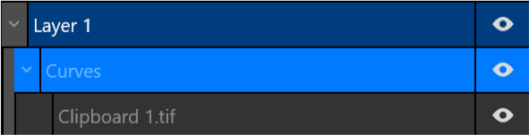
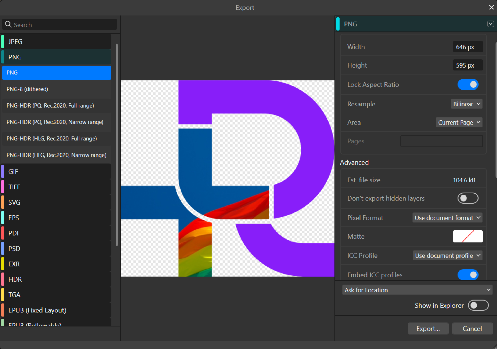

## Add image to R+ logo in Affinity

[Affinity Studio](https://www.affinity.studio/) is professional vector-based software that gives you many options for editing vector-based images and icons. It is available free of charge.

Use Affinity when you need transparent background exports, which are not available in the free version of Canva.

### Accessing the template

1. Download the `.AF` and `.PDF` files from the [Editable assets R+](https://drive.google.com/drive/folders/1D9CsIo9UPxziVgbmbAglii1AC_6P4V5d?usp=sharing) folder
2. Open the files directly in Affinity Studio

### Adding images

1. Drag and drop your image onto the artboard
2. Open the **Layers** panel
3. Move the image layer under either the **R** or **+** layer to embed it within that section

The image should appear as a sublayer inside the shape group, acting as a clipping mask.

4. Use the **Move** tool to reposition or resize the image within the clipped shape

Ensure sufficient contrast between images and background colors.

### Modifying colors

1. Select the section you want to recolor
2. Double-click the outline or fill color
3. Enter a new color code from the brand palette, or use the color picker

| Color          | Hex code  |
|----------------|-----------|
| Blue Violet    | `#881ef9` |
| Bastille Black | `#2f2f30` |
| Lavender White | `#ededf4` |
| Brilliant Rose | `#ff5b92` |
| Dodger Blue    | `#146af9` |

{}
Please do not move, transform, or rotate the R relative to the RLadies+ text part of the logo.
{}

### Exporting

1. Go to **File > Export**
2. Select your working area or page
3. Choose your preferred file format (PNG recommended) and resolution
4. Click **Export**

### Resources

- [Editable assets R+ folder](https://drive.google.com/drive/folders/1D9CsIo9UPxziVgbmbAglii1AC_6P4V5d?usp=sharing) on Google Drive
- [RLadies+ Branding Guidelines](https://drive.google.com/drive/folders/1e0G7ATlPQ4h-vEcON643agdhfxTfKfmp?usp=sharing) on Google Drive
