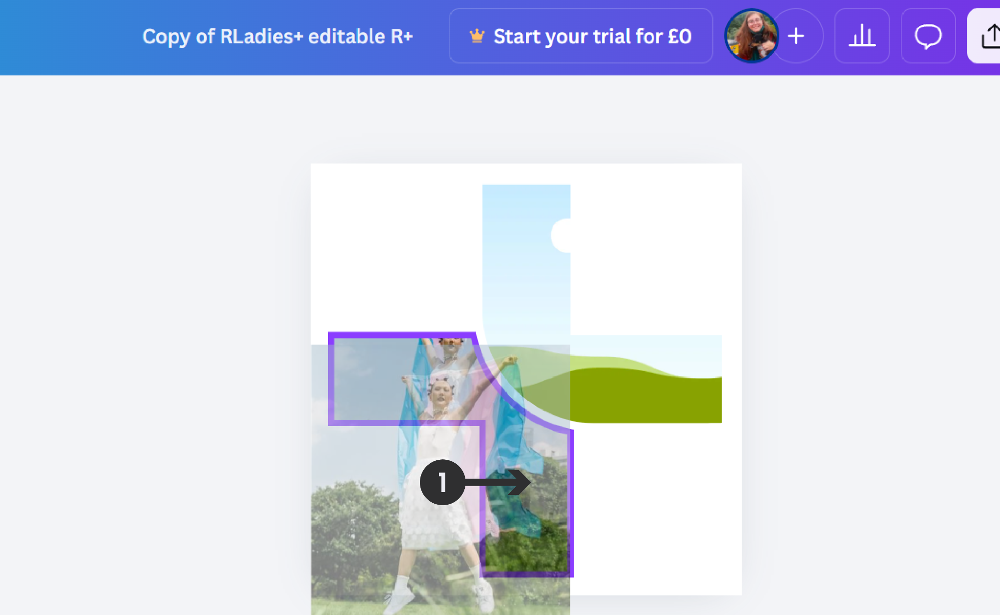
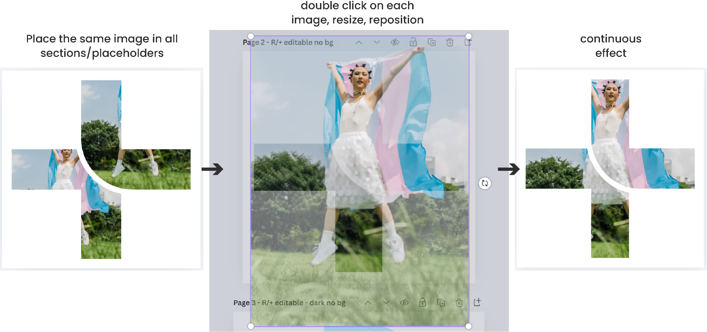
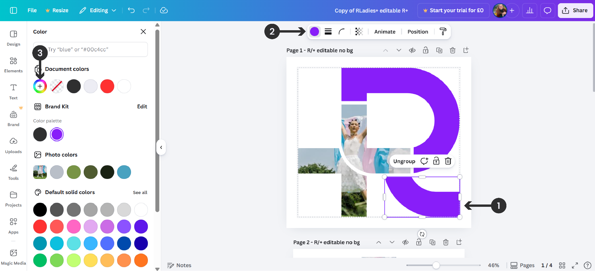
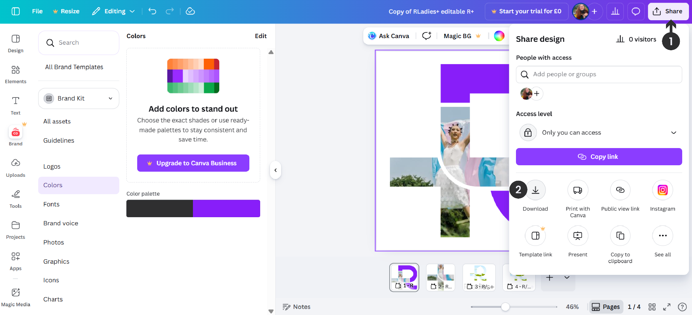

## Add image to R+ logo in Canva

The RLadies+ logo allows customization by inserting images within the R and + symbols. This guide explains how to do this in Canva.

{}
In the free version of Canva, you cannot export a page with a transparent background. For transparent backgrounds, use the [Affinity alternative]({}) instead.
{}

### Accessing the template

The editable R+ template is available as a [Canva project](https://www.canva.com/design/DAHCPp-NNCs/txVNtIcwIuczdk3E6y6vvw/view?utm_content=DAHCPp-NNCs&utm_campaign=designshare&utm_medium=link&utm_source=publishsharelink&mode=preview). Templates are also available within social media template collections.

1. Click **View Template**
2. Click **Open in Editor** to create an editable copy

### Adding images

You can add images from Canva's library or your own files:

- **From Canva**: Go to **Elements > Photos** in the sidebar and browse or search
- **From your computer**: Drag and drop images directly onto the workspace

Position images into the R or + placeholders. Use the **Crop** tool to resize and center images so they fill their respective placeholders completely, creating a seamless visual flow across sections.

### Adding colors

To apply brand colors to sections:

1. Select the section you want to recolor
2. Click the **Fill Color** button in the toolbar
3. Pick a new color from the color panel or enter a HEX code

| Color          | Hex code  |
|----------------|-----------|
| Blue Violet    | `#881ef9` |
| Bastille Black | `#2f2f30` |
| Lavender White | `#ededf4` |
| Brilliant Rose | `#ff5b92` |
| Dodger Blue    | `#146af9` |

{}
Please do not move, transform, or rotate the R relative to the RLadies+ text part of the logo.
{}

### Exporting

1. Click **Share**
2. Select **Download**
3. Choose **PNG** or **JPG** format
4. Download to your device

### Resources

- [Editable R+ Canva template](https://www.canva.com/design/DAHCPp-NNCs/txVNtIcwIuczdk3E6y6vvw/view?utm_content=DAHCPp-NNCs&utm_campaign=designshare&utm_medium=link&utm_source=publishsharelink&mode=preview)
- [RLadies+ Branding Guidelines](https://drive.google.com/drive/folders/1e0G7ATlPQ4h-vEcON643agdhfxTfKfmp?usp=sharing) on Google Drive
