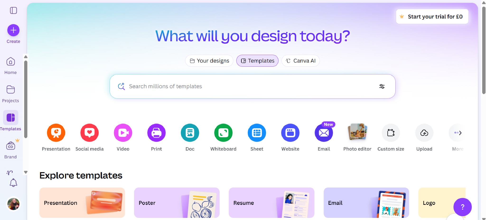
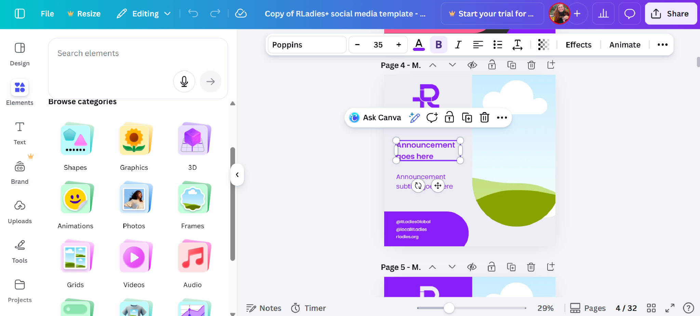
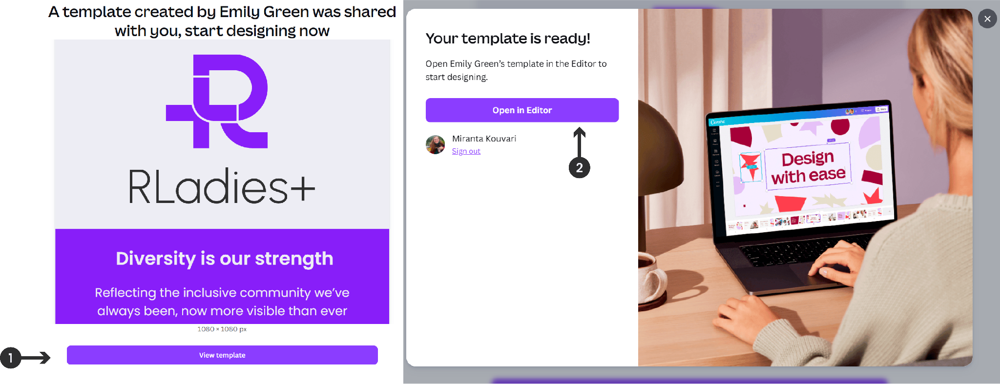
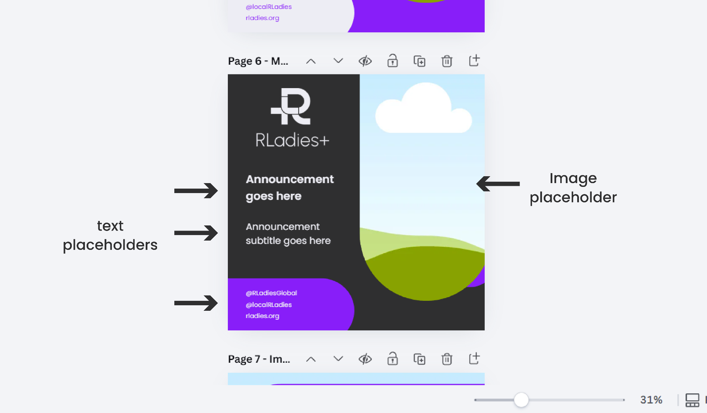
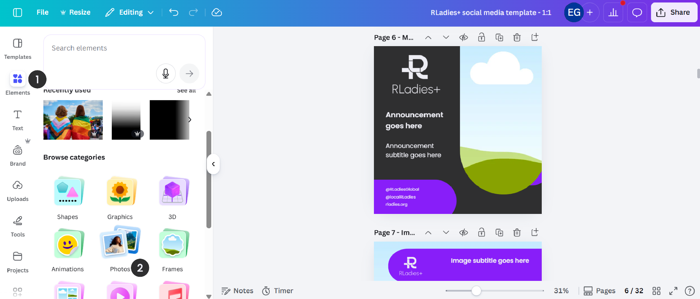
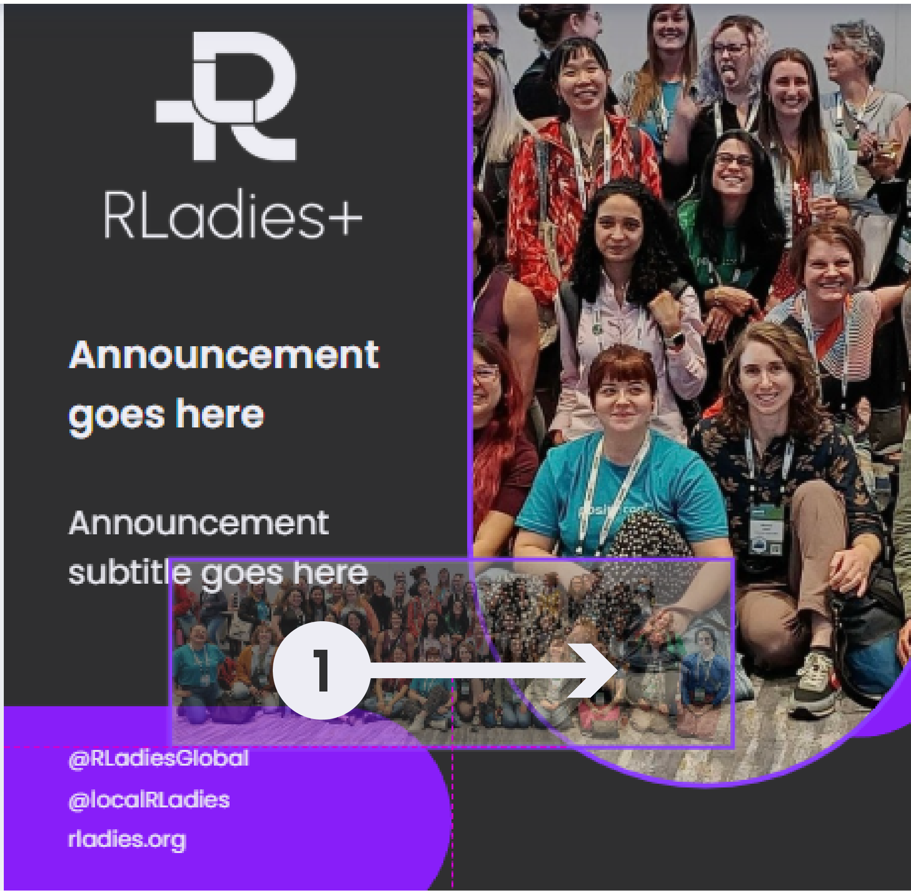
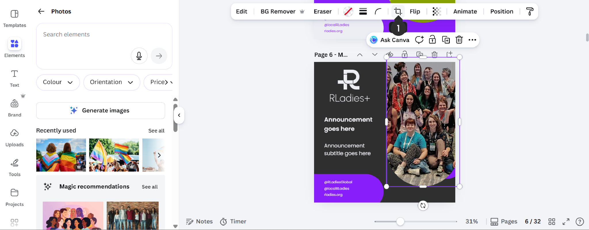
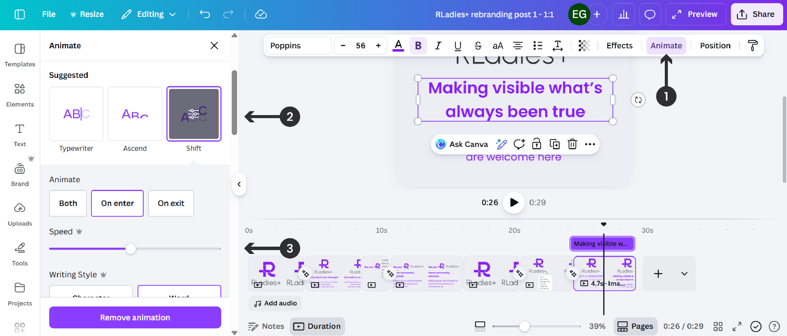
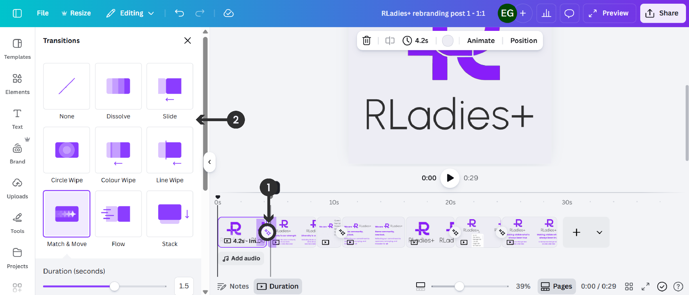
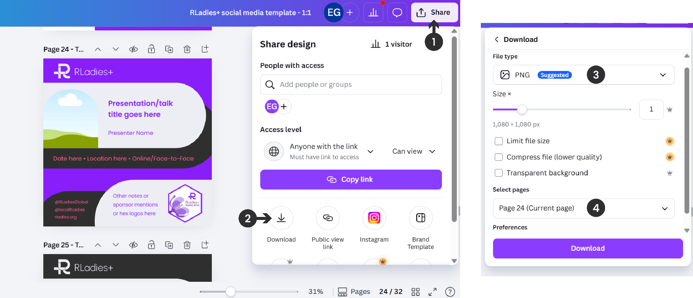

## Using social media templates in Canva

[Canva](https://www.canva.com/) is a web-based design platform with free and paid versions.
The free version is sufficient for working with RLadies+ social media templates.
You need a free account and an internet connection.
Google Chrome is recommended — Safari has known compatibility issues.

Templates are also available in the [RLadies+ Canva workspace](https://www.canva.com/folder/FAHCPq0DH3w).

{}
The social media templates follow the RLadies+ branding guidelines.
**Do not change the fonts or colours of the elements, or add new elements** (unless adding logos) to maintain brand consistency.
{}

### The Canva interface

When you sign in, the Canva homepage shows categories like Presentation, Social media, Video, and Print.

Once inside a template, the editor shows a sidebar with tools (Design, Elements, Text) and a canvas area with your template pages.

### Available formats

Templates come in various dimensions for different platforms:

- **Social media posts**: 1:1 (square), 4:5, 9:16, and 16:9 formats
- **Banners/covers**: 3:1, 4:1, and 16:9 formats

### Accessing templates

1. Click the provided template link
2. Select **View Template**
3. Click **Open in Editor** to create an editable copy in your Canva account

### Template layout

Each template page has pre-formatted placeholders for text and images. The arrows below show where to find each editable region.

### Customising content

#### Text

Click a text placeholder and type your content.
Use **bold** for emphasis only.
Avoid italics, underlines, or all-caps for accessibility.

#### Images

Browse Canva's photo library via **Elements > Photos** in the sidebar, or drag images from your computer directly into placeholders.

Use the **Crop** tool to adjust positioning. Images should fill the entire placeholder.

#### Logos

Drag and drop institution or chapter hex logos onto pages, or use **Insert > Image**.

#### Animations (for video posts)

To animate text, select the text element, choose an animation style (e.g. Typewriter, Ascend, Shift), and adjust timing on the video timeline.

To add transitions between slides, click between slides on the timeline and select a transition effect.

### Exporting

1. Click **Share**
2. Select **Download**
3. Choose **PNG** or **JPG** format (or GIF for animated content)
4. Select which pages to export
5. Click **Download**

