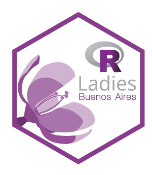
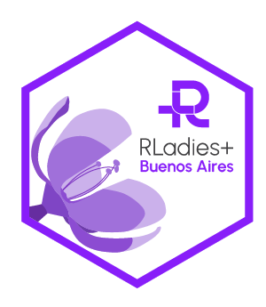
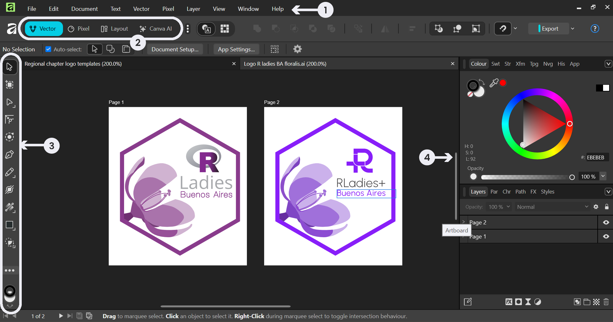
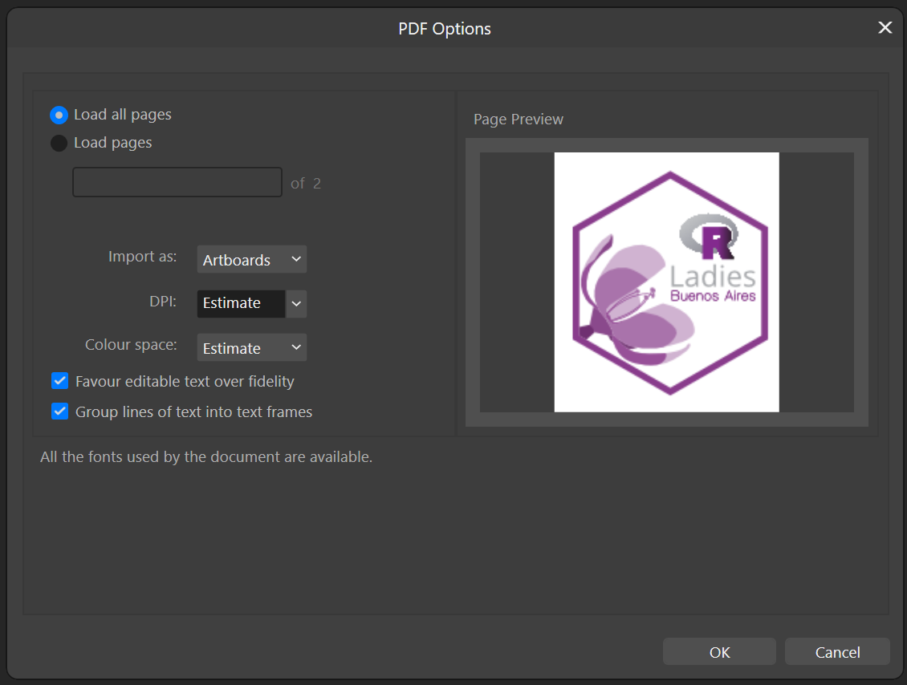
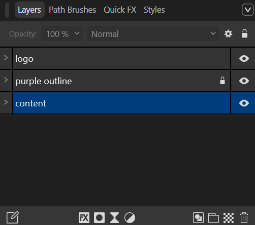
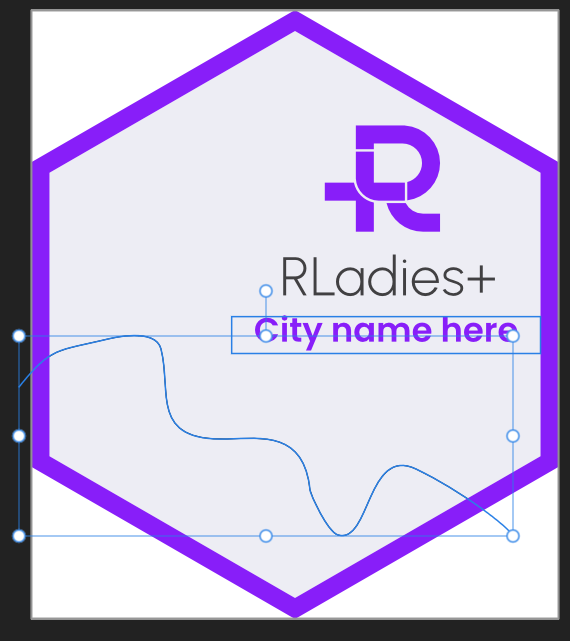
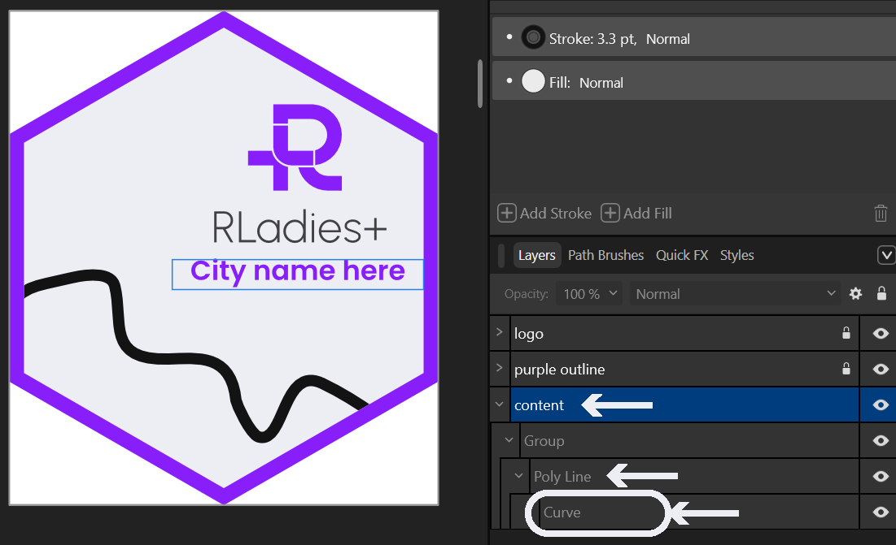
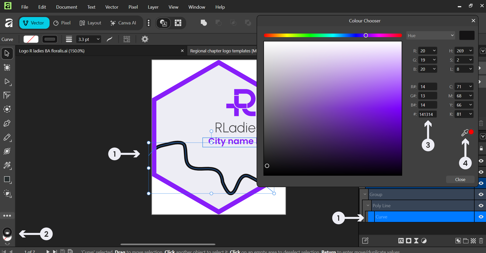
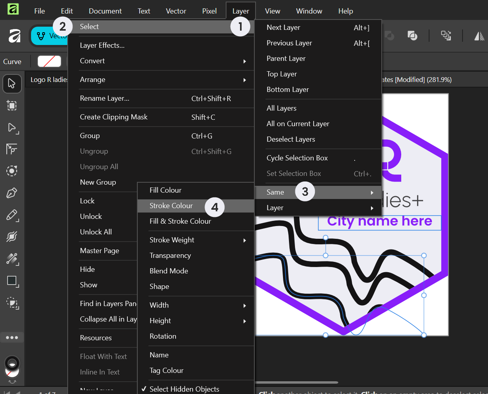
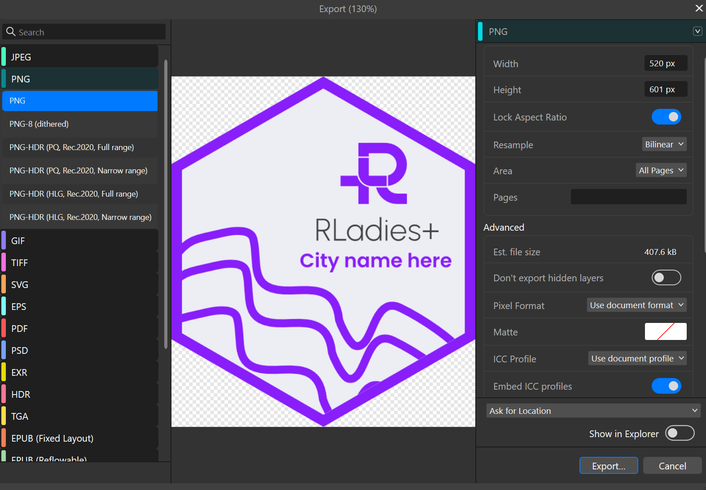

## Updating regional hex logos

All regional chapters should update their hex logos to align with the new RLadies+ branding. Updates include color changes, logo updates, and switching typography to the Poppins font.

Here is an example of a regional hex logo before and after the update:

### What you need

- [Affinity Studio](https://www.affinity.studio/) (free professional vector software)
- [Regional hex logo templates](https://drive.google.com/drive/folders/1Rp4pdihs_bwvW2xiABp0KBbILkPMf-GT?usp=sharing) (available in `.af` and `.pdf` formats)
- [RLadies+ Branding Guidelines](https://drive.google.com/drive/folders/1e0G7ATlPQ4h-vEcON643agdhfxTfKfmp?usp=sharing)

### Affinity Studio basics

The Affinity Studio interface has four main areas:

1. **Top menu**: File operations and settings
2. **Mode interface**: Switch between vector and image editing (Vector Persona)
3. **Right-side panel**: Selection, drawing, and color tools
4. **Left-side panel**: Layers, text, and organizational features

Key tools you will use:

| Tool | Icon | Purpose |
|------|------|---------|
| Move Tool |  | Selecting and moving objects |
| Pen Tool |  | Editing vector paths |
| Colour Picker |  | Sampling and matching colours |

### Importing files

Open existing logo files (SVG, PDF, EPS, AI) via drag-and-drop or **File > Open**.

When importing a PDF, use the following settings:

### Editing the template

Templates organise content into three layers:

1. **Logo** layer — the RLadies+ logo elements
2. **Purple outline** layer (locked) — the hex border
3. **Content** layer — your chapter-specific content

Select the **Content** layer to edit your chapter's name and illustrations.

To find and select decorative elements like curves or wave paths, expand the Content layer in the Layers panel.

### Recoloring

Apply the updated brand colors using either method:

**Manual selection**: Select an element, then open the Colour Chooser to change its stroke or fill colour.

**Batch selection**: Use **Layer > Select > Same > Stroke Colour** to select all elements sharing the same colour at once, then change them all together.

| Color          | Hex code  |
|----------------|-----------|
| Blue Violet    | `#881ef9` |
| Bastille Black | `#2f2f30` |
| Lavender White | `#ededf4` |
| Brilliant Rose | `#ff5b92` |
| Dodger Blue    | `#146af9` |

### Exporting

1. Go to **File > Export**
2. Select PNG format and appropriate resolution
3. Ensure the correct area or page is selected
4. Click **Export**

### Resources

- [Regional hex logo templates](https://drive.google.com/drive/folders/1Rp4pdihs_bwvW2xiABp0KBbILkPMf-GT?usp=sharing)
- [Logo folder](https://drive.google.com/drive/folders/1s60cO3zRkpa-dnADPQj6w2Z1iemXH98p?usp=drive_link)
- [RLadies+ Branding Guidelines](https://drive.google.com/drive/folders/1e0G7ATlPQ4h-vEcON643agdhfxTfKfmp?usp=sharing)
