## Using the RLadies+ slidedeck templates

The RLadies+ slidedeck templates are available in both Google Slides and PowerPoint formats.
They follow the RLadies+ branding guidelines for coherence and accessibility, and offer slide layouts in three colour variations: **light**, **purple**, and **dark**.

All template files are in the [Slidedeck templates folder](https://drive.google.com/drive/folders/1yN0sDAciLWU-4xT2SNbsXh1W-NWrj7ix?usp=drive_link) on Google Drive.

{}
**Do not change the fonts or colours** of the template elements, or add new elements (unless adding logos or images).
This keeps all RLadies+ presentations consistent and accessible.
{}

## Google Slides

Google Slides is free — you only need a Google account and an internet connection.

### Getting started

1. Open the [RLadies+ Slidedeck template & examples](https://docs.google.com/presentation/d/1Fhk0Jq924Ixpvxc6IHPrui0bkG21cdpNQZ-KYQ_K6j8/edit?usp=drive_link) file
2. Go to **File > Make a Copy > Entire Presentation**
3. Choose a location in your Google Drive — the copy is fully editable

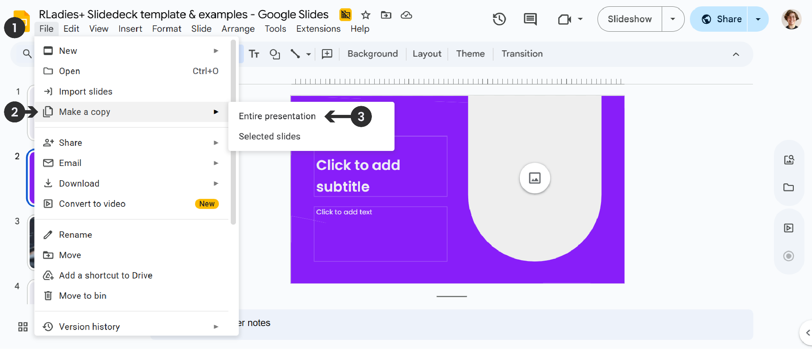

### Choosing slide layouts

The example file shows only a small selection of available layouts.
To see all options, click the small downward arrow next to **New Slide** in the toolbar to browse the full gallery.
Scroll down to see all title and content slide layouts in the three variations (light, purple, dark).

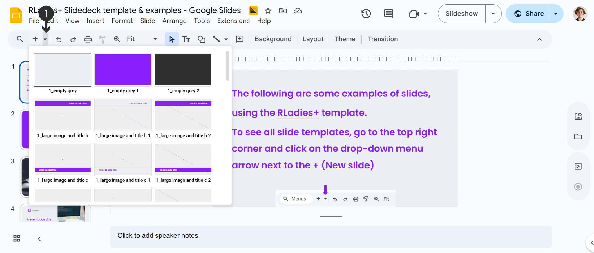

To remove unwanted slides, right-click the slide thumbnail in the sidebar and select **Delete**.

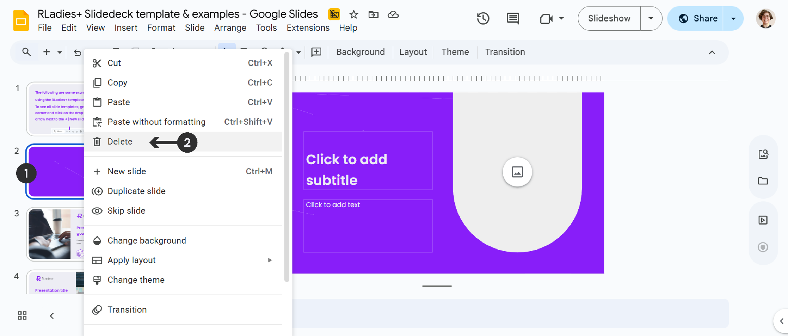

### Slide elements

Each layout includes pre-formatted placeholders for text and images.

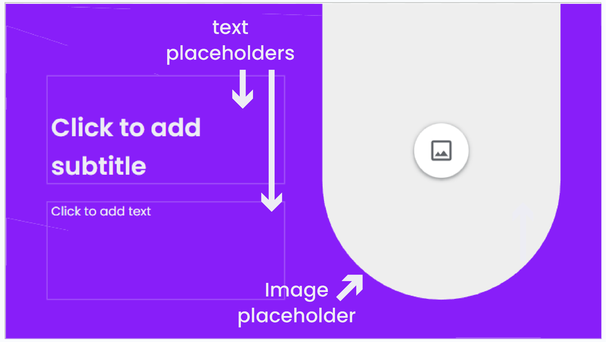

### Adding content

**Text**: Click a text placeholder and type.
Use **bold** for emphasis only — avoid italics, underlines, or all-caps for accessibility.

**Images**: Click the image placeholder icon, then choose a source (Upload from computer, By URL, Drive and Photos, Stock and web).

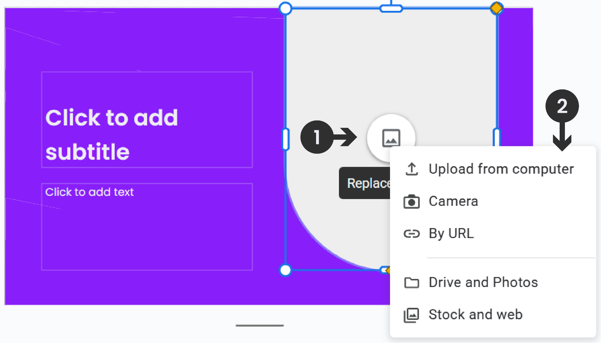

If the placeholder already has an image, right-click the image and select **Replace Image**.

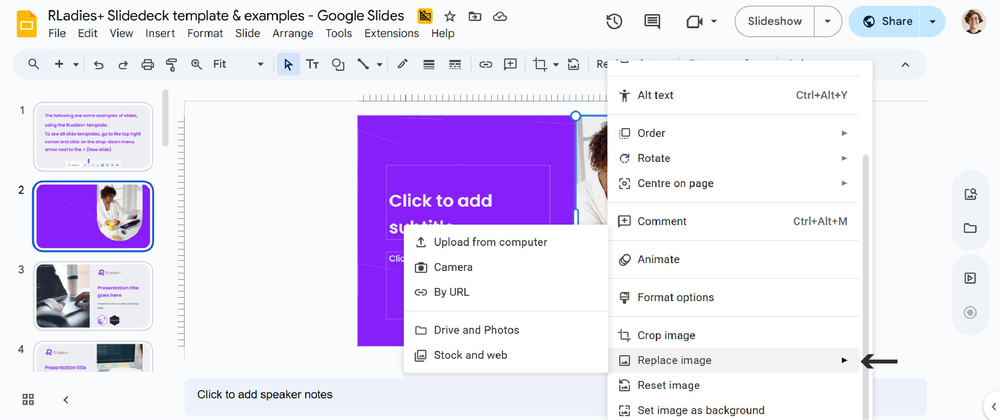

Use the **Crop** tool from the toolbar to adjust the image position within the placeholder.
Images should fill the entire placeholder.

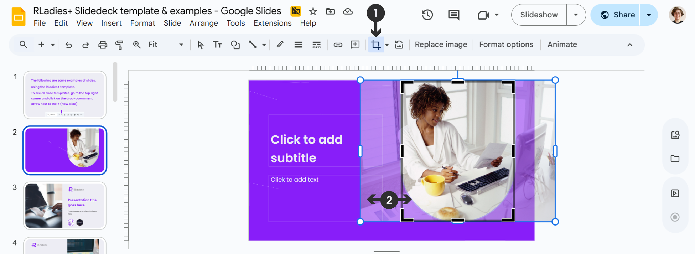

**Logos**: Use **Insert > Image** to add institution logos or R hex logos to your slides.

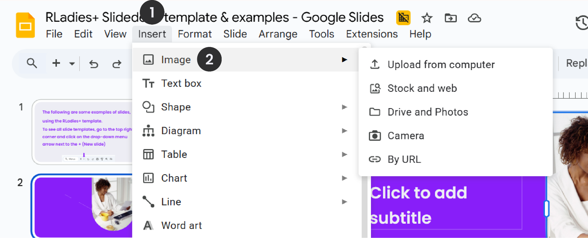

### Adding slide numbers

Go to **Insert > Slide Numbers**, toggle slide numbers **On**, and click **Apply**.

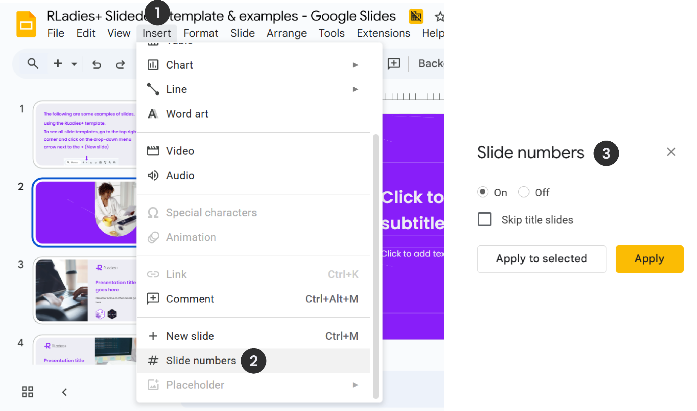

### Exporting

Go to **File > Download** and select the format you need:

- **.pptx** — editable PowerPoint format
- **.pdf** — universal, not editable

You can also share directly via **File > Share > Share with Others** for collaboration.

---

## PowerPoint

PowerPoint requires paid licensing, though educational institutions often provide access.

### Getting started

1. Download the [RLadies+ Slidedeck template PPT](https://docs.google.com/presentation/d/1fU2PWl1fxBkl5Gwbuh_JnlpsfJOHBY80/edit?usp=drive_link&ouid=112076406271805919059&rtpof=true&sd=true) file
2. Open it directly through PowerPoint

The file comes with the Poppins font embedded.
If you see font display issues, install [Poppins from Google Fonts](https://fonts.google.com/specimen/Poppins).

### Choosing slide layouts

Access different layouts through the **Home** tab by clicking the dropdown on **New Slide** or **Layout**.
Layouts are available in the same three variations: light, purple, and dark.

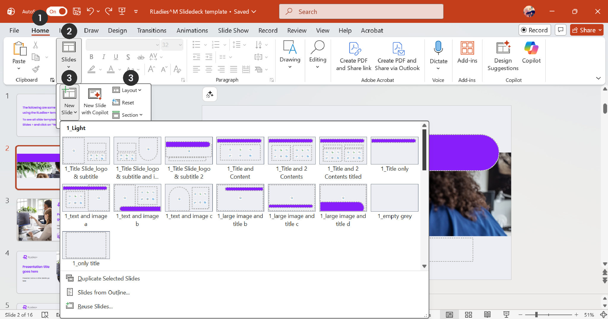

To remove example slides, right-click the slide thumbnail and select **Delete Slide**.

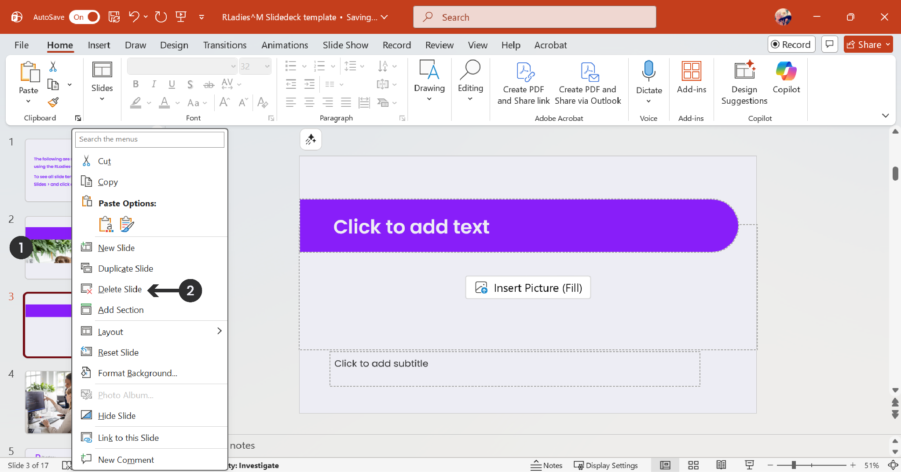

### Slide elements

Each layout has text and image placeholders, similar to Google Slides.

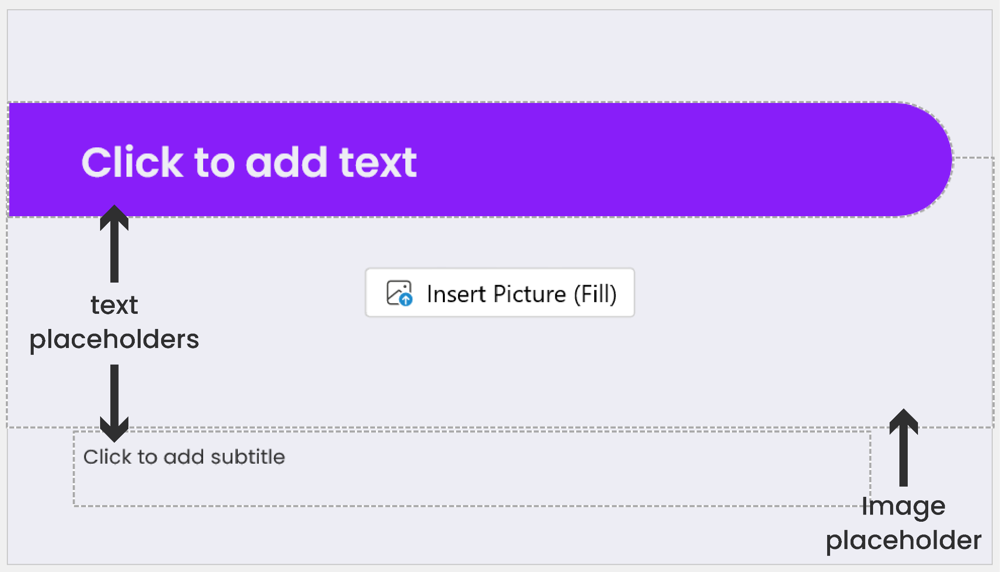

### Adding content

**Text**: Click a text placeholder and type.
Use **bold** for emphasis only.

**Images**: Click the **Insert Picture (Fill)** button in the placeholder and choose a source.

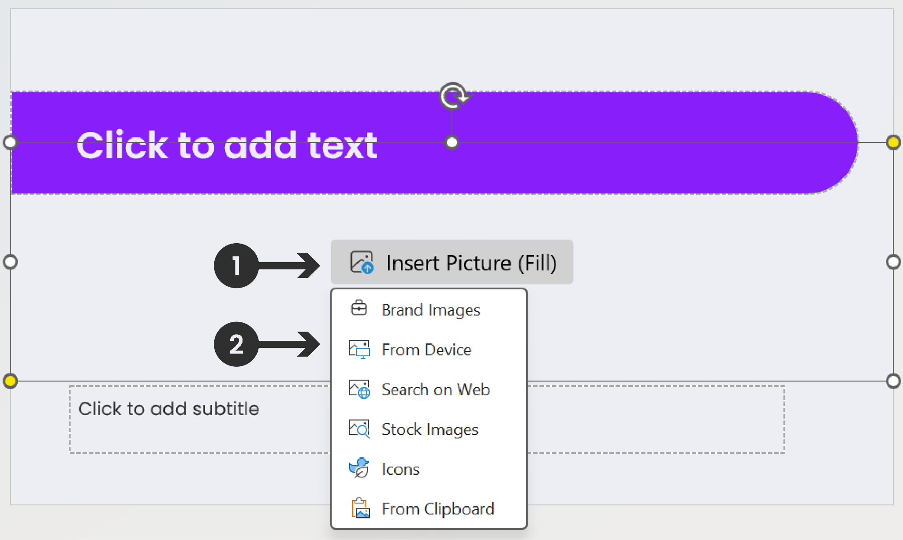

To replace an existing image, right-click it and select **Change Picture**.

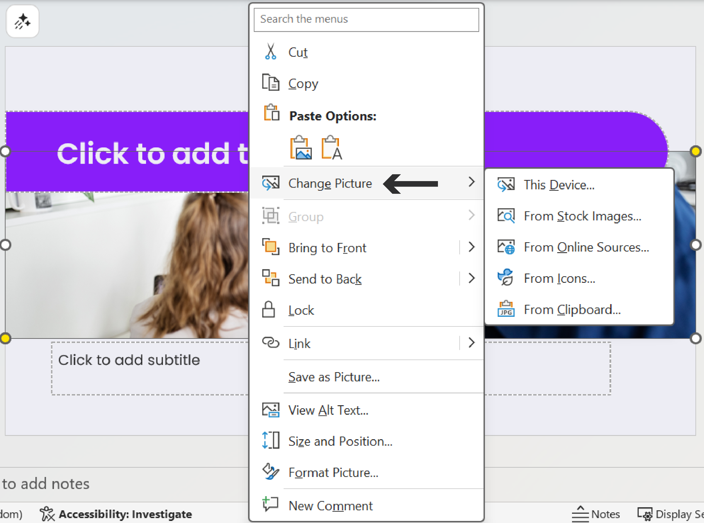

Use the **Crop** tool in the **Picture Format** tab to adjust the image position.

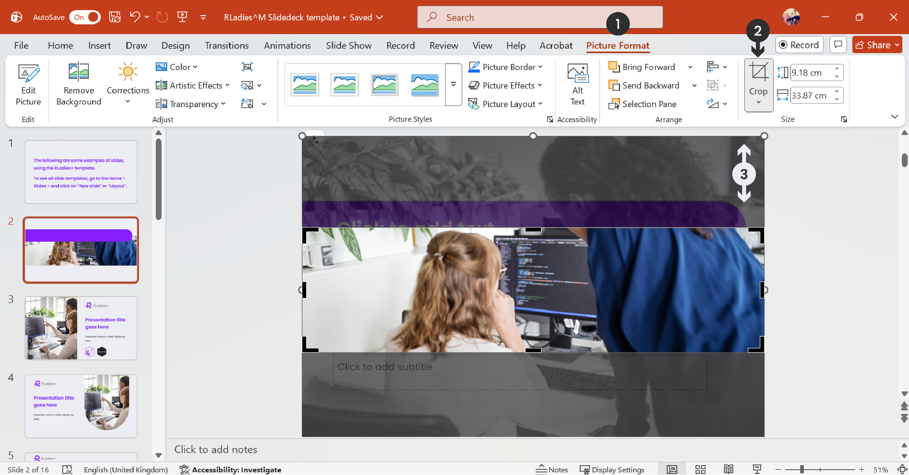

**Logos**: Use **Insert > Pictures** to add institution logos or R hex logos.

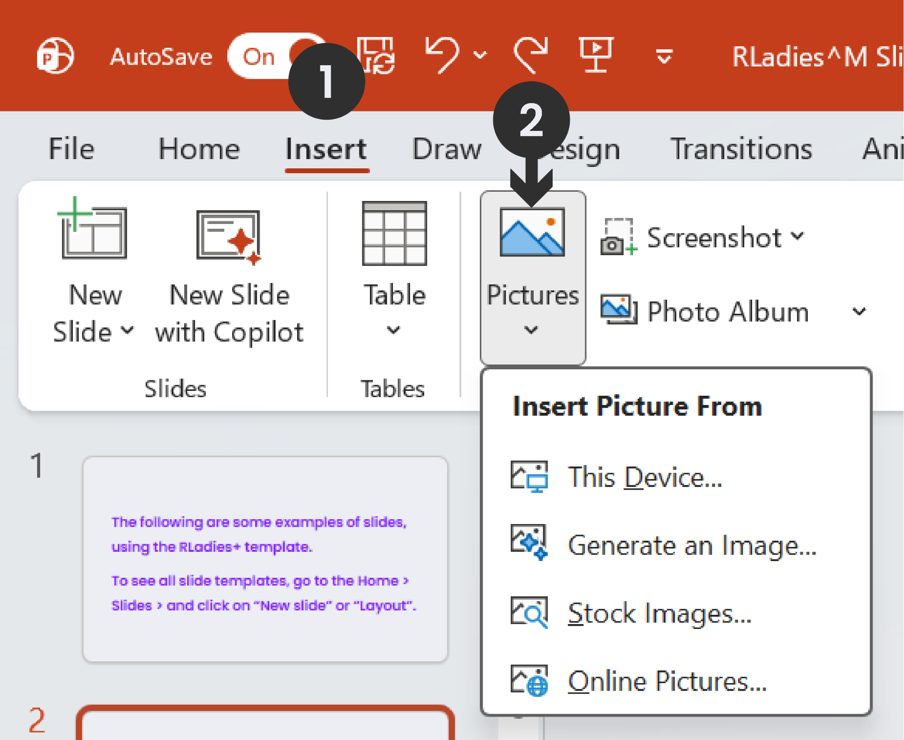

### Adding slide numbers

Go to **Insert > Header & Footer**, check **Slide number**, and click **Apply to All**.

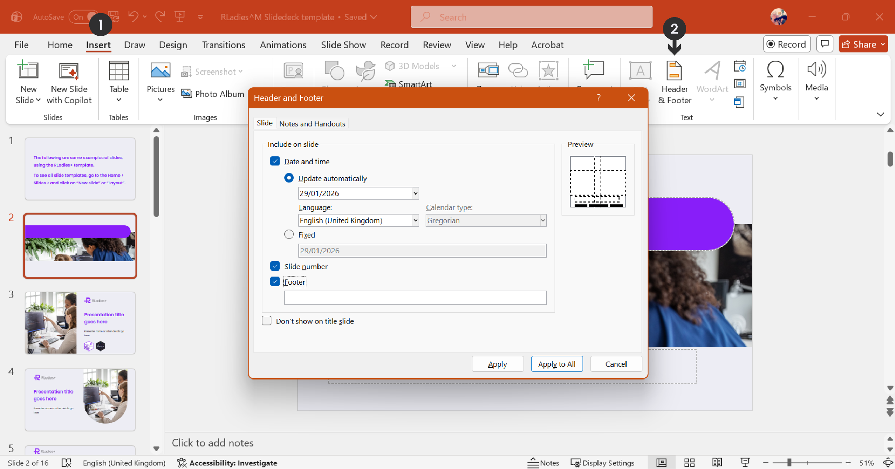

### Exporting

Go to **File > Save As** or **File > Export** and select the format:

- **.pptx** — editable PowerPoint format
- **.pdf** — universal, not editable
