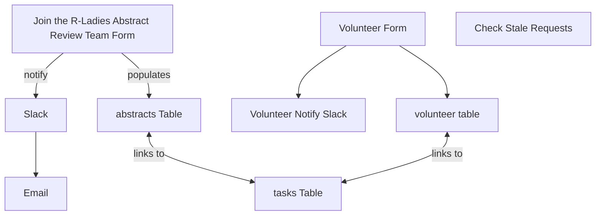

This document details the updated structure and functionality of the "abstract review" Airtable base, used to manage requests for abstract reviews and the team of volunteers who provide the reviews. It now utilizes a central "tasks" table to manage the review workload, linking abstracts and volunteers. The base involves two tables, each populated by a dedicated form, and includes updated automations.

## Data (Tables and Views)

The "abstract review" base contains three key tables: "volunteers", "abstracts", and "tasks".

### volunteers Table

This table stores information about individuals who have volunteered to be abstract reviewers. It is populated by the "Join the R-Ladies Abstract Review Team" form.
**Key Fields:**

- name
- comments
- email
- slack
- review_type
- help_type
- help_type_other
- languages
- language_other
- Gender
- abstracts (Linked to the abstracts table)
- Reviews requested
- Review completed
- Email consent

**Key Views:**

- No specific key views were identified for this table.

### abstracts Table

This table stores information about the abstract review requests submitted by individuals. It is populated by the "Request Feedback for Your Abstract" form. It now links to the "tasks" table to manage individual review assignments.

**Key Fields:**

- name
- email
- conf_url
- conf_name
- conf_deadline
- conf_type
- conf_type_other
- abstract_type
- abstract_url
- comments
- Reviewer Preferences
- Email consent
- Are you a woman or me…
- Tasks (Linked to the tasks table)
- Status (from Tasks) (Lookup field from the tasks table)

**Key Views:**

- No specific key views were identified for this table.

### tasks Table

This new table manages the individual tasks required for each abstract review. It links abstracts to assigned reviewers and tracks the status of each review.

**Key Fields:**

- Record
- Abstract (Linked to the abstracts table)
- Conf Deadline
- Status
- Status last updated
- Reviewer 1 Status
- Reviewer 2 Status
- Reviewer 3 Status
- Reviewer 1 (Linked to the volunteers table)
- Reviewer 2 (Linked to the volunteers table)
- Reviewer 3 (Linked to the volunteers table)

**Key Views:**

- No specific key views were identified for this table.

## Interface

This base does not appear to have any custom interfaces.

## Automation

This base has three active automations:

1.  **Volunteer Notify Slack:**

    - **Trigger:** When a volunteer sign-up form is submitted.
    - **Action:** Sends a notification message to a Slack channel.

2.  **New Request:**

    - **Trigger:** When a abstract submission form is submitted .
    - **Action:** Sends a Slack message, creates a new record in the **tasks** table, and sends an email to abstract-review@rladies.org.

3.  **Check stale requests:**
    - **Trigger:** When a record matches conditions.
    - **Action:** Performs an action on records that meet the defined conditions (action not fully visible).
