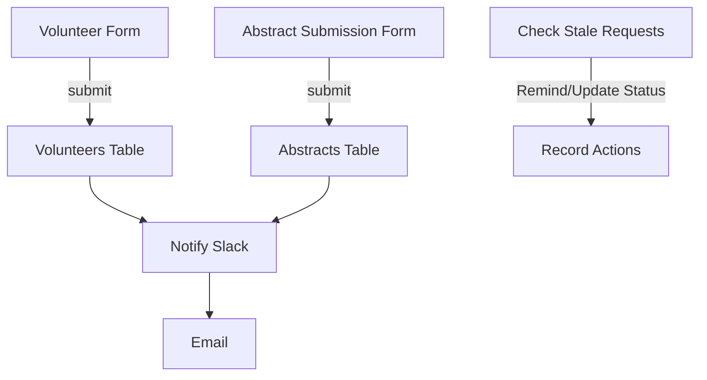

This document details the structure and functionality of the "abstract review" Airtable base, used to manage requests for abstract reviews and the team of volunteers who provide the reviews. It involves two tables, each populated by a dedicated form, and includes automations for notifications and managing requests.

## Data (Tables and Views)

The "abstract review" base contains two tables: "volunteers" and "abstracts".

### volunteers Table

This table stores information about individuals who have volunteered to be abstract reviewers. It is populated by the "Join the R-Ladies Abstract Review Team" form.
**Key Fields (Observed):**

- name
- comments
- email
- slack
- review_type
- help_type
- help_type_other
- languages
- language_other
- Gender
- abstracts (Linked to the abstracts table)
- Reviews requested
- Review completed
- Email consent

**Key Views:**

- No specific key views were identified for this table.

### abstracts Table

This table stores information about the abstract review requests submitted by individuals. It is populated by the "Request Feedback for Your Abstract" form.

**Key Fields (Observed):**

- name
- email
- conf_url
- conf_name
- conf_deadline
- conf_type
- conf_type_other
- abstract_type
- abstract_url
- comments
- Reviewer Preferences (O…
- Reviewer Preference (O…
- Status
- Reviewer 1 email
- Status last updated
- Email consent
- Are you a woman or me…
- Reviewer 1 Status
- Reviewer 2 email
- Reviewer 2 Status
- Reviewer 3 email
- Reviewer 3 Status

**Key Views:**

- No specific key views were identified for this table.

## Interface

This base does not appear to have any custom interfaces.

## Automation

This base has four automations to manage the abstract review process:

1.  **Volunteer Notify Slack:**

    - **Trigger:** When a volunteer sign-up form is submitted.
    - **Action:** Sends a notification message to a Slack channel.

2.  **Request Notify Slack:**

    - **Trigger:** When a abstract submission form is submitted.
    - **Action:** Sends a notification message to a Slack channel (likely for managing abstract review requests).

3.  **Abstract Review Notify:**

    - **Trigger:** When a abstract submission form is submitted.
    - **Action:** Sends an email notification to abstract review team.

4.  **Check stale requests:**
    - **Trigger:** When a record matches conditions
    - **Action:** Performs an action on records that meet the defined conditions, sending reminders or updating status.
