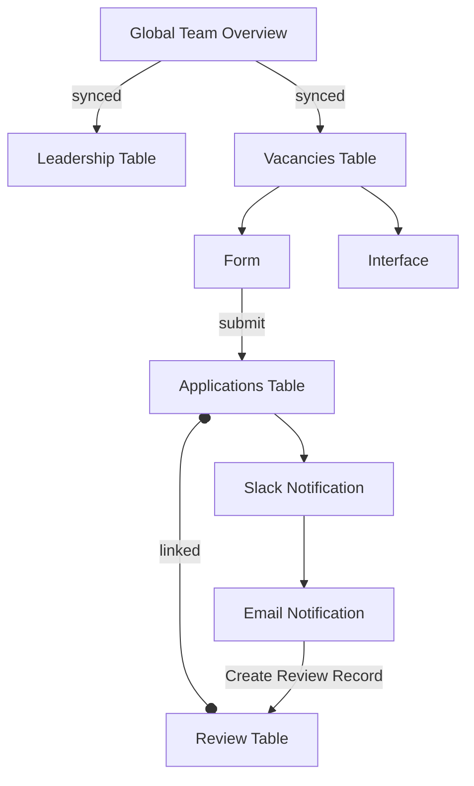

This document details the structure and functionality of the "Global Team Volunteering" Airtable base, used to manage applications from prospective new team members. It involves four tables, with application submissions managed through a form and their review tracked internally. The base also features an interface displaying team vacancies.

## Data (Tables and Views)

The "Global Team Volunteering" base contains four tables: "Leadership", "Review", "Applications", and "Vacancies".

### Leadership Table

This table is synced from the "Global Team overview" base and likely contains information about leadership roles within the organization. As it is synced, the data is managed in the source base.

**Key Fields:**

- Details of the fields are managed in the "Global Team overview" base.

**Key Views:**

- Details of the views are managed in the "Global Team overview" base.

### Review Table

This table is used internally to track the status of each volunteer application as the team reviews them for potential membership.

**Key Fields:**

- Reviewer
- Interview notes
- Applying for (Linked to the Applications table)
- Interview score
- Stage
- Interview Date
- Name (Likely a lookup or formula field)
- Applications (Linked to the Applications table)
- choice
- email (Likely a lookup or formula field)
- Assign team (Likely linked to the Vacancies table)

**Key Views:**

- No specific key views were identified for this table.

### Applications Table

This table is populated by a single form where prospective new team members submit their interest to join the team.

**Key Fields:**

- name
- email
- chapter
- involvement
- time
- commitment
- interest_statement
- start_date
- future_contact
- online_presence
- residence
- r_experience
- ethnicity
- lgbtqia
- gender_freetext
- age
- comments
- involvement_description
- gh_user
- choice1
- Review (Linked to the Review table)
- Interviewer
- choice2
- choice3
- Stage

**Key Views:**

- No specific key views were identified for this table.

### Vacancies Table

This table is synced from the "Global Team overview" base and contains information about teams that have vacancies. The data is managed in the source base.

**Key Fields:**

- Details of the fields are managed in the "Global Team overview" base.

**Key Views:**

- Details of the views are managed in the "Global Team overview" base.

## Interface

This base has a single interface that displays details about the teams that have vacancies. This allows prospective volunteers to browse available opportunities and learn about team responsibilities, required skills, and time commitments. Pages within this interface include information for teams such as "Blog administration", "Chapter Mentoring", "Meetup Pro", and more.

## Automation

The base has a single automation to handle new volunteer applications:

**Submitted form:**

- **Trigger:** When the volunteer application form (feeding into the "Applications" table) is submitted.
- **Actions:**
  1. Sends a Slack message to leadership channel notifying the team of a new volunteer.
  2. Sends an email notification to the leadership team.
  3. Creates a new record in a separate "review table".

This automation ensures timely notification and logging of new volunteer applications.
