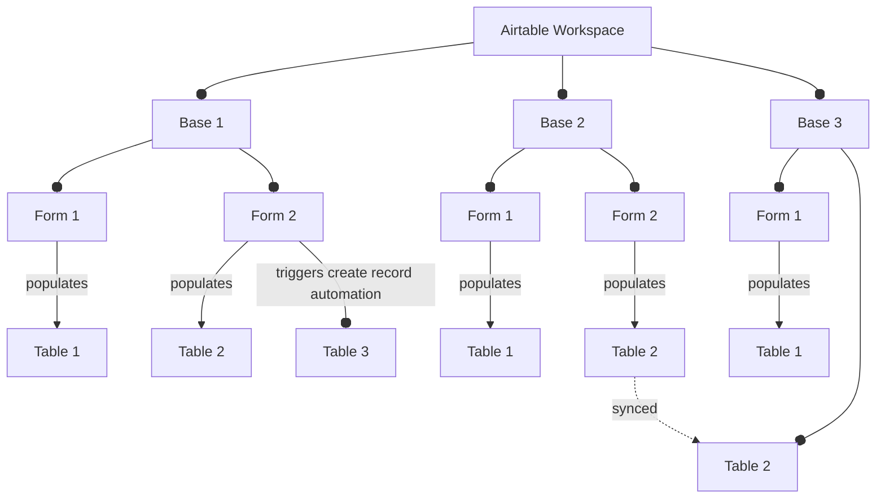
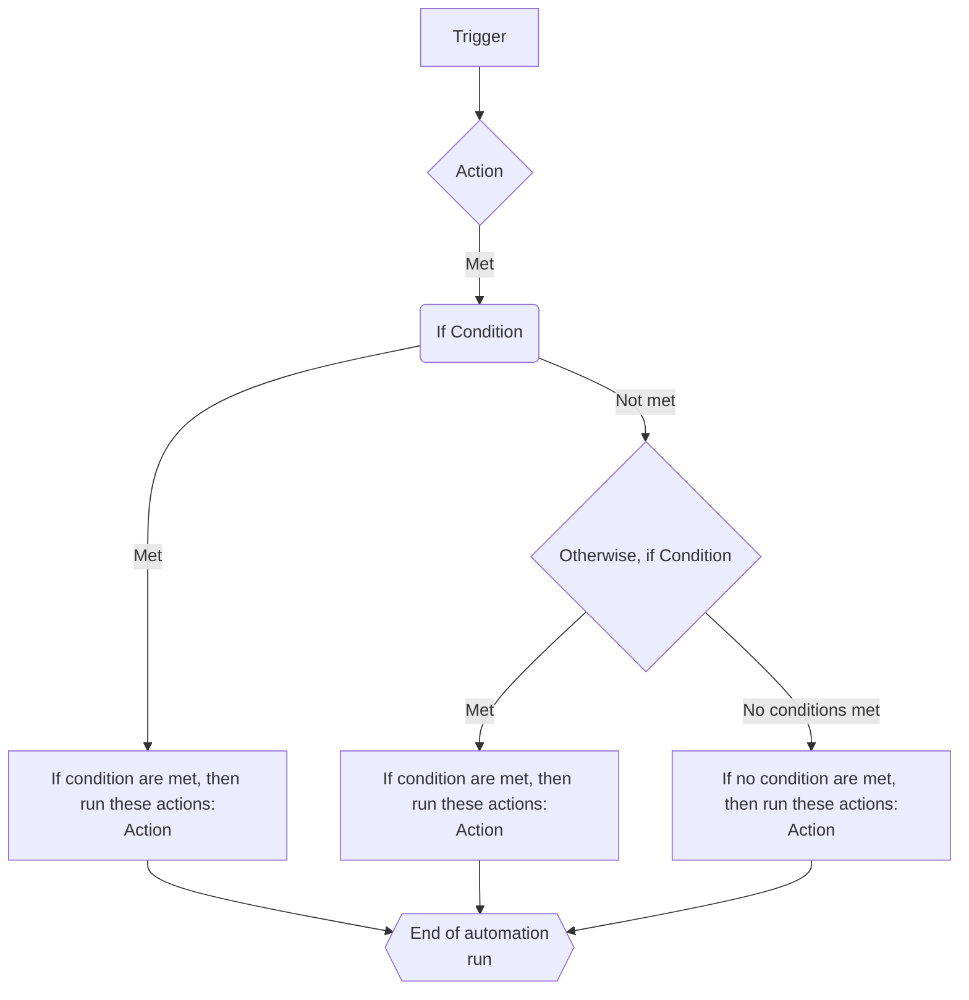
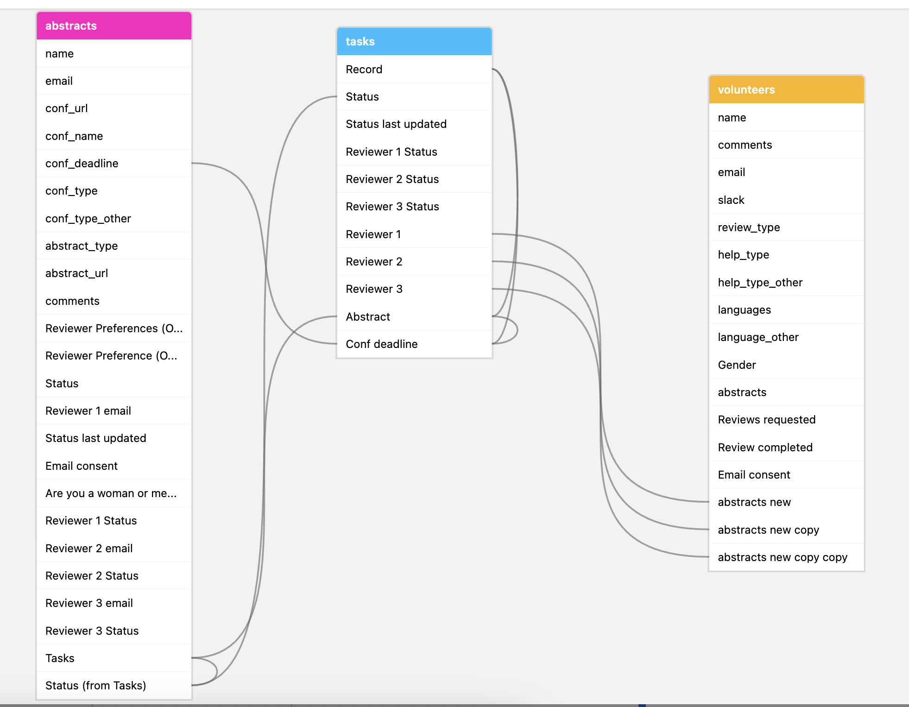

## Bases

A **Base** in Airtable is like a relational database.
It holds all your **tables, views, forms, and automations** for a project.
A single base can contain multiple tables, forms and automations.
In R-Ladies global team, we usually will have one base per team, to coordinate team tasks.

## Understanding the Core Components of Airtable

Airtable is built around four main components: **Data, Interface, Forms, and Automations**. Each serves a different purpose in organizing and managing information efficiently.

### Data (Tables, Fields, and Views)

- **What it is:** The foundation of Airtable—where all your raw information is stored.
- **How it works:**
  - Data is organized into **tables**, similar to spreadsheets.
  - Each **table** contains **fields** (columns) that hold different types of data (text, dates, linked records, etc.).
  - Different **views** (grid, calendar, kanban, etc.) allow you to filter, group, and sort the data without changing the underlying records.
  - Views are made to create accessible subsets of the data to come easily back to.
  - Things like **filtering**, **grouping** and **sorting** in Airtable are not seen as dynamic functions to run _on demand_. They are rather seen as tools for creating **views** of the data to come back to over and over.
- **Example:** A **"Curators"** table stores names, contact info, and scheduled dates. You can have a **Grid View** to see all records and a **Calendar View** to visualize the schedule. You can also create a **Grid View** that is only of future curators, with just a couple of necessary fields.

### Interfaces

- **What it is:** A customizable dashboard that provides a visual and interactive way to view and interact with data. Interfaces can be shared both internally and externally.
- **How it works:**
  - Interfaces let you create **charts, summaries, and interactive views** to help users navigate data more intuitively.
  - Unlike tables, **interfaces don’t store data** — they present existing data in a user-friendly way.
- **Example:** A **Curator Dashboard** that shows upcoming schedules, curators needing follow-ups, and a quick summary of curator feedback.

### Forms

- **What it is:** A way to **collect new data** from users without giving them direct access to the database.
- **How it works:**
  - Forms are connected to a specific **table** and create new records upon submission.
  - You can customize which fields are shown and add descriptions, but the form fields must match the table structure.
- **Example:** A **Curator Signup Form** where potential curators enter their name, availability, and bio. Once submitted, a new record is added to the **Curators** table.

### Automations

- **What it is:** A tool for automating repetitive tasks in Airtable.
- **How it works:**
  - Automations are triggered by specific **events** (e.g., "When a form is submitted").
  - They can perform **actions** such as sending emails, updating records, creating new records, or linking records together.
- **Example:** An automation that **assigns a curator** when they sign up and **sends them a confirmation email**.

### How They Work Together

- **Forms** collect curator signups and store them in the **Data** table.
- The **Data** table (with views) organizes and tracks curators.
- **Interfaces** provide an overview of scheduled curators and pending tasks.
- **Automations** reduce manual work by sending notifications and updating statuses.

These components together make Airtable a powerful system for organizing and streamlining workflows.

## Data Management

### Tables & Views

Each base has **Tables**, which store data in a structured way.

You can create different **Views** of a table to organize and display data:

- **Filtering** – Show only specific rows based on conditions.
- **Grouping** – Organize data by categories, like status or date.
- **View Types**:
  - **Grid View** (like a spreadsheet)
  - **Kanban** (like Trello)
  - **Calendar** (for date-based data)
  - **Gallery** (for image-based records)

Each table may have many different view, as many as you like.
Views are a great way to organise the underlying data into more manageable sizes for easier management.
Look at views as way to create subset of the data you often want to look at.
Filtering, grouping etc. in Airtable are not seen as dynamic things you do many times to inspect the data.
Rather, you are expected to create **views** you come back to over and over again.
You can also use views to sync _partial_ data into another base, like syncing all members of the curator team into the RoCur base from the Global Team Overview base.

There are for example ways to use views when choosing linked records that create more simple data input.
For instance, you might want:

- **Grid view** with all records and all fields
- **Grid view** with only completed records, with unnecessary fields hidden
- **Grid view** with records that are not completed, with unnecessary fields hidden
- **Calendar view** of all **upcoming** records.

### Fields (Columns)

Setting the correct field type in Airtable will enable you to use data in meaningful ways in automations etc.
In addition, special field types will run simple validations in a form, so that only meaningful data can be entered (like the email format makes sure what is entered is an actual email).
Choosing the right field type therefore makes sure the data flow is a smooth as possible.

**Some useful tips:**

- **Use consistent field names** that are computer-friendly (avoid spaces/special characters).
  - This is mostly important for bases that we pull into R for further use (like the directory and global team)
- **Date fields should follow ISO format** (YYYY-MM-DD) for consistency.
  - Airtable by default uses US format (M/D-YY), edit the field and choose ISO format in the field editor.
- **Linked Records** allow connections between tables, avoiding duplicate data.
  - Linked records are the most valuable feature for teams, as it reduces the need to store the same data multiple places.
  - Linked records also allows you to "lookup" or "rollup" values from the linked table to populate the current table. This way you can display information from one table in another, while changes will always stay synced.
- **Formula** are special columns where you can run specific operations in a row-wise fashion on your data. Like calculating a date in the future based on a field, or running calculations on data.

## Forms

Airtable **Forms** let users submit data directly into a table.

### How They Work

- Forms are tied to a **specific table**.
- When a form is filled out, a **new record** is added to the table.

### Best Practices

- **Use clear question titles** (they don’t have to match field names).
- Keep field names **short and structured** for better data handling.

## Automations

Airtable **Automations** help reduce manual work by automatically performing actions.

### Triggers (What Starts an Automation?)

There are many types of triggers for automations, you can create extremely complex custom conditions, or run on a schedule.

** Examples**

- When a **record is created or updated**.
- When a **form is submitted**.
- On a **scheduled time** (e.g., every Monday).
- When date in a table field is _a week from now_ and the _email_ field is not empty.

### Actions (What Can Automations Do?)

- **Send emails** (notifications, reminders).
- **Update records** (change a status, update a date, or link to another record)
- **Create new records** (automate data entry).
- **Run script**: allows us to write custom JavaScript to do special actions.

## Extending Airtable with Extensions

Airtable's functionality can be significantly enhanced through the use of **Extensions**.
These are additional tools and applications that you can add to your bases to perform a wide variety of tasks, from visualizing your data in new ways to automating complex workflows and integrating with other services.
Extensions allow you to customize your Airtable experience to meet your specific needs and go beyond the core features of tables, forms, interfaces, and automations.

![The image shows a partially visible Airtable extension panel, specifically with the "Base schema" extension selected. The main content area of the extension displays the text "Please make this app bigger or fullscreen," indicating that the current window size is too small to properly render the base schema visualization. The top of the extension panel shows a dropdown labeled "Dashboard 1," an option to "+ Add an extension," and a three-dot menu. Below the title "Base schema," there is a blank white area where the schema diagram would typically appear if the window were larger. At the very bottom of the panel, there is another "+ Add an extension" button. The overall context suggests the user is trying to view the relationships between tables in their Airtable base using the Base schema extension, but the view is currently constrained by the window size.](ext-dash.png)

### Types of Extensions

The Airtable Marketplace offers a diverse range of extensions, catering to various needs. Some common types include:

- **Data Visualization:** Create charts, graphs, timelines, and other visual representations of your data directly within Airtable.
- **Bulk Actions:** Perform actions on multiple records simultaneously, such as updating fields, deleting records, or generating documents.
- **Integrations:** Connect your Airtable base with other tools and platforms you use, such as Google Workspace, Slack, Jira, and more, to streamline workflows and data sharing.
- **Scripting:** Write custom JavaScript code to perform complex calculations, data transformations, or automate specific actions that are not available through standard automations.
- **Document Generation:** Create customized documents (like reports, invoices, or contracts) using the data in your Airtable base.
- **Data Cleaning and Enrichment:** Tools to help you standardize, validate, and enrich the data within your tables.

### Notable Extension: Base schema

One particularly useful extension for understanding the structure of your Airtable bases is the **Base schema** extension.
This extension provides a visual overview of all the tables within your base and, crucially, illustrates how these tables are connected through **linked record** fields.
By visualizing these relationships, you can gain a clearer understanding of your database design, making it easier to navigate and manage complex bases.
The Base schema extension is invaluable for documentation purposes and for onboarding new team members to an existing Airtable setup.

### Accessing and Using Extensions

You can access and add extensions to your Airtable base by clicking on the "Extensions" button located in the top right corner of your base. This will open the Extensions panel, where you can browse the Marketplace, install new extensions, and manage the extensions already added to your base. Many extensions offer configuration options to tailor their functionality to your specific data and workflows.

By leveraging the power of Extensions, you can significantly expand the capabilities of your Airtable bases and create more efficient and integrated workflows for your team.

## Exploring the Tools Menu in Airtable

The "Tools" menu in Airtable, typically found in the top right corner alongside the "Share" and "Extensions" buttons, offers a collection of utilities and features to help you manage your base.
These are simple tools to help you manage the tables and records in the base in various ways.

### Manage fields

This tool allows you to **edit the settings of your existing fields** and **inspect field dependencies**.
Understanding field dependencies is crucial for making changes to your base structure without unintentionally breaking formulas, lookups, or other connected elements.
This tool likely provides a visual way to see which fields are used in formulas, lookups, rollups, and linked records throughout your base.

### Record templates

With "Record templates," you can **create pre-filled templates for new records**.
This is incredibly useful for ensuring consistency and saving time when adding records that frequently share the same information.
You can define default values for specific fields within a template, and then easily create new records based on these templates.

### Date dependencies

This newer tool helps you **configure how dates shift between dependent records**.
If you have records with dates that are related (e.g., a project start date and dependent task due dates), this tool likely allows you to set up rules so that if one date changes, the related dates are automatically adjusted accordingly.
This can be very helpful for project management and other time-sensitive workflows.

## Final Tips

✅ **Use structured field names** (avoid special characters).  
✅ **Set up filters & views** to organize data effectively.  
✅ **Automate repetitive tasks** to save time.  
✅ **Use forms** for easy data entry without messing up table structure.
