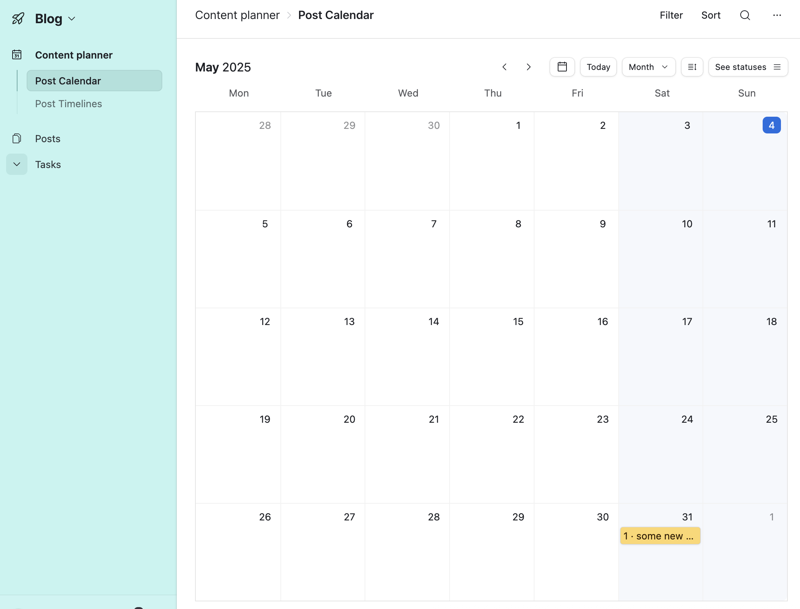
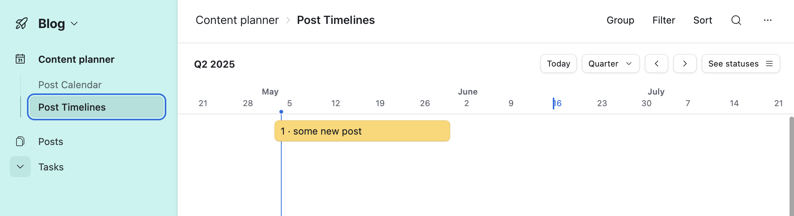
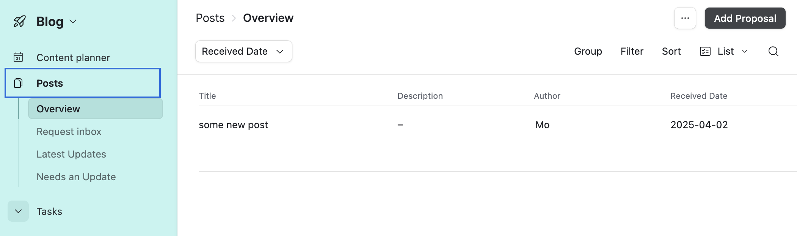
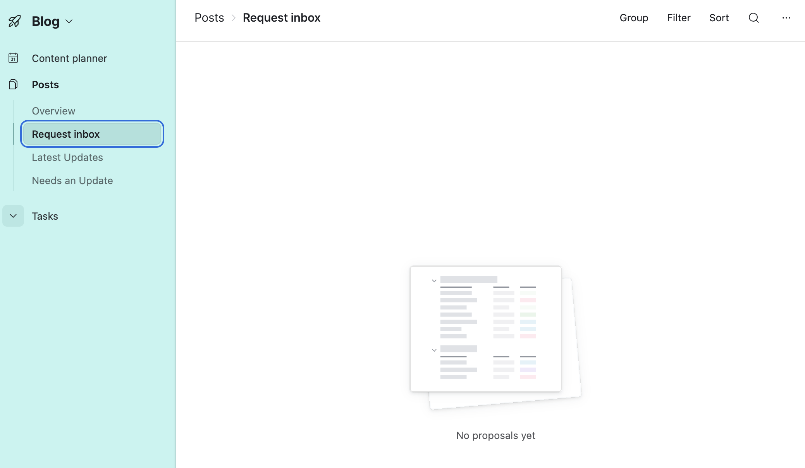
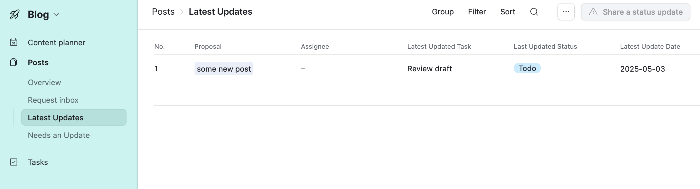
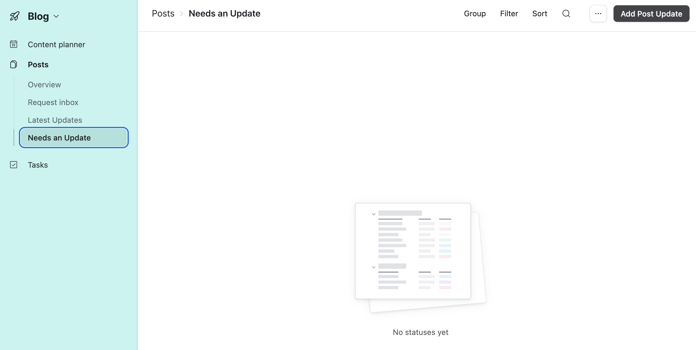
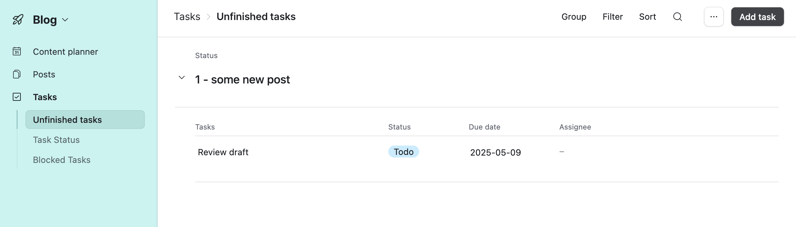
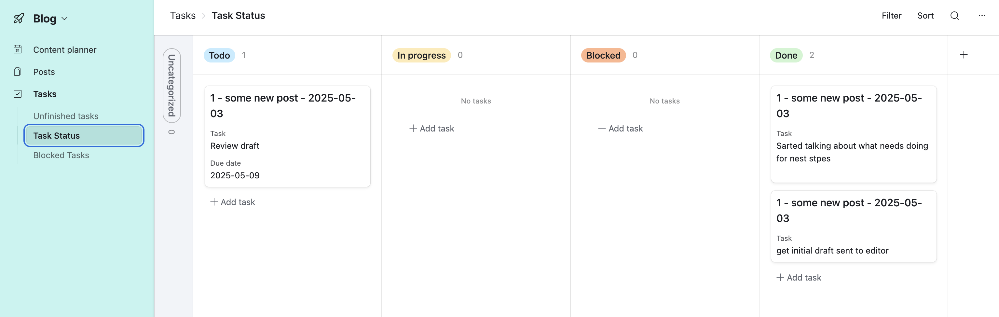
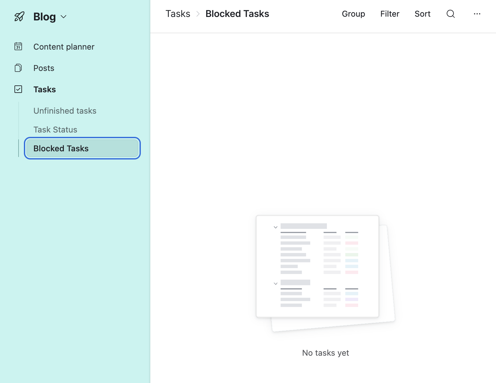

Working on the Blog Administration Team for R-Ladies consists of mainly two tasks:

- Serve as Editor for incoming blog posts
- Recruit possible Authors for contributing to the blog.

There has not been much work done on the blog, and we would like to change that.
This guide is a work in progress and is likely to change once we have a more team working towards making the blog more active.

Once clear working procedures are established, remember to also update [community guide regarding the blog](/comm/website/blog) to reflect the changes.

## Airtable

**Purpose:** This Airtable base is designed to help the R-Ladies blog administration team efficiently manage their workflow, from reviewing guest author proposals to publishing blog posts and tracking associated tasks.

**Intended Users:** The primary users of this base are the members of the R-Ladies blog administration team, including content reviewers, editors, and potentially social media managers.

### Interface

The blog teams [Airtable base](https://airtable.com/appUHSzConYaSxLZ5?) has an [interface](https://airtable.com/appUHSzConYaSxLZ5/pag9ADY1fkjkcvDQZ) intended to cover the tasks needed to perform editorial tasks for the blog.

In this interface you have 3 sections, with their subsequent pages to keep track of current, incoming and previous posts.

#### Content planner

The content planner has two pages to visualise blog content.
The Post Calendar is a calendar view where the `Due date` (expected publishing date) of a post is marked on the calendar.

The post timeline show the time from when the post was started on until its due time, in an attempt to show overlapping periods working towards several posts.

#### Posts

The Posts section is intended to give an overview of Posts in progress and their updates.

##### Overview

Provides a brief overview of the current in progress posts, and their latest status.
Clicking any row should take you into the specific post details.

##### Request inbox

All new requests come into the request inbox.
From here, you can click into any post proposal to review the details, and choose to accept or reject the proposal.

Accepting the proposal creates a record in the Post overview, so you can manage the post and its updates from now on.

Rejecting a post can be done by clicking the three `...` next to the Accept button, and choosing Reject.
Currently, nothing happens when a rejection is done, this procedure needs to be developed.

##### Latest updates

Shows all posts and what has been the latest updates for each post.
Intended to give a quick idea of most recent changes.

##### Needs an Update

Here all posts that have not had any updates for a while appear, to provide an easy place to see which posts need a follow up asap.

Clicking "Add post update" toggles the ability to add a task to a post.

#### Tasks

Is the place to view all individual tasks so far written down.
While the [Posts](#posts) section only shows the most recent updates for each post, this section may have several tasks per post.

Since each post is unique, having a curated set of tasks is not yet established, and as such, each task's details is denoted in the `Task` column.

##### Unfinished tasks

A simple overview of all unfinished tasks, grouped by post.

##### Task Status

A Kanban board of the current status of each task.
In this view, you can also easily add tasks, update them, and drag them to their correct status if this has changed.

##### Blocked Tasks

In this view you can easily see all tasks that are blocked for some reason.
These are highlighted, as they often require you to push for fixing from someone else (like the website or translation team, or even someone external like if crossposting from another community, maybe they are being hard to reach).

### Description of the base

**Key Workflows:**

- **Proposal Review:** Guest authors submit blog post ideas via a form, which populate the [Proposals table](#proposals). The team reviews these proposals and makes decisions on whether to accept or reject them.
- **Post Management:** Once a proposal is accepted, a corresponding record is created in the "Post Status" table. This table serves as the central hub for tracking the progress of each blog post.
- **Task Management:** The "Post Tasks" table lists all the individual tasks required to bring a blog post to publication. These tasks are linked to specific proposals and track their status and assignments.
- **Team Information:** The "Admins" table, synced from a global team overview base, provides information about the blog administration team members.
- **Automated Notifications and Processes:** Several automations help streamline the workflow, such as notifying the team of approaching deadlines and creating records for accepted proposals.


erDiagram
Proposals ||--o{ PostStatus : has_accepted_proposal
PostStatus ||--o{ PostTasks : has_many_tasks
PostStatus }|--|| Admins : assigned_to
PostTasks }|--|| Admins : assigned_to

    Proposals {
        Title text
        Description text
        Author text
        Received_Date datetime
        Post_date datetime
        Tags text
        GitHub_User text
        Email text
        pr text
        crosspost boolean
        crosspost_url text
        crosspost_allow boolean
        minority_gender text
        Proposal_Status text
        Status text
        Decision text
    }

    PostStatus {
        No int
        Proposal link
        Status text
        Assignee link
        Start_date date
        Due_date date
        Latest_update_date datetime
        Latest_updated_task text
        Last_updated_status text
        Identifier text
        Proposal_Updates link
    }

    PostTasks {
        Name text
        Status text
        Proposal_Status link
        Assignee link
        Task text
        Due_date date
        Last_Modified datetime
        Latest_Update_Date datetime
        Is_Latest boolean
        Created_Date datetime
    }

    Admins {
        Name text
        GitHub_handle text
        R_Ladies_email text
        email_zoom text
        organiser_slack text
        Activities text
    }



## Tables and Their Structure

### Proposals

- **Purpose:** Stores blog post ideas submitted by prospective guest authors via a form. It serves as the initial stage for reviewing and deciding on content.
- **Key Fields:**
  - **Title:** The title of the proposed blog post.
  - **Description:** A detailed explanation of the proposed blog post idea.
  - **Author:** The name of the guest author who submitted the proposal.
  - **Received Date:** The date when the proposal was submitted.
  - **Post date:** (Potentially) The desired or planned publication date for the post.
  - **Tags:** Keywords associated with the blog post topic.
  - **GitHub User:** The guest author's GitHub username.
  - **Email:** The guest author's email address.
  - **pr:** (Potentially) A link to a pull request or relevant document.
  - **crosspost:** Indicates if the post is intended for crossposting.
  - **crosspost_url:** The URL for crossposting.
  - **crosspost_allow:** Permission for crossposting.
  - **minority_gender:** Information about the author's gender identity (for inclusivity tracking).
  - **Proposal Status:** Linked record field to the [Post Status table](#post-status).
  - **Status:** Lookup field from [Post Status table](#post-status) on the general status of the post.
  - **Decision:** The final decision on the proposal (e.g., "New", "Accept," "Reject").
- **Relationships to Other Tables:** Linked to the [Post Status table](#post-status).

### Post Status

- **Purpose:** Tracks the overall status and recent activity of accepted blog post proposals as they move through the publication process. It acts as a central hub linking to other relevant information.
- **Key Fields:**
  - **Identifier:** A unique name for the record, combining `No.` and `Proposal`.
  - **No.** A unique identifier for each blog post.
  - **Proposal:** A linked record to the original proposal in the [Proposals table](#proposals).
  - **Status:** The overall current status of the blog post (e.g., "Planning," "In progress," "Ready for review," "Published").
  - **Assignee:** The blog team member currently responsible for the post. Linked to the [Admin table](#admins).
  - **Start date:** The date when work on the post officially began.
  - **Due date:** The target completion or publication date for the post.
  - **Latest update date:** The date of the most recent activity or change related to the post (Rollup of the max date of all modified dates regarding this Post in the [Post Tasks table](#post-tasks)).
  - **Latest updated task:** A brief description of the most recently updated task [Post Tasks table](#post-tasks).
  - **Last updated status:** The status of the post at the time of the latest update from [Post Tasks table](#post-tasks).
  - **Proposal Updates:** A linked record field to the [Post Tasks table](#post-tasks) (generally hidden).
- **Relationships to Other Tables:** Linked to [Proposals table](#proposals) and [Post Tasks table](#post-tasks), and implicitly related to [Admin table](#admins) through the `Assignee` field.

### Post Tasks

- **Purpose:** Lists all the individual tasks required for each blog post, allowing for detailed tracking of progress and assignments.
- **Key Fields:**
  - **Name:** A unique identifier for each task record.
  - **Status:** The current status of the individual task (e.g., "Todo," "In progress," "Done").
  - **Proposal Status:** A linked record to the corresponding entry in the [Post Status table](#post-status), indicating the overall post status.
  - **Assignee:** The blog team member responsible for completing this task, loookup from [Post Status table](#post-status).
  - **Task:** A description of the action required for this task (e.g., "Review draft," "Edit for grammar," "Schedule social media"). This is a freetext field, any task description goes here.
  - **Due date:** The deadline for completing this specific task.
  - **Last Modified:** The date and time when this task record was last updated.
  - **Latest Update Date:** The date of the latest update related to this task.
  - **Is Latest?** A boolean value indicating if this task was the most recently updated task for its associated proposal, calculated by a formula.
  - **Created Date:** The date when this task record was created.
- **Relationships to Other Tables:** Linked to the [Post Status table](#post-status).

### Admins

- **Purpose:** Contains information about the R-Ladies blog administration team members, _synced from a "Global Team Overview" base_.
- **Key Fields:**
  - **Name:** The full name of the blog team member.
  - **GitHub handle:** Their GitHub username.
  - **R-Ladies email:** Their dedicated R-Ladies email address.
  - **email_zoom:** Their email address used for Zoom communication.
  - **organiser_slack:** Their username or ID on the R-Ladies organizers' Slack workspace.
  - **Activities:** (Potentially links to or tracks specific roles or responsibilities within the blog administration).
- **Relationships to Other Tables:** Implicitly related to [Post Status table](#post-status) and [Post Tasks table](#post-tasks) through the `Assignee` fields, but the data originates from an external base.

## Automations

1.  **Start date is within the next 3 days**

    - **Trigger:** When a record matches conditions in the "Post Status" table where the "Due date" is within the next 3 days.
    - **Actions:** Sends a Slack message to the `#team-blog` channel notifying them about the approaching publication date and asking about any outstanding tasks.
    - **Status:** ON

2.  **Copy approved project**

    - **Trigger:** When a record enters the "Accepted" view in the [Proposals table](#proposals).
    - **Actions:**
      - Finds records in the [Post Status table](#post-status) that are linked to the triggering proposal.
      - If no such record exists, it creates a new record in the [Post Status table](#post-status), linking it to the accepted proposal. (Further field population details are not currently documented).
    - **Status:** ON

3.  **New request**

    - **Trigger:** When a new record is created in the [Proposals table](#proposals) (i.e., a new proposal is submitted).
    - **Actions:**
      - Sends a Slack message to the `#team-blog` channel to notify the team about the new submission. (Message content not fully documented).
      - If the "Email" field in the new proposal is not empty, sends a confirmation email to the guest author. (Email content not documented).
    - **Status:** ON

4.  **Request reminder**

    - **Trigger:** When a record matches conditions in the [Proposals table](#proposals) where the "Received Date" is before one week ago AND the "Decision" is still "Awaiting Decision."
    - **Actions:** Sends a Slack message (content partially visible as "Send reminder that a Proposal is wait...") to remind the team about the pending proposal.
    - **Status:** OFF

5.  **Task update**
    - **Status:** OFF (Work in Progress)
