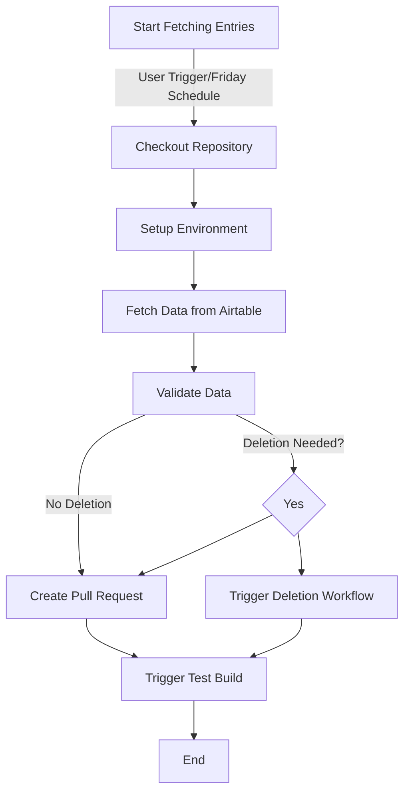
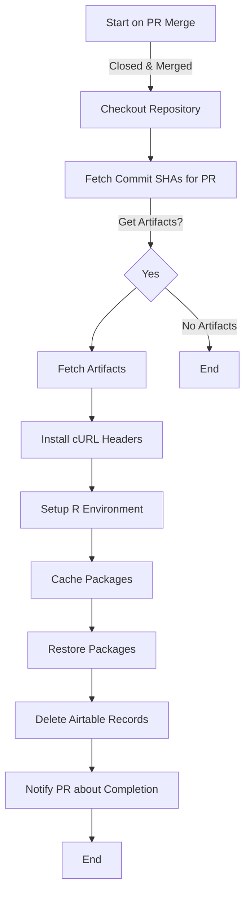
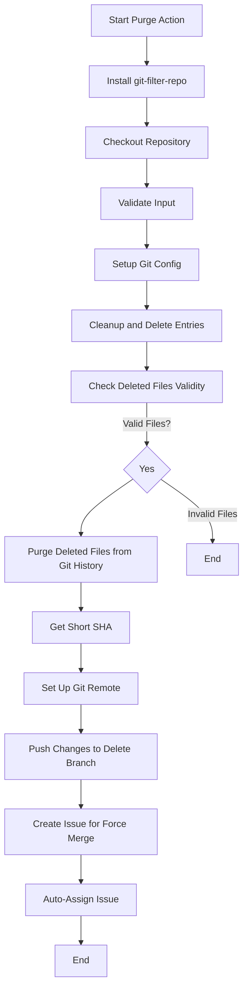
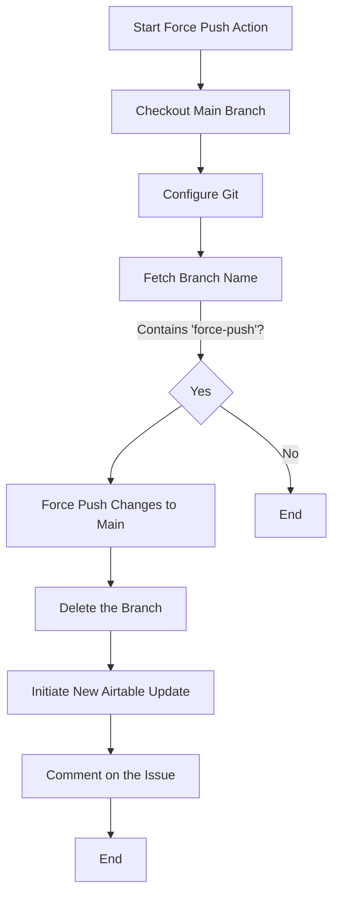
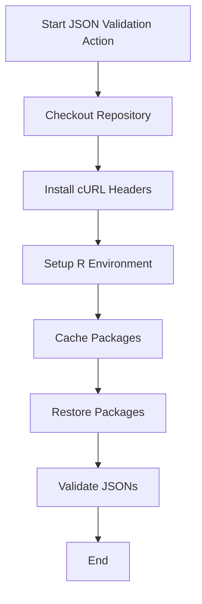

## GitHub Action: Fetch Entries from Airtable

This GitHub Action is designed to automate the process of fetching entries from Airtable and updating the directory in our repository. 

Here’s a simple breakdown of what this action does:

1. **Triggering**: This action can be triggered manually or it runs automatically every Friday at midnight.

2. **Checkout**: The action checks out the repository to the latest commit.

3. **Setup Environment**: It installs necessary packages for making HTTP requests and sets up the R environment for processing data.

4. **Data Fetching**: Using an API key, the action retrieves data from Airtable and conditions it for next steps.

5. **Data Validation**: The fetched data is validated to ensure it's in the correct format.

6. **Record Deletion**: If any entries need to be deleted, a secondary workflow is triggered to handle the deletions.

7. **Pull Requests**: If no deletions are required, the action creates a new pull request to review the new or updated entries.

8. **Test Build**: After the pull request is created, it triggers a test build to ensure everything is functioning correctly.

## Overview Flowchart

Here's a visual representation of the action's workflow using Mermaid syntax:

### Conclusion

This GitHub Action streamlines the process of keeping our directory up-to-date with the latest information from Airtable while ensuring data integrity through validation and review workflows. 

By automating this process, we save time and reduce the potential for errors during manual updates.

## Delete Merged Entries from Airtable

This GitHub Action automates the deletion of records from Airtable when a Pull Request (PR) labeled as both "update" and "automated" is merged.

Here’s a simplified breakdown of the action:

1. **Triggering**: The action is automatically triggered when a pull request is closed and merged, given that it contains specific labels.

2. **Checkout**: The first step is to check out the repository to access the latest commit.

3. **Fetch Artifact Information**: The action fetches the artifacts associated with the merged PR, specifically looking for artifacts that match the naming pattern for records from that PR.

4. **Download Artifacts**: If any matching artifacts are found, they are downloaded for further processing.

5. **Setup Environment**: It installs necessary packages and sets up the R environment to ensure all required dependencies are available.

6. **Delete Records**: The action runs a script to delete the fetched records from Airtable using the stored API key.

7. **Notify Completion**: Finally, the action comments on the merged PR to notify users that the records have been successfully deleted.

### Overview Flowchart

Here's a visual representation of the action's workflow using Mermaid syntax:

### Conclusion

This GitHub Action simplifies the management of Airtable records by automatically deleting entries linked to merged PRs that are tagged as updates. 

By automating this process, we reduce the risk of human error and streamline the workflow for managing data updates in Airtable.

## Purge Entries from History

This GitHub Action is designed to permanently delete specified entries from the repository and purge them from Git history. 
This is particularly useful for removing sensitive data or unnecessary files.

Here’s a straightforward breakdown of what this action does:

1. **Triggering**: The action is manually triggered via the GitHub Actions workflow dispatch feature. It requires a comma-separated list of filenames that should be deleted.

2. **Install Dependencies**: The action begins by installing the `git-filter-repo` tool, which is necessary for purging files from the Git history.

3. **Checkout Repository**: It checks out the repository's main branch to work with the latest changes.

4. **Input Validation**: Validates that the required input (the list of entries to delete) has been provided.

5. **Setup Git Configuration**: Configures Git to use a generic identity for committing changes made during the action.

6. **Cleanup and Delete Entries**: Reads the provided filenames, deletes the corresponding files from the repository, and keeps track of what files were deleted.

7. **Check Deleted Files Validity**: Validates that only `.json` and image files are deleted, raising an error if any invalid files are included.

8. **Purge Deleted Files from Git History**: Uses `git filter-repo` to permanently remove the deleted files from the repository's history.

9. **Get Short SHA**: Retrieves the short SHA of the current commit for reference.

10. **Set Up Git Remote**: Configures the remote repository for pushing changes.

11. **Push Changes to New Branch**: Creates a new branch to prepare for the deletion pull request.

12. **Create PR for Force Merge**: Generates an issue that alerts team members regarding the changes that need to be reviewed before merging.

13. **Auto-Assign Issue**: Automatically assigns the issue to a random member of the team for review.

### Overview Flowchart

Here's a visual representation of the action's workflow using Mermaid syntax:

### Conclusion

This GitHub Action effectively manages the deletion of entries from a repository while ensuring that sensitive information is also purged from Git history. 

By streamlining this process, we mitigate the risk of unintentionally exposing private data and maintain a clean and secure codebase.

## Force Push Purged Entries into Main

This GitHub Action facilitates the forceful pushing of purged entries back into the main branch of the repository. 
This action is triggered when an issue related to a delete request is closed.

Here’s a clear overview of what this action accomplishes:

1. **Triggering**: The action is activated when an issue is closed, specifically those labeled with "delete-request" and titled "Force Push Required."

2. **Checkout Main Branch**: The action begins with checking out the main branch of the repository to prepare for the updates.

3. **Configure Git**: It sets up the Git user configuration to allow committing changes.

4. **Fetch Branch Name**: Extracts the branch name that is to be force-pushed to the main branch from the issue body.

5. **Force Push Changes**: If the issue has the label "force-push," it forcefully pushes the changes from the specified branch back into the main branch.

6. **Delete the Branch**: After the successful force push, the temporary branch used for purging is deleted from the remote repository.

7. **Initiate Airtable Update**: If applicable, it triggers the Airtable update workflow to refresh the entries after the force push.

8. **Comment on the Issue**: Finally, it posts a comment on the closed issue to inform the team about the successful execution of the force push and, if applicable, the initiation of a new update from Airtable.

### Overview Flowchart

Here’s a visual representation of the action's workflow using Mermaid syntax:

### Conclusion

This GitHub Action significantly simplifies the process of merging changes that involve purging entries from history into the main branch. 

By automating the force push and related tasks, we enhance the efficiency of our workflows while maintaining a clean repository.

## Validate Directory JSONs

This GitHub Action is designed to validate JSON files in the directory whenever changes are made. It ensures that the JSON files maintain their integrity and are formatted correctly.

Here's a straightforward overview of what this action does:

1. **Triggering**: The action can be manually triggered or it runs automatically on pushes and pull requests that include changes to any `.json` files in the repository.

2. **Concurrency Control**: The action prevents concurrent runs for the same workflow and ref, cancelling any in-progress runs when a new one is triggered.

3. **Checkout**: The action begins by checking out the repository to access the latest commit.

4. **Install Dependencies**: It installs necessary packages, specifically the `libcurl4-openssl-dev`, which may be required for HTTP requests.

5. **Setup R Environment**: The action sets up the R environment to facilitate the execution of R scripts.

6. **Cache Packages**: It caches installed R packages to speed up subsequent workflow runs.

7. **Restore Packages**: The action ensures that all required R packages are installed, using `renv` for package management.

8. **Validate JSONs**: Finally, it runs a specified R script to validate the JSON files in the directory.

### Overview Flowchart

Here's a visual representation of the action's workflow using Mermaid syntax:

### Conclusion

This GitHub Action provides an automated mechanism to ensure the correctness of JSON files within the repository. 

By validating these files upon any changes, we help maintain data integrity and prevent errors that could arise from improperly formatted JSON entries.
