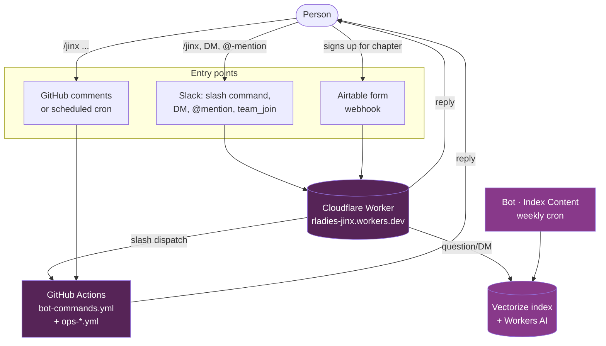

Someone opens a pull request in the directory repo.
Within seconds, a website preview build kicks off in `rladies.github.io`, a comment appears on the PR with a link to follow the build, and the contributor sees a friendly note welcoming them.
Someone in Slack DMs Jinx asking how to start a chapter, and a few seconds later they get an answer with a link straight to the relevant guide page.
None of that needed a person.
It needed Jinx.

Jinx is the RLadies+ organization's GitHub App _and_ Slack bot.
Think of it as a small bot account that lives in the org and lends its identity to our automations.
When a workflow needs to comment on a pull request, kick off a build in another repository, or invite a new contributor to a team, it asks Jinx for a short-lived token and acts on Jinx's behalf.
When someone DMs Jinx in Slack, it searches across the RLadies+ guide, website, and other indexed sources and replies with a grounded answer.
The bot is the familiar -- the little creature that does the errands so the witches don't have to.

## Why we use a bot instead of personal tokens

For a long time RLadies+ workflows ran on personal access tokens.
That worked, but it had two annoying properties.
First, those tokens belong to one person.
When the person leaves, takes a long break, or simply forgets to rotate, the tokens expire and a workflow somewhere goes quiet -- usually at the worst possible moment.
Second, personal tokens tend to drift toward broad scopes: it is easier to grant "all my repos" than to scope down per-workflow, and what starts as a quick fix becomes a key with far more reach than it needs.

A GitHub App fixes both.
Jinx has no human owner.
The credentials live as org-level secrets, not in any individual's account.
Each workflow run mints a token that expires in an hour and is scoped to the specific repos that workflow needs to touch.
Nothing long-lived sits around waiting to leak.

## Three ways to talk to Jinx

- **Slash commands on GitHub.** Comment on any issue or PR with `/jinx ...` and Jinx runs the command and replies in the thread.
- **Slash commands on Slack.** Type `/jinx ...` in any channel or DM in the RLadies+ workspaces. A Cloudflare Worker takes the request, sends a friendly ack, and either handles it itself or dispatches to GitHub.
- **Just ask a question.** DM Jinx, `@`-mention them, or open the Slack Assistant panel. Jinx searches an index of RLadies+ content and replies with a grounded answer plus citations.

For the full picture, see the pages below.

## Architectural overview

Three entry points feed into Jinx today: GitHub events, Slack events, and an Airtable webhook (for the chapter-signup invite flow).
The Cloudflare Worker is the front door for everything Slack-related.

The pages in this section walk through each path:

- **[Commands]()** — the full reference of what `/jinx` can do.
- **[Slash commands]()** — how `/jinx ...` actually flows through GitHub Actions and the Cloudflare Worker.
- **[Asking Jinx a question]()** — the DM / Assistant / @-mention path, backed by retrieval-augmented generation.
- **[Content indexer]()** — how the RAG knowledge base is built and refreshed weekly.
- **[Airtable invite webhook]()** — how chapter sign-ups become Slack invites.
- **[For developers]()** — adding Jinx to a workflow, permissions, secrets, CI checks.
- **[Troubleshooting]()** — failure modes that have actually happened.

## Where the code runs

Jinx is not a single app -- it is four kinds of code, each running in a different place.
Knowing which runtime owns what makes debugging much faster: a slow `/jinx report weekly` means look in GitHub Actions, a Slack DM that 500s means tail the worker, a stale answer means re-run the indexer.

| Code                     | Where it lives in `rladies/jinx`                                                                               | Language      | Runs in                                                                     |
| ------------------------ | -------------------------------------------------------------------------------------------------------------- | ------------- | --------------------------------------------------------------------------- |
| **R package**            | [`R/`](https://github.com/rladies/jinx/tree/main/R), [`inst/`](https://github.com/rladies/jinx/tree/main/inst) | R             | GitHub Actions, inside the `ghcr.io/rladies/jinx-bot` container             |
| **Cloudflare Worker**    | [`worker/src/`](https://github.com/rladies/jinx/tree/main/worker/src)                                          | JavaScript    | Cloudflare Workers (edge)                                                   |
| **Content indexer**      | [`indexer/`](https://github.com/rladies/jinx/tree/main/indexer)                                                | Node.js       | GitHub Actions, plain Ubuntu runner                                         |
| **Workflow definitions** | [`.github/workflows/`](https://github.com/rladies/jinx/tree/main/.github/workflows)                            | YAML          | GitHub Actions                                                              |
| **Container image**      | [`Dockerfile`](https://github.com/rladies/jinx/blob/main/Dockerfile)                                           | (built image) | Published to GHCR; pulled by `bot-commands.yml` and ops workflows           |
| **Vector DB & LLM**      | (Cloudflare-hosted, not in repo)                                                                               | --            | Cloudflare Vectorize index `rladies-content` + Workers AI (BGE + Llama-3.1) |

For each user-facing flow, the runtime trail looks like this:

| Flow                                                                     | Triggered by        | Code path                                                                  | Runs in                      |
| ------------------------------------------------------------------------ | ------------------- | -------------------------------------------------------------------------- | ---------------------------- |
| `/jinx ...` on GitHub                                                    | issue_comment       | `bot-commands.yml` → R `cmd_execute()`                                     | GHA + container              |
| `/jinx ...` on Slack (most commands)                                     | Slack slash command | Worker `slash-command.js` → `repository_dispatch` → `bot-commands.yml` → R | Worker + GHA + container     |
| `/jinx setup-channel`, `/jinx pair`, `/jinx remind-me`, `/jinx feedback` | Slack slash command | Worker `slash-local.js` → Slack Web API                                    | Worker only                  |
| DM / @-mention / Assistant Q&A                                           | Slack event         | Worker `slack-events.js` → `rag.js` → Vectorize + Workers AI               | Worker + Cloudflare services |
| Welcome on Slack join                                                    | `team_join` event   | Worker `slack-events.js`                                                   | Worker only                  |
| Airtable invite webhook                                                  | Airtable form POST  | Worker `airtable-invite.js` → Slack Web API                                | Worker only                  |
| Content indexing                                                         | weekly cron         | `bot-index-content.yml` → `indexer/index.mjs` → Vectorize upsert           | GHA + Cloudflare Vectorize   |
| Scheduled reports / sync                                                 | cron                | `ops-*.yml` → R package                                                    | GHA + container              |
| Worker auto-deploy                                                       | push to `worker/**` | `infra-deploy-worker.yml` → `wrangler deploy`                              | GHA → Cloudflare             |

Each technical sub-page below opens with a one-line "Runs in:" reminder so you know which runtime you are reading about.

## Where Jinx runs today

Jinx is installed across the RLadies+ GitHub org.
Every automated comment, PR, issue, and commit across these repos shows up as `Jinx[bot]`.

- [**rladies/jinx**](https://github.com/rladies/jinx) -- the app's home, command workflows, scheduled jobs, Cloudflare Worker code, the content indexer
- [**rladies/global-team**](https://github.com/rladies/global-team) -- onboarding, offboarding, stale-issue reminders, status reports
- [**rladies/rladies.github.io**](https://github.com/rladies/rladies.github.io) -- preview builds, blog lint, JSON validation, Lighthouse audits, contributor welcomes, merge automation
- [**rladies/directory**](https://github.com/rladies/directory) -- Airtable sync, preview-build dispatch, purge workflows, outreach
- [**rladies/awesome-rladies-creations**](https://github.com/rladies/awesome-rladies-creations) -- content/package issue automation, URL checks, Slack RSS feed
- [**rladies/meetupr**](https://github.com/rladies/meetupr) -- README rendering
- [**rladies/rladiesguide**](https://github.com/rladies/rladiesguide) -- contributor greetings, acknowledgements, quarterly releases

If you maintain a repo not on this list and find yourself reaching for a personal access token, that is a good signal to use Jinx instead.

## A note on the name

The bot account is `jinx-familiar` -- Jinx the app, familiar the role.
Familiars carry messages, fetch ingredients, and generally handle the small magic so the witches can focus on the big magic.
That is roughly what we want the bot to do for us, too.
