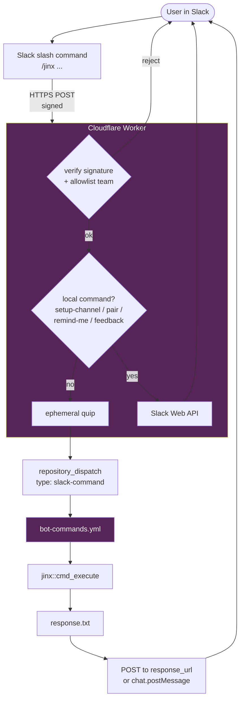
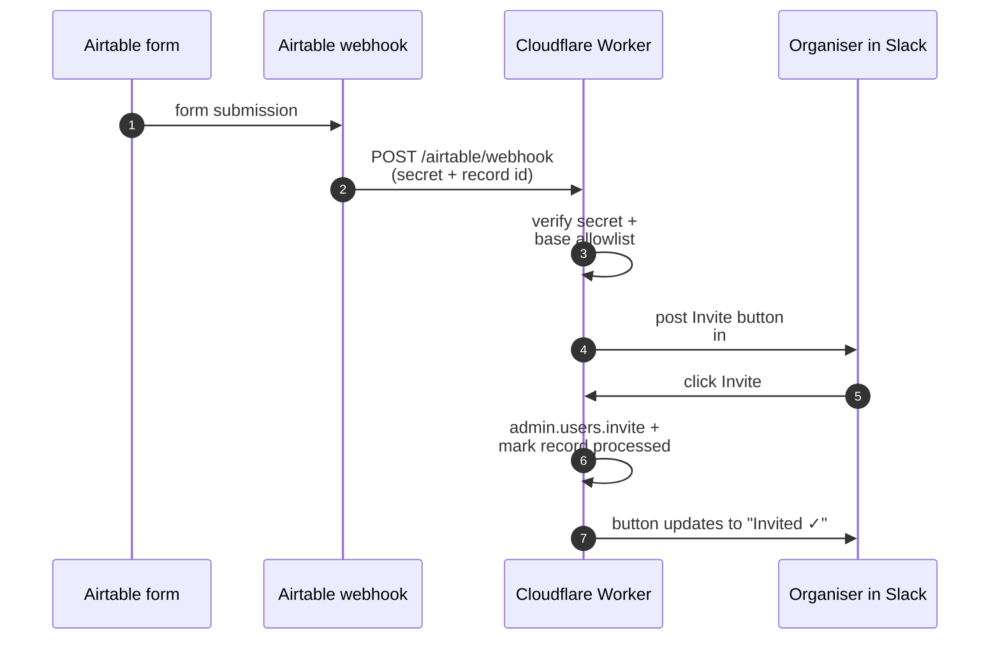

Someone opens a pull request in the directory repo.
Within seconds, a website preview build kicks off in `rladies.github.io`, a comment appears on the PR with a link to follow the build, and the contributor sees a friendly note welcoming them.
Someone in Slack DMs Jinx asking how to start a chapter, and a few seconds later they get an answer with a link straight to the relevant guide page.
None of that needed a person.
It needed Jinx.

Jinx is the RLadies+ organization's GitHub App _and_ Slack bot.
Think of it as a small bot account that lives in the org and lends its identity to our automations.
When a workflow needs to comment on a pull request, kick off a build in another repository, or invite a new contributor to a team, it asks Jinx for a short-lived token and acts on Jinx's behalf.
When someone DMs Jinx in Slack, it searches across the RLadies+ guide, website, and other indexed sources and replies with a grounded answer.
The bot is the familiar -- the little creature that does the errands so the witches don't have to.

## Why we use a bot instead of personal tokens

For a long time RLadies+ workflows ran on personal access tokens.
That worked, but it had two annoying properties.
First, those tokens belong to one person.
When the person leaves, takes a long break, or simply forgets to rotate, the tokens expire and a workflow somewhere goes quiet -- usually at the worst possible moment.
Second, personal tokens tend to drift toward broad scopes: it is easier to grant "all my repos" than to scope down per-workflow, and what starts as a quick fix becomes a key with far more reach than it needs.

A GitHub App fixes both.
Jinx has no human owner.
The credentials live as org-level secrets, not in any individual's account.
Each workflow run mints a token that expires in an hour and is scoped to the specific repos that workflow needs to touch.
Nothing long-lived sits around waiting to leak.

## Three ways to talk to Jinx

### Slash commands on GitHub

In any repo where Jinx is installed, you can leave a comment on an issue or pull request that starts with `/jinx`.
The bot reads the comment, runs the matching command, and replies inline.

### Slash commands on Slack

Jinx also lives in the RLadies+ organiser and community Slack workspaces.
Type `/jinx` followed by a command in any channel, DM, or conversation with the Jinx app.
A Cloudflare Worker receives the request, sends a friendly acknowledgement so you are not left waiting, and either handles the command itself (for Slack-only commands like `/jinx pair`) or dispatches it to GitHub Actions.
When the command finishes, Jinx posts the result back to Slack.

### Asking Jinx a question

You can DM Jinx, `@`-mention them in a channel, or open the Slack Assistant panel and just _ask a question_ -- no slash command required.
Jinx searches a Cloudflare Vectorize index of the RLadies+ guide, the main website, the jinx docs, R package documentation across the org, the meetup archive, the awesome-rladies-creations directory, and our YouTube channel, and replies with an answer plus links to the sources it used.
React to the answer with 👍 / 👎 / ❤️ and we collect that signal to track which answers are useful.

The same `/jinx` commands work on GitHub and Slack.
The difference is where the response goes -- a GitHub issue comment or a Slack message.

## Architectural overview

Three entry points feed into Jinx today: GitHub events, Slack events, and an Airtable webhook (for the chapter-signup invite flow).
The Cloudflare Worker is the front door for everything Slack-related.


The next few sections walk through each path.

## Commands

Here is what Jinx knows how to do today.

### Information (replies with content)

| Command                                     | What it does                                                |
| ------------------------------------------- | ----------------------------------------------------------- |
| `/jinx help`                                | Show all available commands                                 |
| `/jinx report weekly`                       | Org-wide activity summary (commits, PRs, issues)            |
| `/jinx report monthly`                      | Same, for the past 30 days                                  |
| `/jinx report chapters`                     | Chapter health: active vs inactive, months since last event |
| `/jinx gha-dashboard`                       | GitHub Actions CI status across all repos                   |
| `/jinx analytics`                           | Org-wide contributor and commit trends                      |
| `/jinx generate website analytics [period]` | Plausible website stats (7d/30d/month/6mo/12mo)             |
| `/jinx contributors [repo]`                 | Contributor list for a repo                                 |
| `/jinx contributors org`                    | Top contributors org-wide                                   |
| `/jinx events <chapter>`                    | Recent events for a chapter                                 |
| `/jinx cfp list`                            | Open calls for proposals                                    |
| `/jinx translate status`                    | Translation coverage across languages                       |
| `/jinx translate validate [lang]`           | Check translation placeholders                              |
| `/jinx chapter-health`                      | Check chapter activity health                               |
| `/jinx validate-directory`                  | Validate directory entries in a PR                          |
| `/jinx blog-check-links`                    | Check all blog URLs for broken links                        |

These commands return the information directly.
No GitHub issues are created.

### Actions (does something, replies with a link)

| Command                                 | What it does                                                  |
| --------------------------------------- | ------------------------------------------------------------- |
| `/jinx invite @user to <team>`          | Invite a user to the org and a team, creates onboarding issue |
| `/jinx offboard @user from <team>`      | Start offboarding, creates tracking issue                     |
| `/jinx chapter-setup <city> <country>`  | Create a chapter setup checklist issue                        |
| `/jinx chapter-update <city> <country>` | Create a chapter update issue                                 |
| `/jinx blog-add <url>`                  | Auto-create a blog entry from a URL                           |
| `/jinx cfp add <conf> <deadline> <url>` | Track a new call for proposals                                |
| `/jinx cfp recommend <conf> @speaker`   | Recommend a speaker for a conference                          |
| `/jinx contributors update [repo]`      | Update the contributors list via PR                           |
| `/jinx events sync`                     | Sync and publish the chapter event summary                    |
| `/jinx announce <post-url>`             | Announce a blog post on social media                          |
| `/jinx remind stale`                    | Nudge stale onboarding/offboarding issues, report links       |
| `/jinx slack-invite <email>`            | Post a Slack invite request for an organiser to action        |

### Slack-only commands (handled in the worker, no GitHub dispatch)

| Command                            | What it does                                                        |
| ---------------------------------- | ------------------------------------------------------------------- |
| `/jinx setup-channel`              | Pin the standard RLadies+ resource bookmarks in the current channel |
| `/jinx pair @alice @bob [message]` | Open a group DM with mentioned users (up to 7)                      |
| `/jinx remind-me <when> \| <what>` | Set a personal Slack reminder for yourself                          |
| `/jinx feedback [days]`            | Show reaction signal on Jinx's recent answers                       |

These four commands never leave the Cloudflare Worker -- they hit the Slack Web API directly, so they reply in seconds.

The canonical command list is always at [`/jinx help`](https://github.com/rladies/jinx/blob/main/inst/commands/help.md).

## How GitHub slash commands work

A `/jinx ...` comment on an issue or PR fires the `bot-commands.yml` workflow.
The workflow runs inside a prebuilt container image (`ghcr.io/rladies/jinx-bot:latest`) so R and the package are ready to go without a per-run setup, mints a Jinx installation token, runs `jinx::cmd_execute()`, and posts the result back as an `actions/github-script` comment on the originating thread.

```mermaid
sequenceDiagram
    autonumber
    participant U as Person
    participant GH as GitHub issue/PR
    participant W as bot-commands.yml
    participant R as jinx R package
    U->>GH: /jinx report weekly
    GH-->>W: issue_comment event
    W->>W: mint app installation token
    W->>R: cmd_parse() &rarr; cmd_execute()
    R-->>W: result string
    W->>GH: post comment as Jinx[bot]
    GH-->>U: comment appears in thread
```

## How Slack slash commands work

The Slack integration has three pieces.

**1. The Slack apps.** Jinx is installed in both RLadies+ Slack workspaces -- organisers and community.
Each one provides the `/jinx` slash command and the bot identity for posting messages.
Workspace-specific behaviour (welcome message, allowed commands) is driven by config in `inst/config/` and templates in `inst/templates/`.

**2. The Cloudflare Worker.** A small JavaScript function at `rladies-jinx.workers.dev` receives slash commands.
It verifies the Slack request signature, checks the workspace is on the allowlist, immediately responds with a friendly quip so the user is not left waiting, and either handles the command itself or dispatches it to GitHub.
`/jinx help`, `/jinx setup-channel`, `/jinx pair`, `/jinx remind-me`, and `/jinx feedback` are handled entirely in the worker (no GitHub Actions involved).
Everything else is forwarded to GitHub Actions via `repository_dispatch`.
The worker mints its own Jinx GitHub App installation token -- no personal access tokens involved.

**3. The GitHub Actions workflow.** The single `bot-commands.yml` workflow in the `rladies/jinx` repo handles both GitHub issue comments and Slack dispatches.
It runs the command through the jinx R package, captures the result as a string, and routes it to the right destination -- a GitHub issue comment or a Slack message via `response_url`.



If anything fails along the way, Jinx always responds -- either with a helpful error message or a link to the workflow logs.
Sensitive data (Slack channel IDs, response URLs, usernames, the raw command) is masked in the CI logs.

## Asking Jinx a question (DM / Assistant / @mention)

When you DM Jinx, mention them in a channel, or use the Slack Assistant panel, your message is treated as a question -- not a slash command.
The worker embeds the question, queries a Cloudflare Vectorize index of RLadies+ content, reranks the top matches (the reranker boosts the canonical guide and main website, gently down-weights older or maintainer-only pages, and clamps future-dated content like upcoming events to the top), and asks a Workers AI model to write a short answer using only the retrieved sources.
Coding questions ("debug this regex") are politely declined with a pointer to `#help-r`.

```mermaid
sequenceDiagram
    autonumber
    participant U as Person
    participant S as Slack
    participant W as Cloudflare Worker
    participant E as Workers AI<br>(BGE embeddings)
    participant V as Vectorize<br>(rladies-content)
    participant L as Workers AI<br>(Llama-3.1)
    U->>S: DM / @-mention / Assistant message
    S->>W: event_callback
    W->>W: intent check<br>(coding? &rarr; decline)
    W->>E: embed(question)
    E-->>W: vector
    W->>V: top-k similarity search
    V-->>W: candidate chunks + metadata
    W->>W: rerank<br>(source weight × recency × staleness × audience)
    W->>L: prompt + top 5 chunks
    L-->>W: grounded answer
    W->>W: repair links<br>(strip URLs not in sources)
    W->>S: chat.postMessage with citations
    S-->>U: answer + 👍/👎/❤️ reactions
```

Two more things happen automatically in Slack:

- **Welcome on join.** When a person joins either workspace, Jinx DMs them with a workspace-specific welcome message rendered from a markdown template in `inst/templates/`. If the new member's email matches a pending chapter sign-up coming in from Airtable, the welcome notes that we matched them up.
- **Assistant panel suggestions.** Opening the Jinx Assistant in Slack triggers a `assistant_thread_started` event; the worker sets the thread title and four suggested prompts, all driven by `inst/config/assistant-prompts.json`.

## The content indexer

A separate weekly workflow (`bot-index-content.yml`, every Sunday 04:00 UTC) walks a set of sources, chunks them, embeds each chunk with the BGE model, and upserts the vectors into the `rladies-content` Vectorize index.
The same index is queried at retrieval time from the worker.

```mermaid
flowchart LR
    subgraph Sources
      G[rladiesguide<br>hugo-site]
      W[rladies.github.io<br>hugo-site]
      O[rladies GitHub org<br>READMEs]
      P[pkgdown llms.txt<br>across org R packages]
      J[jinx-docs<br>help.md, NEWS, PRIVACY]
      M[meetup_archive<br>events.json]
      A[awesome-rladies-creations<br>packages + content]
      Y[RLadies+ YouTube channel<br>via Data API v3]
    end

    Sources --> Chunk[chunk into ~1.8k-char<br>sections with title,<br>heading, url, date, lastmod]
    Chunk --> Embed[Workers AI<br>BGE-base embedding]
    Embed --> Upsert[upsert to Vectorize<br>rladies-content]

    Upsert -. queried at runtime .-> Q[(DM / Assistant /<br>@-mention answers)]

    style Chunk fill:#88398A,color:#fff
    style Embed fill:#88398A,color:#fff
    style Upsert fill:#88398A,color:#fff
```



The reranker treats `lastmod` (last-modified date pulled from Hugo's `article:modified_time` meta tag) as a tiebreaker: pages maintained recently win narrow contests over pages that have not been touched in years.
Upcoming events (active events from `meetup_archive`) clamp to the recency ceiling, so "what events are coming up?" surfaces them above year-old past meetups.

## The Airtable invite webhook

When someone fills the RLadies+ chapter sign-up form (an Airtable form), Airtable POSTs a webhook to the worker.
The worker validates the request against a shared secret, checks the source base is on a per-token allowlist, and posts an actionable message in `#new-invitee` with an **Invite** button.
An organiser clicks the button, the worker invites the email to the community Slack workspace, and updates the Airtable record so it does not re-fire.



## Where Jinx runs today

Jinx is installed across the RLadies+ GitHub org.
Every automated comment, PR, issue, and commit across these repos shows up as `Jinx[bot]`.

- [**rladies/jinx**](https://github.com/rladies/jinx) -- the app's home, command workflows, scheduled jobs, Cloudflare Worker code, the content indexer
- [**rladies/global-team**](https://github.com/rladies/global-team) -- onboarding, offboarding, stale-issue reminders, status reports
- [**rladies/rladies.github.io**](https://github.com/rladies/rladies.github.io) -- preview builds, blog lint, JSON validation, Lighthouse audits, contributor welcomes, merge automation
- [**rladies/directory**](https://github.com/rladies/directory) -- Airtable sync, preview-build dispatch, purge workflows, outreach
- [**rladies/awesome-rladies-creations**](https://github.com/rladies/awesome-rladies-creations) -- content/package issue automation, URL checks, Slack RSS feed
- [**rladies/meetupr**](https://github.com/rladies/meetupr) -- README rendering
- [**rladies/rladiesguide**](https://github.com/rladies/rladiesguide) -- contributor greetings, acknowledgements, quarterly releases

If you maintain a repo not on this list and find yourself reaching for a personal access token, that is a good signal to use Jinx instead.

## Under the hood

A workflow that wants to act as Jinx follows a three-step pattern.

First, it mints an installation token:

```yaml
- name: Generate app token
  id: app-token
  uses: actions/create-github-app-token@v3
  with:
    client-id: ${{ secrets.JINX_APP_ID }}
    private-key: ${{ secrets.JINX_PRIVATE_KEY }}
    owner: rladies
```

Second, it uses the token wherever it would otherwise have used `GITHUB_TOKEN` or a personal access token:

```yaml
- name: Comment on the PR
  env:
    GH_TOKEN: ${{ steps.app-token.outputs.token }}
  run: gh pr comment ${{ github.event.pull_request.number }} --body "Hi from Jinx"
```

Third, for actions that create visible bot activity (comments, commits, PRs), use the token so it shows as `Jinx[bot]`:

```yaml
- name: Post checklist
  uses: actions/github-script@v9
  with:
    github-token: ${{ steps.app-token.outputs.token }}
    script: |
      await github.rest.issues.createComment({ ... })
```

For git commits, use the Jinx identity:

```yaml
git config user.name "Jinx[bot]"
git config user.email "jinx@rladies.org"
```

The token returned by the first step is good for one hour.
Once the workflow finishes, the token is revoked.

## What Jinx is allowed to touch

Jinx asks for the minimum set of permissions it needs across the org.

| Scope        | Permission                    | What it enables                                   |
| ------------ | ----------------------------- | ------------------------------------------------- |
| Repository   | Issues -- read & write        | PR/issue comments, slash command replies          |
| Repository   | Pull Requests -- read & write | PR comments, reviews, status                      |
| Repository   | Contents -- read & write      | Reading files, creating branches, pushing commits |
| Repository   | Actions -- read & write       | Cross-repo workflow dispatch                      |
| Organization | Members -- read & write       | `/jinx invite` and `/jinx offboard`               |
| Organization | Administration -- read        | Reading team membership                           |

If a new workflow needs a permission outside this list, ask the org admins to expand Jinx rather than introduce a parallel token.
A single bot identity is easier to audit and rotate than several.

## Secrets and tokens

### Org-level GitHub secrets

All Jinx secrets are stored at the **org level** and available to every repo:

| Secret                  | What it is                                                          |
| ----------------------- | ------------------------------------------------------------------- |
| `JINX_APP_ID`           | The GitHub App's client ID (passed to `create-github-app-token` v3) |
| `JINX_PRIVATE_KEY`      | The app's PEM private key                                           |
| `SLACK_ORGANISER_TOKEN` | Slack bot token (`xoxb-...`) for the organisers workspace           |
| `SLACK_COMMUNITY_TOKEN` | Slack bot token for the community workspace                         |
| `AIRTABLE_API_KEY`      | PAT for Airtable reads (chapter directory, invites, events)         |
| `SLACK_INVITE_LINK`     | Shared invite URL used when emailing new chapter members            |
| `CLOUDFLARE_API_TOKEN`  | For auto-deploying the Cloudflare Worker and running the indexer    |

### Cloudflare Worker secrets

The worker has its own secrets, set via `npx wrangler secret put`:

| Secret                                                    | What it is                                                                |
| --------------------------------------------------------- | ------------------------------------------------------------------------- |
| `SLACK_SIGNING_SECRET`                                    | Verifies requests actually come from Slack                                |
| `SLACK_ORGANIZER_TEAM_ID` / `SLACK_COMMUNITY_TEAM_ID`     | Allowlist of Slack workspaces Jinx will respond in                        |
| `SLACK_ORGANIZER_BOT_TOKEN` / `SLACK_COMMUNITY_BOT_TOKEN` | Per-workspace bot tokens for the Slack Web API                            |
| `JINX_APP_ID` / `JINX_PRIVATE_KEY`                        | Same app credentials, used to mint installation tokens for slash dispatch |
| `AIRTABLE_WEBHOOK_SECRET`                                 | Shared secret on the Airtable invite webhook                              |
| `AIRTABLE_PAT`                                            | PAT used to read base metadata and update invite records                  |

### Indexer secret

The `bot-index-content.yml` workflow needs one extra secret beyond the GitHub App and Cloudflare token:

| Secret            | What it is                                                                    |
| ----------------- | ----------------------------------------------------------------------------- |
| `YOUTUBE_API_KEY` | YouTube Data API v3 key, used to list videos from the RLadies+ Global channel |

## CI and quality checks

The jinx repo runs several checks on pull requests:

- **R-CMD-check** -- standard R package check, only triggers on R package file changes
- **Cloudflare Worker validation** -- `wrangler deploy --dry-run` on worker file changes, catches syntax/bundling errors
- **Worker unit tests** -- `vitest` over the JS modules in `worker/src/`
- **goodpractice** -- runs `goodpractice::gp()` and posts suggestions as a Jinx PR comment
- **i18n validation** -- checks translation placeholders for the in-package strings
- **pkgdown** -- builds the documentation site on push to main

## Adding Jinx to a new workflow

1. Confirm Jinx is installed on the repo: check [the org's app settings](https://github.com/organizations/rladies/settings/installations).
2. Confirm `JINX_APP_ID` and `JINX_PRIVATE_KEY` are available as org-level secrets (they are, for every repo in the org).
3. Add the `actions/create-github-app-token@v3` step to your workflow (note: it expects `client-id`, not `app-id`).
4. Use `steps.app-token.outputs.token` wherever you would have used a token.
5. For comments and commits, make sure they go through the app token so they show as `Jinx[bot]`.

If Jinx is not yet installed on the repo, ping someone with org-admin access.

## When something breaks

A few failure modes that have actually happened.

**"A JSON web token could not be decoded"** -- the private key in `JINX_PRIVATE_KEY` is not a valid PEM.
This usually means the contents were truncated when pasted, or a repo-level secret is shadowing the org-level one.
Check `gh secret list --repo rladies/<repo>` for repo-level overrides and delete them if they exist.

**"Resource not accessible by integration"** -- the token was minted, but the action is outside Jinx's permission set on the target repo.
Either Jinx is not installed on the target, or the permission needed is not yet granted.
Check the app installation list and the permission table above.

**"channel_not_found" in Slack** -- the bot needs to be in the channel to post.
For DMs, open a conversation with the Jinx app first.
For private channels, `/invite @Jinx`.
Public channels work if the bot has `chat:write.public` scope.

**Slack says "app did not respond"** -- the Cloudflare Worker is down or the signing secret is wrong.
Check the worker logs with `npx wrangler tail` from the `jinx` repo.

**No response from Jinx in Slack after the quip** -- the GitHub workflow failed.
Check the [Jinx Actions runs](https://github.com/rladies/jinx/actions) for `repository_dispatch` events.
If the workflow fails, Jinx tries to post the error back to Slack with a link to the logs.

**"My whiskers came up empty on that one"** -- the RAG retrieval returned nothing above the relevance threshold for a DM/Assistant question.
The indexer probably has not seen the topic yet (it runs weekly).
Trigger `Bot · Index Content` manually with `gh workflow run "Bot · Index Content" --repo rladies/jinx`, or check whether the page it should have matched even exists in the guide/website.

**Jinx is silent in a workspace** -- the worker's allowlist (`SLACK_ORGANIZER_TEAM_ID` / `SLACK_COMMUNITY_TEAM_ID`) probably does not include that workspace's team ID.
This is intentional: Jinx only responds in the two RLadies+ workspaces.

## The jinx R package

The command logic lives in the [`jinx` R package](https://rladies.github.io/jinx/).
Key design principle: `cmd_execute()` is a pure function that returns a string.
It has no knowledge of GitHub or Slack.
The caller (the workflow YAML) handles routing the response to the right place.

This means you can run any Jinx command from an R console:

```r
cmd <- jinx::cmd_parse("/jinx report weekly")
result <- jinx::cmd_execute(cmd)
cat(result)
```

Functions follow a `<module>_<verb>[_<object>]` schema -- `cmd_*`, `gh_*`, `slack_*`, `i18n_*`, `cfp_*`, `gha_*`, `gt_*` -- so autocomplete groups them cleanly.
Full package documentation is at [rladies.github.io/jinx](https://rladies.github.io/jinx/).

## A note on the name

The bot account is `jinx-familiar` -- Jinx the app, familiar the role.
Familiars carry messages, fetch ingredients, and generally handle the small magic so the witches can focus on the big magic.
That is roughly what we want the bot to do for us, too.
