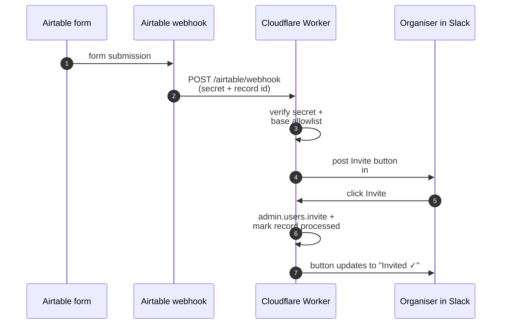

_Runs in: **Cloudflare Worker** ([`worker/src/airtable-invite.js`](https://github.com/rladies/jinx/blob/main/worker/src/airtable-invite.js)). No GitHub Actions, no R package._

When someone fills the RLadies+ chapter sign-up form (an Airtable form), Airtable POSTs a webhook to the Cloudflare Worker.
The worker validates the request, checks the source base is on a per-token allowlist, and posts an actionable message in `#new-invitee` with an **Invite** button.
An organiser clicks the button, the worker invites the email to the community Slack workspace, and updates the Airtable record so it does not re-fire.

## The flow

## Why a button and not an auto-invite

Auto-inviting from a public form would be a spam risk -- anyone could fill the form with any email.
The two-step "form → button → human click" pattern gives a human the chance to skim the chapter and email before pulling the trigger, without making the organiser do any actual data entry.

## Adding a new Airtable base

The webhook validates the source base against the per-token allowlist served by [`worker/src/airtable-meta.js`](https://github.com/rladies/jinx/blob/main/worker/src/airtable-meta.js), which calls the Airtable Meta API with the `AIRTABLE_PAT` worker secret.
To accept invites from a new base:

1. Grant the existing Airtable PAT access to the new base in Airtable's PAT settings.
2. Configure the form's webhook action to POST to `https://rladies-jinx.workers.dev/airtable/webhook` with the shared `AIRTABLE_WEBHOOK_SECRET` in the `x-airtable-secret` header.
3. Include `record_id`, `base_id`, `table_id`, and `email` in the payload.

The worker will pick the new base up the next time the Meta API allowlist refreshes -- no worker redeploy needed.

## The matchback to Slack

When someone signs up via the form and later joins the community Slack workspace, Jinx tries to match their Slack email to a pending Airtable record.
If it finds one, the [welcome DM]() notes the match ("I matched you up with your RLadies+ chapter sign-up -- welcome aboard!") and the worker clears the pending link so it does not re-fire.
