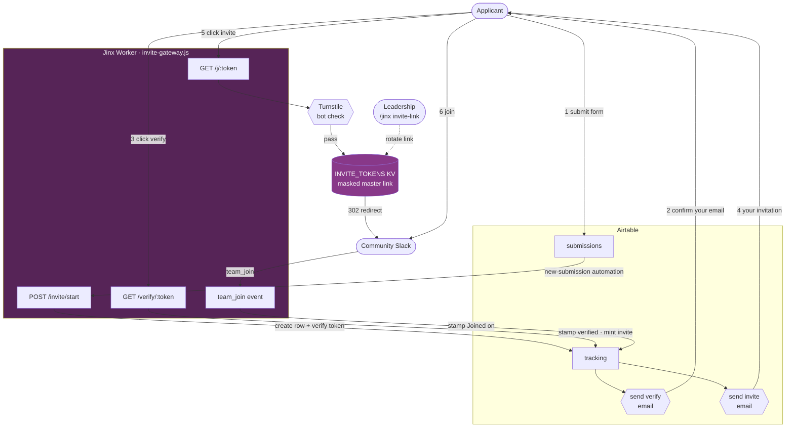
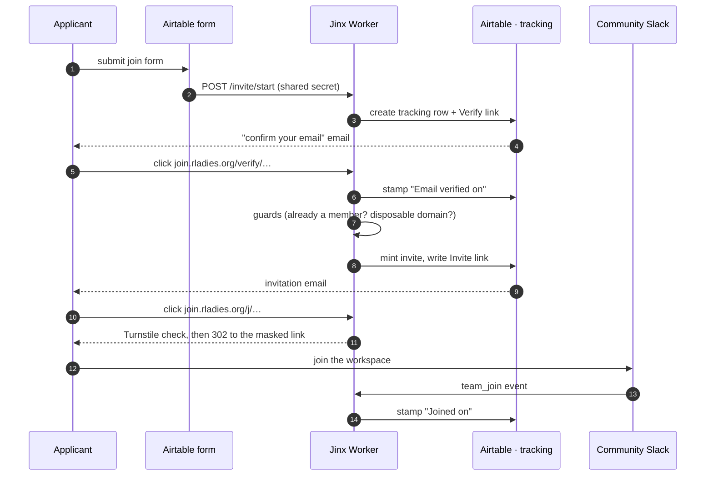

_Runs in: **Cloudflare Worker** ([`worker/src/invite-gateway.js`](https://github.com/rladies/jinx/blob/main/worker/src/invite-gateway.js)) plus two Airtable automations. No GitHub Actions, no R package._

Joining the RLadies+ Community Slack mostly runs itself.
Someone fills in the Airtable join form, confirms their email, and Jinx sends them a personal invite link — no organiser has to press a button for the everyday case.
The real Slack invite link never leaves the server: each applicant gets a masked, single-use link on `join.rladies.org` that quietly redirects to it.

This replaces the old "form → button → an organiser clicks _Invite_" flow.

## Architecture at a glance



The short version: the form feeds Airtable, Jinx mints per-person tokens and emails them, and the one link that actually matters — the real Slack invite — stays hidden in Cloudflare KV, where only Jinx and the leadership rotation command can reach it.

## The flow, step by step



## The masked invite link

The real Slack invite link — the "master" link — lives _only_ in Cloudflare KV, at key `config:master_invite_link`.
It is never emailed, never written to Airtable, and never committed to the repo.

Each applicant gets a per-person, expiring, limited-use link on `join.rladies.org` instead:

- **`/verify/<token>`** proves they own the email (double opt-in) before any invite is minted.
- **`/j/<token>`** redeems the invite — it runs an optional bot check, then `302`-redirects to the masked master link.

Each link is single-use-ish (72 hours, three opens), so a forwarded one is close to useless.
And because the real link sits behind the worker, nobody can mass-forward it, and rotating it is a one-liner that breaks nothing.

## Two layers keep bots out

Double opt-in comes first.
No invite is minted until the applicant clicks the verify link sent to their address, which on its own kills typos, other people's emails, and most bots.

Then come the guards.
Before auto-inviting, Jinx skips anyone already in the workspace (`users.lookupByEmail`) and holds requests from disposable-email domains for a human to look at.
Held requests post an alert to `#team-community-slack`; everything clean is invited automatically.

Cloudflare Turnstile is the last wall.
If the `TURNSTILE_*` keys are set, `/j/<token>` shows a quick, usually-invisible bot check right before the redirect.

## The two Airtable tables

The join form is backed by two linked tables:

- **`submissions`** — the form's landing zone: name, email, the agreement checkboxes.
- **`tracking`** — one row per invite attempt, linked back to a submission.

Jinx walks each `tracking` row through the funnel:

| Column              | Set when                             |
| ------------------- | ------------------------------------ |
| `Verify link`       | the row is created                   |
| `Email verified on` | the applicant clicks the verify link |
| `Invite link`       | the invite is auto-minted            |
| `Invite sent on`    | the invitation email goes out        |
| `Link clicked on`   | the invite link is opened            |
| `Joined on`         | the applicant actually joins Slack   |

Two Airtable automations send the emails — one when `Verify link` is written, one when `Invite link` is written.
Jinx does the logic; Airtable does the sending.

## Knowing when someone actually joined

Clicking an invite link is not the same as joining.
So when someone does join, Slack fires a `team_join` event, Jinx matches their email to a `tracking` row, and stamps `Joined on`.
The result is a real funnel — requested, verified, invited, clicked, joined — rather than a guess.

## The invite link's budget

A Slack shared invite link is finite — usually 400 signups.
Jinx counts redemptions and warns `#team-community-slack` as the count nears the cap, so someone can swap in a fresh link before it runs dry.

## Rotating the link

The invite link belongs to the **RLadies+ Leadership account (`leadership@rladies.org`)**, on both sides.

First, it _issues_ the link.
In the community workspace: workspace menu → _Invite people_ → copy the shared invite link.
Only a workspace Owner or Admin can create one.
Slack doesn't record who created a shared link, so this half is a procedural rule, not something the system can verify.

Second, it _activates_ the link, from Slack:

```
/jinx invite-link https://join.slack.com/t/rladies-community/shared_invite/zt-NEW…
→ ✅ Invite link updated — budget reset to 0/400.
```

The command is locked to `leadership@rladies.org` — Jinx checks the caller's verified email and turns everyone else away.
Run it with no URL to see current usage (`137/400`) without exposing the link.
Any invites already emailed re-point to the new link on their own.

See [Commands]() for the command itself, and [Ask Jinx]() for the welcome DM new members get when they land.
