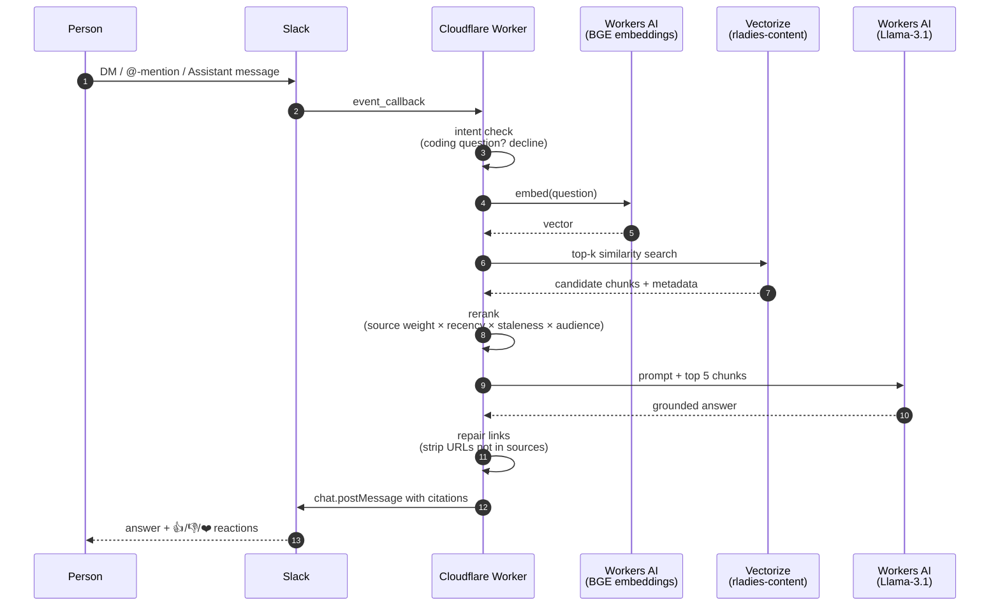

_Runs in: **Cloudflare Worker** ([`worker/src/slack-events.js`](https://github.com/rladies/jinx/blob/main/worker/src/slack-events.js), [`worker/src/rag.js`](https://github.com/rladies/jinx/blob/main/worker/src/rag.js)) + **Cloudflare Vectorize** + **Workers AI**. No GitHub Actions, no R package._

When you DM Jinx in Slack, mention them in a channel, or use the Slack Assistant panel, your message is treated as a question -- not a slash command.
There is no `/jinx` prefix, no command to remember; just ask.

Jinx searches a Cloudflare Vectorize index of RLadies+ content and replies with a grounded answer plus links to the sources it used.
React to the answer with 👍 / 👎 / ❤️ and we collect that signal to track which answers are useful (see `/jinx feedback` on the [Commands]() page).

## How a question becomes an answer

A few details worth knowing:

- **Coding questions are politely declined.** "Debug this regex" or "why is my ggplot empty?" gets a pointer to `#help-r`. Jinx is an organisational guide, not a coding assistant.
- **The reranker favours canonical sources.** Pages from the guide and main website outrank R package READMEs and other community content. `/global-team/` pages (maintainer-facing) are down-weighted relative to user-facing equivalents.
- **Future-dated content (upcoming events) gets a boost.** The recency factor clamps to 1.0 for future dates, so "what's coming up?" surfaces upcoming meetups above past ones.
- **Link integrity is enforced.** Any URL the model emits that does not appear in the retrieved sources is stripped (the label stays). Jinx will never invent a link.

## Welcome on join

When a person joins either RLadies+ workspace, the worker receives a `team_join` event and DMs them with a workspace-specific welcome message rendered from a markdown template in `inst/templates/`.

If the new member's email matches a pending chapter sign-up coming in from Airtable (see [Airtable invite webhook]()), the welcome notes that we matched them up.

## Assistant panel suggestions

Opening the Jinx Assistant in Slack triggers an `assistant_thread_started` event; the worker sets the thread title and four suggested prompts.
Both the title and the prompts come from [`inst/config/assistant-prompts.json`](https://github.com/rladies/jinx/blob/main/inst/config/assistant-prompts.json) in the jinx repo, so they can be edited without redeploying the worker.
