_Runs in: **GitHub Actions** ([`bot-index-content.yml`](https://github.com/rladies/jinx/blob/main/.github/workflows/bot-index-content.yml), Ubuntu runner) executing **Node.js** code in [`indexer/`](https://github.com/rladies/jinx/tree/main/indexer), which calls **Cloudflare Workers AI** for embeddings and **Cloudflare Vectorize** to store them._

The answers Jinx gives in [DMs and the Assistant panel]() come from a Cloudflare Vectorize index called `rladies-content`.
A separate weekly workflow walks a set of sources, chunks them, embeds each chunk with the BGE model, and upserts the vectors into the index.
The same index is queried at retrieval time from the worker.

## When it runs

The [`Bot · Index Content`](https://github.com/rladies/jinx/blob/main/.github/workflows/bot-index-content.yml) workflow runs every Sunday at 04:00 UTC and can be triggered manually:

```bash
gh workflow run "Bot · Index Content" --repo rladies/jinx
```

A full run takes a few minutes and re-embeds every chunk -- there is no incremental indexing today.

## The pipeline

```mermaid
flowchart LR
    subgraph Sources
      G[rladiesguide<br>hugo-site]
      W[rladies.github.io<br>hugo-site]
      O[rladies GitHub org<br>READMEs]
      P[pkgdown llms.txt<br>across org R packages]
      J[jinx-docs<br>help.md, NEWS, PRIVACY]
      M[meetup_archive<br>events.json]
      A[awesome-rladies-creations<br>packages + content]
      Y[RLadies+ YouTube channel<br>via Data API v3]
    end

    Sources --> Chunk[chunk into ~1.8k-char<br>sections with title,<br>heading, url, date, lastmod]
    Chunk --> Embed[Workers AI<br>BGE-base embedding]
    Embed --> Upsert[upsert to Vectorize<br>rladies-content]

    Upsert -. queried at runtime .-> Q[(DM / Assistant /<br>@-mention answers)]

    style Chunk fill:#88398A,color:#fff
    style Embed fill:#88398A,color:#fff
    style Upsert fill:#88398A,color:#fff
```



## What gets indexed

| Source                              | What it covers                                                                                                                 |
| ----------------------------------- | ------------------------------------------------------------------------------------------------------------------------------ |
| `rladies/rladiesguide`              | The guide you are reading right now. Crawled from the production sitemap (English content only).                               |
| `rladies/rladies.github.io`         | The main RLadies+ website. Crawled from the production sitemap.                                                                |
| `rladies/*` org READMEs             | Top-level README of every non-archived repo in the org.                                                                        |
| pkgdown `llms.txt`                  | LLM-friendly summaries of every R package in the org with a `DESCRIPTION` file and a published pkgdown site.                   |
| `rladies/jinx` docs                 | Jinx's `inst/commands/help.md`, `NEWS.md`, and `PRIVACY.md`.                                                                   |
| `rladies/meetup_archive`            | The full `events.json` -- active events plus past events from the last 12 months. Cancelled and older past events are dropped. |
| `rladies/awesome-rladies-creations` | Both `awesome_packages.json` (~315 R packages) and `awesome_content.json` (blogs / sites / videos).                            |
| RLadies+ Global YouTube channel     | Every video on the channel, fetched via YouTube Data API v3. Title, description, and publish date are indexed.                 |

## How dates are used

The reranker treats `lastmod` (last-modified date pulled from Hugo's `article:modified_time` meta tag for guide/website pages) as a tiebreaker: pages maintained recently win narrow contests over pages that have not been touched in years.

`date` (the original publication date for blog/news content, or `datetime_utc` for events) feeds a content-recency factor with a two-year half-life.
Upcoming events clamp to the recency ceiling, so "what events are coming up?" surfaces them above year-old past meetups.

## Adding a new source

Each source lives as a small module in [`indexer/sources/`](https://github.com/rladies/jinx/tree/main/indexer/sources) and is wired into [`indexer/index.mjs`](https://github.com/rladies/jinx/blob/main/indexer/index.mjs).
A new source needs three things: a `gather*Source()` function that returns chunks with `text`, `url`, `title`, `date`, `lastmod`, an entry in the `SOURCES` array in `index.mjs`, and (optionally) a new entry in `SOURCE_WEIGHTS` in [`worker/src/rag.js`](https://github.com/rladies/jinx/blob/main/worker/src/rag.js) if it deserves a non-default rerank weight.
