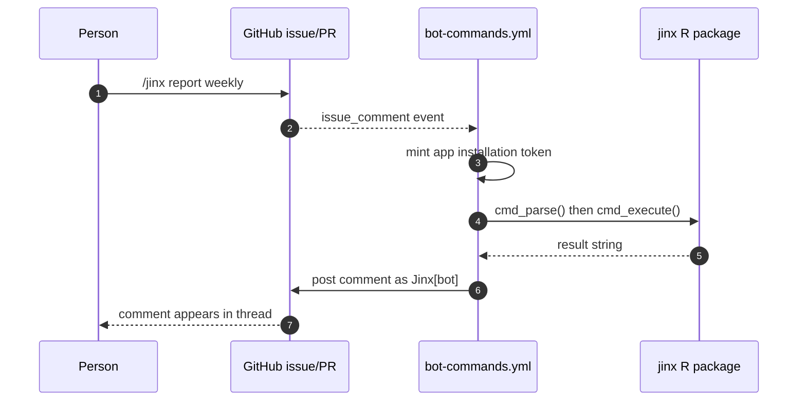
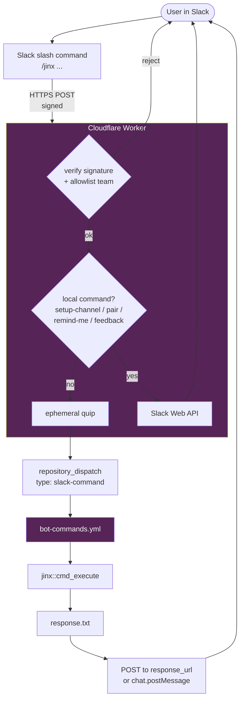

_Runs in: **Cloudflare Worker** (Slack slash entry) → **GitHub Actions** with the `jinx-bot` container (most commands) or **Worker only** ([the local commands]())._

A `/jinx ...` invocation has two front doors: GitHub issue comments and Slack slash commands.
Both end up running the same R package logic; the only difference is which event triggers it and where the answer is posted.

## On GitHub

A `/jinx ...` comment on an issue or PR fires the `bot-commands.yml` workflow.
The workflow runs inside a prebuilt container image (`ghcr.io/rladies/jinx-bot:latest`) so R and the package are ready to go without a per-run setup, mints a Jinx installation token, runs `jinx::cmd_execute()`, and posts the result back as an `actions/github-script` comment on the originating thread.

Only repository owners, members, and collaborators can run `/jinx` commands; the workflow's `if:` guard filters everyone else.

## On Slack

The Slack integration has three pieces.

**1. The Slack apps.** Jinx is installed in both RLadies+ Slack workspaces -- organisers and community.
Each one provides the `/jinx` slash command and the bot identity for posting messages.
Workspace-specific behaviour (welcome message, allowed commands) is driven by config in `inst/config/` and templates in `inst/templates/`.

**2. The Cloudflare Worker.** A small JavaScript function at `rladies-jinx.workers.dev` receives slash commands.
It verifies the Slack request signature, checks the workspace is on the allowlist, immediately responds with a friendly quip so the user is not left waiting, and either handles the command itself or dispatches it to GitHub.
`/jinx help`, `/jinx setup-channel`, `/jinx pair`, `/jinx remind-me`, `/jinx feedback`, `/jinx questions`, `/jinx shorten`, and `/jinx invite-link` are handled entirely in the worker (no GitHub Actions involved).
Everything else is forwarded to GitHub Actions via `repository_dispatch`.
The worker mints its own Jinx GitHub App installation token -- no personal access tokens involved.

**3. The GitHub Actions workflow.** The single `bot-commands.yml` workflow in the `rladies/jinx` repo handles both GitHub issue comments and Slack dispatches.
It runs the command through the jinx R package, captures the result as a string, and routes it to the right destination -- a GitHub issue comment or a Slack message via `response_url`.

If anything fails along the way, Jinx always responds -- either with a helpful error message or a link to the workflow logs.
Sensitive data (Slack channel IDs, response URLs, usernames, the raw command) is masked in the CI logs.

For the actual list of commands, see [Commands]().
For the underlying R package design (`cmd_parse` / `cmd_execute`), see [For developers]().
