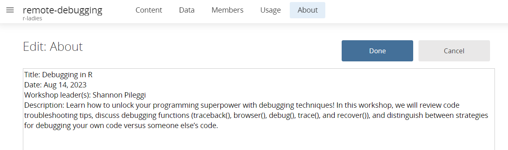
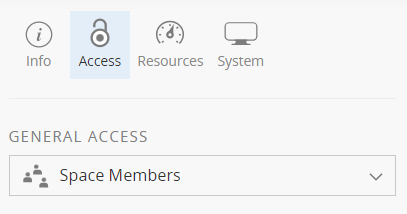
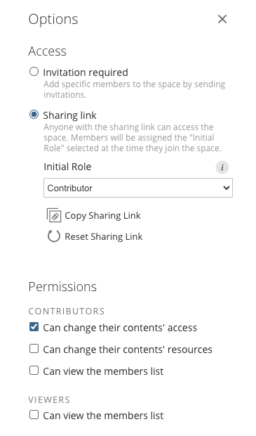
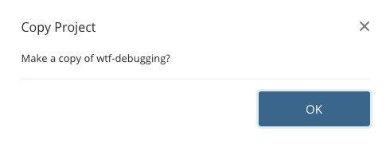
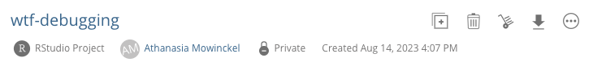
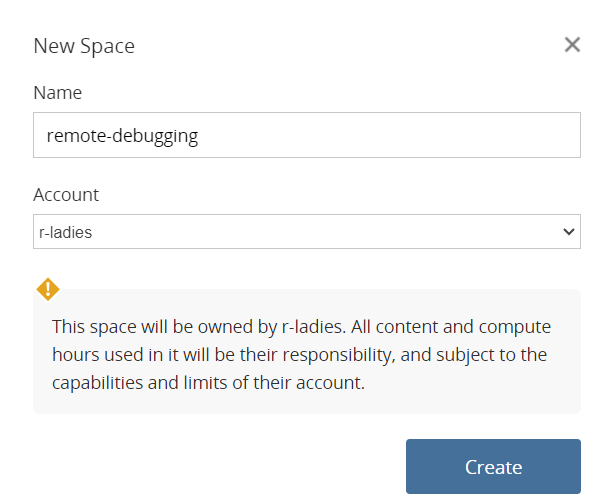
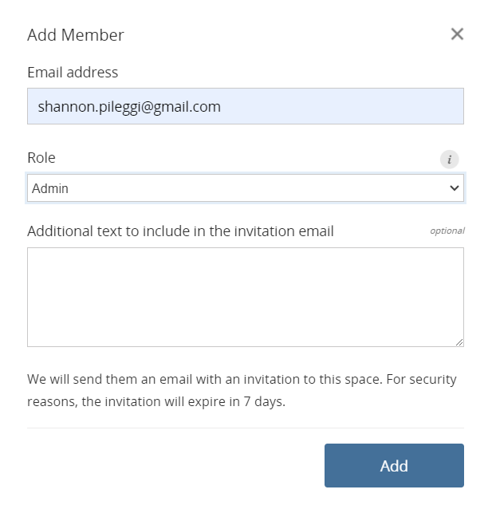

## Slack

- Once you initiate the process of becoming an organizer by sending an email to chapter [at] rladies [dot] org, you will be sent and invite to the [R-Ladies Organizers' Slack](http://r-ladies.slack.com).
- Please add your city or chapter to your Slack profile.
- The Organizers' Slack has a lot of channels that cover different topics. Explore them and join the ones that you find useful.
- You can create a channel on the global Slack for communication within the organizing team of your chapter,
  e.g., #rladies-san-francisco.
- There is also a [global "all the R-Ladies" Slack](/comm/slack/).

### Etiquette for Slack

- **Prefer asking in official channels rather to DM people or sending an email.** This allows us to create collective
  knowledge, i.e., learning from other experiences. It will also ensure you a faster response, as more people will see your question.

- As a volunteer receiving DMs, feel free to gracefully redirect them to the communication channel of your choice, or to indicate them to use another communication channel next time.

## Meetup

Meetup is an online social platform used to announce events and manage registration to events.

### Why do we use Meetup?

Meetup might not be well-known to you or your region, but it has been a very
important platform for many to establish a community. Members can "join" your
chapter's page and then subscribe to all your events. This makes it easier
for people to never miss an event announcement.

While you may prefer using other platforms that reach more people in your area,
we still require you to register your events on Meetup. Meetup provides the
most straight forward way for the Global Team to obtain information about chapter
activity and members. Despite these numbers likely not 100% reflecting chapter
memberships, at minimum we can have a singular platform where events are registered.

Registering events on Meetup enables the Global Team to create chapter activity reports
required for our funders. These reports are then used to justify a continuation (or modification,
if needed) of our funding agreement. These funds are used to pay for for global operations,
including Meetup, Zoom, E-Mails, Website hosting, Calendly for bookings, and more.

A Meetup account is also a requirement for the chapter to be eligible for the [RConsortium RUGs grants](https://www.r-consortium.org/all-projects/r-user-group-support-program).

### Creating your chapter on Meetup

- We will create your chapter on Meetup during the onboarding process. R-Ladies [meetup.com](https://www.meetup.com/pro/rladies) accounts are paid for by the R-Ladies Organization using a grant from the [R-Consortium](https://www.r-consortium.org/).
- You need to have a personal account on Meetup for us to asign you the role of co-organizer there.

**Suggested Meetup Alignment**

The meetup page for your chapter will be created with some default text en English. This is what you will find there:

```markdown
This is a local chapter of R-Ladies Global (https://www.rladies.org), an organisation that promotes gender diversity in the R community worldwide. We meetup in person or virtually to learn about the R programming language, algorithms and advanced tools.

R-Ladies welcomes members of all R proficiency levels, whether you're a new or aspiring R user, or an experienced R programmer interested in mentoring, networking & expert upskilling. Our community is designed to develop our members' R skills & knowledge through social, collaborative learning & sharing. Supporting minority identity access to STEM skills & careers, the Free Software Movement, and contributing to the global R community!

We are pro-actively inclusive of queer, trans, and all minority identities, with additional sensitivity to intersectional identities. Our priority is to provide a safe community space for anyone identifying as a minority gender who is interested in working with R. As a founding principle, there is no cost or charge to participate in any of our R-Ladies communities around the world. You can access our presentations, R scripts, and Projects on our Github account (https://github.com/rladies) and follow us on Mastodon (https://hachyderm.io/@RLadiesGlobal) to stay up to date about R-Ladies news!

Make sure you read and comply with our code of conduct (https://rladies.org/coc/) and community guidelines (https://guide.rladies.org/about/mission/#r-ladies-rules--guidelines).

Please note that by taking part in an R-Ladies event you grant the community organizers full rights to use the images resulting from the photography/video filming/media, and any reproductions or adaptations of the images for publicity, fundraising or other purposes to help achieve the community's aims. This might include (but is not limited to), the right to use them in their printed and online publicity, social media, press releases and funding applications. If you do not wish to be recorded in these media please inform a community organizer.
```

To edit this message and other basic information of your group, go to Manage Group > Edit Group Settings and select the 'Basic Information' tab.

- Feel free to translate this message to your local language(s).

- You can adapt the content, as long as it aligns with our code of conduct and community guidelines. This means
  that R-Ladies mission, the code of conduct and the message regarding photography and filmings must be included.

- You can add links to your chapters' social media if you want.

- You can add new topics.

- Please don't change the name of the group or the meetup url.

{}
**Every time you run an event publish it into your chapter Meetup account.** This will keep the chapter active.
Only events published on Meetup are considered as chapter activity (because these are the ones we can keep
track of).
{}

{}
What if Meetup is not a popular platform in your country?
You might want to complement it with e.g. a mailing list after e.g. collecting email addresses via a form.
Make sure to comply with the local rules about personal data protection.
{}

### Meetup members management

{}
R-Ladies mission focuses on women and other gender minorities. How can you ensure events are open to all whilst still foremost serving women and other gender minorities?

Please do be aware of the relevant Equality Legislation in your jurisdiction, e.g the Equality Act 2010 in the UK, when designing participation frameworks for the majority gender, to ensure your procedures are not infringing local laws re. potential discrimination.
{}

A good strategy might be to make your group private and ask candidates questions before they join

- Have them accept the code of conduct
- Remind that priority is given to minoritized genders, that everybody that identifies as such can enter and that cis-men are welcome if 1. they know already someone in, in that case they are asked to give the name of the person, who will act as a liaison just in case (like a “godmother”) 2. If they bring someone and agree to be their +1.

## E-Mail

As of November 2022 R-Ladies email use a Google Workspace to manage emails accounts. We provide chapters email address (`yourcity@rladies.org`) during the onboarding process.
_You do not need to request an email_, after the creation of your chapter account you will get an email from R-Ladies Google Workspace with information about your chapter email.
adress, the temporary password, the link to login to your account for the first time and change the temporary password and instruction on how to create strong passwords.

The chapter email address is the public facing email address for your community,
so members or meetup hosts (a company or university) can get in touch with you and your co-organisers easily.
You can then use your personal email address to reply., but we recommend you put the chapter email in cc when
answering an email so that your co-organizers can see the answer.

{}
Your chapter email account should be used to set up any chapter [social media accounts (e.g. Twitter, Instagram, etc)](/organization/online-presence/social-media/).
{}

- You can set up Twitter or other accounts to not send email notifications, so that you and your fellow organizers don't get overwhelmed with emails going to your chapter accounts.
- If you have an issue with your email, have read all the online guidance and still can't resolve your issue, please explain your issue on Organizers Slack in the #organizers channel. A volunteer will get back to you as soon as possible.

As of March 18, 2019, we only provide personal rladies.org emails (`yourname@rladies.org`) to Leadership and Global Team members.

{}
Check out the section about [account security](/organization/tech/security/)
{}

## GitHub

- There is a [global organisation](http://github.com/rladies) to collect all material
  related to R-Ladies in one place, so it's easier to know what's out there and get inspired by what other chapters did. Ask to be added as a member in the `#new_chapters` channel of the organizers slack.
- If you have presentations, please add them all to
  one repo for your chapter, e.g., `meetup-presentations_london`. If you have code for a
  workshop you can add it to the repository or ask us to create a new repository for that. Please name
  it location\_\*, e.g., `london_20161130_h2o-and-r`.

## Posit Cloud

### About Posit Cloud

[Posit Cloud](https://posit.cloud/) is an online platform from Posit that allows users to work on data science projects without requiring software installation
on personal computers. This is a particularly attractive option for workshops
as creators of a Posit Cloud space can ensure all workshop attendees
are using the same version of both R and R packages, as well as create a directory
with files to work from.

### Posit Cloud Considerations

Posit Cloud could be a wonderful addition to your R-Ladies meet-ups! Posit Cloud
would be best suited for workshop style meet-ups where participants are encouraged
to actively submit code or do exercises.

Use of Posit Cloud requires both administrators of the Posit Cloud space and
workshop participants to have a Posit Cloud account. This may require
a bit of extra time to get started as users may need to create an account.

There are limits to the computing capacity of the Posit Cloud account. We haven't
tested the boundaries, but be aware that computationally heavy workshops could
possibly have slow performance.

### Posit Cloud Use

This section is for R-Ladies event organizers requesting access to Posit Cloud.

All correspondence regarding Posit Cloud should be on the `posit-cloud` channel
in the R-Ladies organizers slack, which includes both requests to access or
support related questions.

1. Request access to Posit Cloud for your event by submitting the [Posit Cloud Request form](https://rladies.org/form/posit-cloud-request) with
   the following information:

- Name of the R-Ladies chapter hosting the event.
- Title of the event.
- Date of the event.
- Name of the Posit Cloud space administrator (person responsible for customizing the Posit Cloud space).
- Email address of the Posit Cloud space administrator.
- Name of the R-Ladies chapter organizer coordinating the event.
- Email address of the R-Ladies chapter organizer coordinating the event.
- Is this a one-time workshop or workshop you would like to repeat with the same
  Posit cloud space?

Please request access **at least two weeks** in advance of your event to allow time for the
the R-Ladies Posit Cloud team to grant access and time for your Posit Cloud administrator
to set up the Posit Cloud space. If you are less than two weeks in advance of your
event you may still request access and we will try to accommodate.

An R-Ladies Posit Cloud team member will review your request as soon as possible. If you do not receive a response withing 7 days, please post on the the `posit-cloud` channel on the R-Ladies organizers slack
to notify us that you have not received access.

Once the Posit Cloud space administrator has been granted access, they can add other administrative collaborators to the Posit Cloud space.

Please note that the invitation to the Posit Cloud space must be accepted
within 7 days; if not, the invitation will expire and will need to be re-sent.

2. Edit the About section with information about your workshop. This should include:

- Title of the event.
- Date of the event.
- Name(s) of event organizer.
- Name of the R-Ladies chapter hosting the event.
- Brief description of the event.



3. Create your project within the Posit Cloud space. Helpful documentation includes:

- [Posit Cloud Guide](https://posit.cloud/learn/guide)

- [Posit Cloud Essentials | Ep 1: Getting Started](https://www.youtube.com/watch?v=-fzwm4ZhVQQ) (~30 min YouTube recording)

- [Posit Cloud Essentials | Ep 2: Managing Data Projects with Spaces](https://www.youtube.com/watch?v=JdOn8_Co8VI) (~40 min YouTube recording)

- [Posit Cloud Essentials | Ep 3: Speed up your data workflows with Project Templates](https://www.youtube.com/watch?v=ppfYco3Dhkc) (~30 min YouTube recording)

4. Change project access to space members.



5. Change space access to sharing link with role as Contributor, which allows the
   event organizer to share a url with participants to join the space. The "Contributor” role
   enables the participants to work in their own personal copy of the project.



6. When users receive a sharing link they will enter the space, they will be required
   to either login or create a Posit Cloud account. Then users have to click on content
   to open the project. It may take a couple of minutes for the initial deployment. Then
   users will be invited to make a copy of the project.



The project copy is labelled as "Private" for the user, indicating that they get
their own dedicated computing resources, and any changes made in this project
do not affect other students.



7. Posit Cloud work spaces may be deleted 2 weeks after your event in order to make room
   for new workshops. If you have indicated that you would like to repeat the workshop
   with the same Posit Cloud space, the R-Ladies Global Posit Cloud Team will contact
   you to see if the space is still needed prior to deletion.

### Posit Cloud FAQ

**1. Under Resources, it gives me the option to change the RAM, COMPUTE, and
BACKGROUND EXECUTION LIMIT of the workshop. Can we change these values? Does it
cost money to do so?**

Yes, you can change these values; no, it does not cost R-Ladies money. However,
if you are doing simple work, maxing out to 16gb and 4CPU is not needed and does
incur extra costs to Posit.

**2. Does apply changes impact just my own workspace or does it also affect people
who have created a copy of my project?**

Changes made to already copied projects will only be seen by people copying your
project after the changes were made. People who had previously copied your project
will not see the changes unless they copy the project again.

**3. Am I still limited to 25 compute hour/month if I am using a free personal account
(even though the Posit Cloud space was created on my behalf by R-Ladies).**

Work done within spaces created in your free personal account is subject to the 25
compute hours per month. However, any work done within an R-Ladies space will not
count against your personal account hours.

**4. Assuming that we do not have endless computing resources, do you think it is
a good idea to encourage everyone to create a Posit Cloud ahead of time but to
only provide the sharing link to those who actually show up on the day of the event?**

This will not make a big difference in computing resources. Providing the link
ahead of time can speed up account creation and login.

**5. How much storage space is available for projects under the R-Ladies Posit Cloud
License Terms? Our workshop instructors are wondering if it will be possible for
participants to use a 10GB dataset for the workshop. It would also involve writing
to disk in a few different formats (CSV, then partitioned CSV, then parquet).**

The storage space for the project is around 20gb. However, I would not advise using a 10GB dataset for a workshop on Posit Cloud because you will likely run into performance issues, especially around importing. We only recommend up to [500mb](https://posit.cloud/learn/guide#project-settings-resources) files in the user guide.

For workshops intentionally using flat files (and not db connections), many instructors will offer a randomized subset that will work on Posit Cloud and the full file for those wanting to wrangle the very large files locally.

### R-Ladies Posit Cloud License Terms

| Item                | License                                |
| ------------------- | -------------------------------------- |
| INSTRUCTORS         | 10                                     |
| STUDENTS            | 440                                    |
| SHARED SPACES       | Unlimited                              |
| PROJECTS            | Unlimited                              |
| OUTPUTS             | 100                                    |
| COMPUTE HOURS       | Unlimited                              |
| BETA FEATURES       | Configurable                           |
| MAX RAM             | 16 GB                                  |
| MAX CPU             | 4 CPU                                  |
| MAX EXECUTION       | 48 hours per project; 96 hours per job |
| CONCURRENT PROJECTS | Unlimited                              |
| DATA CONNECTIONS    | 100 per space                          |
| PROJECT TEMPLATES   | 1000                                   |

### R-Ladies Posit Cloud Team

This section is for members of R-Ladies Global Posit Cloud Team who have administrative
access to the Posit Cloud account.

1. Create a new space. Name the space `chapter-title` and assign to r-ladies account.



2. Add email of primary workshop leader with an Admin role on the space.


