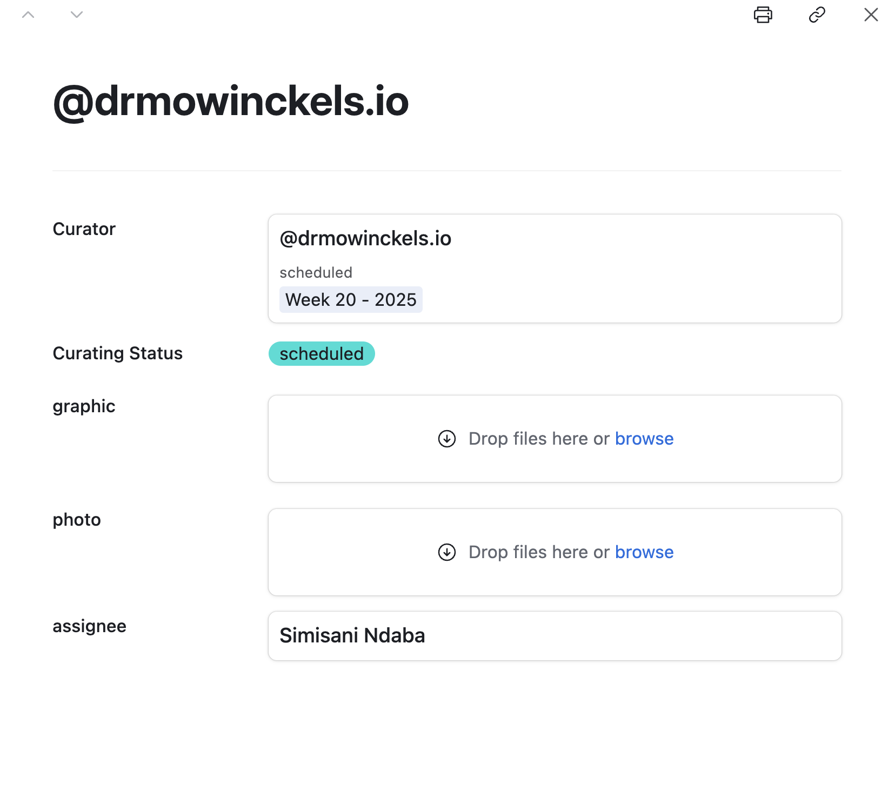

This document details the structure and functionality of the "Rotating Curator" Airtable base, used to manage the process of onboarding, scheduling, supporting, and gathering feedback from rotating curators.
The base is intended to help Global Team members in charge of the RoCur program to keep track of necessary steps for a successful curation.



graph TD;

subgraph R-Ladies Workspace

subgraph RoCur Base

      subgraph Data
        NominationsTable["📑 Nominations"]
        CuratorsTable["📑 Curators"]
        ScheduleTable["📑 Schedule"]
        FollowUpTable["📑 Follow-up"]
        TasksTable["📑 Tasks"]
        AdminTable["📑 Admin"]
        TaskUpdatesTable["📑 Task Updates"]
        CuratorProgressTable["📑 Curator Progress"]
      end

      subgraph Forms
        NominationForm("📝 Nomination Form")
        SignupForm("📝 Curator Sign-up Form")
        FollowUpForm("📝 Follow-up Form")
      end

      subgraph Interfaces
        Dashboard("📊 Curation Dashboard")
        Calendar("📅 Schedule Calendar")
        Pipeline("📌 Curator Pipeline")
        TeamTasks("✅ Team Tasks")
      end

end
end

%% Connections
NominationForm -->|Stored in| NominationsTable
SignupForm -->|Stored in| CuratorsTable
FollowUpForm -->|Stored in| FollowUpTable
CuratorsTable -->|Links to| ScheduleTable
CuratorsTable -->|Links to| FollowUpTable
CuratorsTable -->|Links to| TasksTable
CuratorsTable -->|Might link to| NominationsTable

ScheduleTable ---> Calendar
CuratorsTable --->|Tracks| Pipeline
TasksTable --->|Manages| TeamTasks
TeamTasks ---> Dashboard
CuratorsTable ---> Dashboard
FollowUpTable ---> Dashboard

CuratorsTable -->|Synced from| AdminTable
TasksTable -->|Populates| TaskUpdatesTable
CuratorsTable -->|Linked to| CuratorProgressTable

style NominationsTable fill:#a9b8dbcc,stroke:#616a80;
style CuratorsTable fill:#a9b8dbcc,stroke:#616a80;
style ScheduleTable fill:#a9b8dbcc,stroke:#616a80;
style FollowUpTable fill:#a9b8dbcc,stroke:#616a80;
style TasksTable fill:#a9b8dbcc,stroke:#616a80;
style AdminTable fill:#a9b8dbcc,stroke:#616a80;
style TaskUpdatesTable fill:#a9b8dbcc,stroke:#616a80;
style CuratorProgressTable fill:#a9b8dbcc,stroke:#616a80;

style NominationForm fill:#cfb5e8,stroke:#736382;
style SignupForm fill:#cfb5e8,stroke:#736382;
style FollowUpForm fill:#cfb5e8,stroke:#736382;

style Dashboard fill:#88cddb,stroke:#578891;
style Calendar fill:#88cddb,stroke:#578891;
style Pipeline fill:#88cddb,stroke:#578891;
style TeamTasks fill:#88cddb,stroke:#578891;



## Forms

Forms are used as data ingestion, primarily to make sure community members have a way to voice their interest in the program.
Forms always send data to a specific table.
The RoCur base utilizes three primary forms to collect essential information:

### Nomination Form

This form is used by individuals to nominate potential rotating curators, and populates the [Nomination](#nomination) table.
It captures the nominator's details, the nominee's social media handle and email address, and a reason for the nomination.
Submissions to this form trigger the [Email nominator](#email-nominator) and [Email nominee](#email-nominee) automations.

### Curator Sign-up Form

This form is for individuals who wish to volunteer as rotating curators, and populates the [Curator](#curator) table.
It collects the curator's contact information, social media handles, areas of interest, and their agreement to the curator guidelines.
Submissions to this form trigger the [New signup notifications](#new-signup-notifications) and [Set up Tasks for Curator](#set-up-tasks-for-curator) automations.

### Follow-up Form

This form is completed by curators after their curation week is finished, and populates the [Follow-up](#follow-up) table.
It serves to gather feedback on their experience, asking about positive aspects and areas for improvement.
Submissions to this form trigger the [Complete follow-up](#complete-follow-up) automation.

## Data

The data are organised and stored into respective tables, to keep things as distinct as possible.
We treat tables populated by forms as "raw" data, i.e. these are not tables admins directly interact with (unless it is to correct information that was submitted).

### Tasks

**Purpose:**
Stores a comprehensive list of all the singular tasks that must be performed per curator.
This table is used to populate the [Task Updates](#task-updates) table.
Only reason to edit this table is to:

- Add a new task
- Update the description of an existing task.

**Key Fields:**

- Task
- Description
- task updates (linked to the [Task Updates](#task-updates) table)
- Timing (picklist: Pre-Scheduling, Pre-curation, Curation Start, Post-curation)

**Views:**

- Full table

### Admin

**Purpose:**
Provides a list of Rocur Team members with administrative responsibilities within the rotating curator workflow.

**Source:** Synced table from the "Rocur Team members" view in the "Members" table of the "Global Team Overview" base.
When new team members are added to the RoCur team in the source base, they will automatically appear in this table too.
To update this table, go to the source base.

### Nomination

**Purpose:**
Stores information about individuals nominated to be rotating curators.
Populated by the [Nomination Form](#nomination-form).

- **Key Fields:**

  - nominator_name
  - nominee_notified
  - nominator_email
  - nominee_name
  - nominee_bluesky_handle
  - nominee_email

- **Views:**
  - All nominations

### Schedule

**Purpose:**
Used to schedule Curators for designated time slots.
Weekly maintained by the [Schedule cleanup](#schedule-cleanup) automation, which makes sure there are 50 weeks into the future, and no more than 2 weeks into the past.

**Key Fields:**

- Week (calculated)
- start_date (user input)
- end_date (calculated)
- curator (linked to the [Curator](#curator) table)
- notes
  - writing "break" in notes will make this week unavailable as a date preference in the [Signup Form](#curator-sign-up-form).

**Functionality:**
The `Week` and `end_date` are calculated based on the `start_date` input.

**Views:**

- Available timeslots
  - linked to the [Signup Form](#curator-sign-up-form) so prospective curators can pick preferred dates from those available.
- Calendar
- Full schedule

### Follow-up

**Purpose:**
Captures feedback on the curator experience to learn what works well and what can be improved.
Populated by the [Follow-up form](#follow-up-form), which curators are provided a link to with both their handle and curation start date [prefilled](https://support.airtable.com/docs/prefilling-a-form-via-encoded-url) in the form through the [Initiate follow-up automation](#initiate-curator-follow-up).

**Key Fields:**

- curation_week (linked to the [Schedule](#schedule) table)
- curator (linked to the [Curator](#curator) table)

**Views:**

- All

### Curator

**Purpose:**
Stores information about individuals who have signed up to be curators.
Populated by the [Curator Sign-up Form](#curator-signup-form).

**Key Fields:**

- Name
- Bluesky handle

**Lookup Fields:**

- Curator status (lookup from the [Curator Progress](#curator-progress) table)

- **Views:**
  - Not completed (Curators in progress)
  - Completed (Completed Curators)
  - All curators (Full table)

### Task Updates

**Purpose:**
Tracks the completion status and update date for each individual task assigned to each curator.
Admins should actively use this table to tick off completed tasks and have full overview of which tasks are remaining.
To add new tasks that for each curator, see the [Tasks table](#tasks).

- **Key Fields:**
  - Update (formula/concatenation of Curator and Task)
  - Curator (linked to the [Curator](#curator) table)
  - Task (linked to the [Tasks](#tasks) table)
  - Completed (boolean)
  - Date
- **Views:**
  - Full table (All records)
  - To-do (Only tasks that need to be completed)

### Curator Progress

**Purpose:**
Tracks the latest information on each curator's status, including the most recently updated task and the timestamp.
It is intended to be the main table to check for general updates on each specific curator.
It is the source for the overall curation status.
Primarily populated by automation scripts, like updating when a task from [Task Updates](#task-updates) was last ticked off as "Completed".

- **Key Fields:**
  - Display Handle (linked to the [Curator](#curator) table)
  - Curator (linked to the [Curator](#curator) table)
  - Scheduled (linked to the [Schedule](#schedule) table)
  - Curating Status (picklist: new, cancelled, scheduled, completed)
  - Tasks Remaining
  - Assignee (linked to the [Admin](#admin) table)
  - Latest Update
  - Latest update date
- **Views:**
  - todo (All curators that are not completed)
  - completed (all completed curators)
  - full table (All records)

## Interface

Interfaces can serve many different functions.
An interface might be for internal use, like updating records etc, or outward facing for reporting to sponsors etc.
The intention is to provide an overarching interface towards the data, without having access to all the minute details of what the underlying data actually looks like.

### [Curation Dashboard](https://airtable.com/appFVxNxj9OlJw0VD/pagm9GYghj7VHFHug)

This interface provides a structured way to oversee the entire curation process, ensuring smooth scheduling, status tracking, and team coordination.
Ideally, Global Team members only need to interact with the interface for doing their tasks, not having to go into the raw data beneath.
In all pages of the interfaces, any linked record is displayed as black text in a grey box, clicking the box will open the linked record, so you can view it in its entirety.

#### Overview

- Displays an overview of the entire interface.
- Resources and Guidance on using Airtable in the side panel.
- Offers an introduction and tips for users navigating the interface.

![RoCur Airtable landing page. The sidebar on the left shows navigation options: RoCur Airtable (selected), Dashboard, Schedule Calendar, Curator Pipeline, and Team Tasks. The main content area features the R-Ladies logo and text describing the RoCur Airtable base as a tool for managing the Rotation Curation process. Below this, there are sections for "Curation Dashboard" with a description, "Schedule Calendar" with a description, "Curator Pipeline" with a description, and "About" and "Other Airtable resources" with links to guides and help.](interface_overview.png "Interface overview page, with links and details about the entire interface.")

#### Dashboard

- Displays an overview of the project's progress.
- Highlights curator status, team assignments, and curator feedback.

#### Schedule Calendar

- A dedicated space for managing curator schedules.
- Helps visualize who is curating when.
- Where Global Team members can add curators to specific curation periods.

#### Curator Pipeline

- Uses a Kanban-style layout to track curator progress.
- Makes it easy to see where each curator stands in the process.

- If you want to add anything to the [Curator Progress table](#curator-progress) (like a photo of the curator, an graphic announcing their curation, or assigning a team member), click on the curators card, and input the information you want to add.

#### Team Tasks

- Provides a clear view of curator assignments to team members.
- Organised by team members, and curation week, and displaying only tasks that need completion.
- Ensures all necessary actions for each curator are completed.

![Team Tasks view in RoCur Airtable. The tasks are grouped by assignee, with sections visible for "Reiko Okamoto", "Simisani Ndaba" (expanded), and "Meenakshi Kushwaha". Under "Simisani Ndaba", tasks are further grouped under "Scheduled - Week 20 - 2025". A table lists tasks for "@drmowinckels.io" including "Revoke Buffer access", "Email new curator", "Graphic Approved", "1 Week Email", "Thank you Email Sent", "Graphic sent", "Intro Posted", "Bluesky Account Update", "Provide Buffer access", and "Revert Bluesky & Delete". A "Completed" column shows checkboxes, some ticked and some unticked. A "Scheduled" column indicates "Week 20 - 2025" for all listed tasks.](interface_team_tasks.png "Team Tasks view shows eash uncompleted task per admin and curator.")

## Automations

This base has several automations to streamline the rotating curator workflow:

### Pre-scheduling

#### Email nominator

- **Trigger:** When a [nomination form](#nomination-form) is submitted.
- **Actions:** Finds the nominated curator (if they exist in the [Curators](#curator) table) and sends a tailored email to the nominator based on the curator's signup and scheduling status.

#### Email nominee

- **Trigger:** When a [nomination form](#nomination-form) is submitted.
- **Actions:** Checks if the nominated curator is already signed up. If not, it sends an invitation to curate via email and notifies the #team-rocur Slack channel.

#### New signup notifications

- **Trigger:** When the [curator signup form](#curator-signup-form) is submitted.
- **Actions:** Sends a thank you email to the new curator, finds any associated nomination records, notifies the #team-rocur Slack channel, and informs the nominator (if applicable) that their nominee has signed up.

### Task updaters

#### Set up Tasks for Curator

- **Trigger:** When a new curator signs up via the [curator signup form](#curator-signup-form).
- **Actions:** Finds all tasks in the [Tasks](#tasks) table, creates a new [Curator Progress](#curator-progress) record for the new curator, and then creates individual records in the [Task Updates](#task-updates) table for each task, assigning them to the new curator using a script.

#### Update Curator Progress

- **Trigger:** When a record in the [Task Updates](#task-updates) table is updated (specifically the "Completed" or "Date" fields).
- **Actions:** Runs a script that updates the [Curator Progress](#curator-progress) table for the relevant curator, logging the latest task completion and its date.

#### Team member assigned

- **Trigger:** When the "assignee" field is updated in the [Curator Progress](#curator-progress) table.
- **Actions:** Finds the corresponding curator in the [Curator](#curator) table and updates a field (likely "Completed") to acknowledge the assignment.

### Curator communication

#### Schedule curator

- **Trigger:** When the "curator" field is updated in the [Schedule](#schedule) table.
- **Actions:** Finds relevant records in the [Curator](#curator), [Curator Progress](#curator-progress), and [Task Updates](#task-updates) tables. If it's a new scheduling, it updates the curator's status, marks the scheduling task as complete, and sends a confirmation email. If a curator is removed, it updates their status in [Curator Progress](#curator-progress) to "cancelled" and marks the unscheduling task as complete.

#### Send 1 week reminder email

- **Trigger:** One week before a scheduled curator's "start_date" in the [Schedule](#schedule) table.
- **Actions:** Finds the curator and their assigned admin, finds the relevant task update record, and sends a reminder email to the curator (with different content based on whether the graphic has been uploaded) and notifies the #team-rocur Slack channel.

#### Initiate curator follow-up

- **Trigger:** The day after a curator's scheduled "end_date" in the [Schedule](#schedule) table.
- **Actions:** Finds the curator and their assigned admin, updates the curator's status in [Curator Progress](#curator-progress) for follow-up, sends a feedback request email to the curator, and updates the [Task Updates](#task-updates) table.

#### Complete follow-up

- **Trigger:** When the curator submits the [Curator follow-up form for weare.rladies.org](#follow-up-form).
- **Actions:** Finds the corresponding curator record and updates it (likely marking follow-up as done or recording feedback), and notifies the #team-rocur Slack channel.

### Misc

#### Schedule cleanup

- **Trigger:** Every Monday at 2:00 AM CEST.
- **Actions:** Runs a script to delete schedule entries older than two weeks and ensures the schedule extends 50 weeks into the future in the [Schedule](#schedule) table.

#### Publish Curator on Slack

- **Trigger:** On the "start_date" of a scheduled curator in the [Schedule](#schedule) table.
- **Actions:** Sends a notification to both the "Organiser Slack" and "Community Slack" channels announcing the new curator for the week.



graph TD;
%% Forms
NominationsForm("📝 Nomination Form");
SignupForm("📝 Curator Signup Form");
FollowUpForm("📝 Follow-up Form");

%% Tables
NominationsTable("📂 Nominations Table");
CuratorsTable("📂 Curators Table");
ScheduleTable("📅 Schedule Table");
FollowUpTable("📂 Follow-up Table");
TasksTable("✔️ Tasks Table");
AdminTable("👤 Admin Table");
TaskUpdatesTable("✔️ Task Updates Table");
CuratorProgressTable("📊 Curator Progress Table");

%% Actions
EmailNominator("📨 Email Nominator");
EmailNominee("📨 Email Nominee");
NewSignupNotification("📨 New Sign-up Notification");
ScheduleAutomation("⚡ Schedule Curator Automation");
WeekNotice("📨 1 Week Curation Notice");
CompletionAutomation("⚡ Complete Follow-up Automation");
PreCurationWeek("Assigned admin follows up closely");
CurationWeek(("🦋 Curation week"));

%% Connections
NominationsForm -->|Data stored in| NominationsTable;
NominationsForm -->|Curator invited| SignupForm;
SignupForm -->|Data stored in| CuratorsTable;

AdminTable --> |Assigns to| CuratorProgressTable;

CuratorsTable -->|When scheduled, update in| ScheduleTable;
ScheduleTable -->|Triggers| ScheduleAutomation;
ScheduleAutomation --> CuratorNotified
CuratorNotified("📨 Curator Notified");
ScheduleAutomation -->|Update curator status| CuratorsTable;
CuratorsTable -->|Linked to| TasksTable;

WeekNotice --> PreCurationWeek;
WeekNotice --> |Updates | TaskUpdatesTable;
TasksTable --> PreCurationWeek;
PreCurationWeek -->|Completes tasks| TaskUpdatesTable;
TaskUpdatesTable -->|Triggers update| CuratorProgressTable;
PreCurationWeek --> CurationWeek
CurationWeek -->|Curator provides feedback| FollowUpForm;
FollowUpForm -->|Data stored in| FollowUpTable;

FollowUpTable -->|Triggers| CompletionAutomation;
CompletionAutomation --> CompletedCurators("✅ Completed");

%% Additional Automations
NominationsForm -->|Triggers| EmailNominator
NominationsForm -->|Triggers| EmailNominee;
SignupForm -->|Triggers| NewSignupNotification;

%% Styles
style NominationsTable fill:#a9b8dbcc,stroke:#616a80;
style CuratorsTable fill:#a9b8dbcc,stroke:#616a80;
style ScheduleTable fill:#a9b8dbcc,stroke:#616a80;
style FollowUpTable fill:#a9b8dbcc,stroke:#616a80;
style TasksTable fill:#a9b8dbcc,stroke:#616a80;
style TaskUpdatesTable fill:#a9b8dbcc,stroke:#616a80;
style CuratorProgressTable fill:#a9b8dbcc,stroke:#616a80;

style NominationsForm fill:#cfb5e8,stroke:#736382;
style SignupForm fill:#cfb5e8,stroke:#736382;
style FollowUpForm fill:#cfb5e8,stroke:#736382;

style CompletionAutomation fill:#88cddb,stroke:#578891;
style ScheduleAutomation fill:#88cddb,stroke:#578891;
style WeekNotice fill:#88cddb,stroke:#578891;

style CompletedCurators fill:#a9dbc8,stroke:#638276;

style EmailNominator fill:#deffb6,stroke:#4c6b22;
style EmailNominee fill:#deffb6,stroke:#4c6b22;
style NewSignupNotification fill:#deffb6,stroke:#4c6b22;


