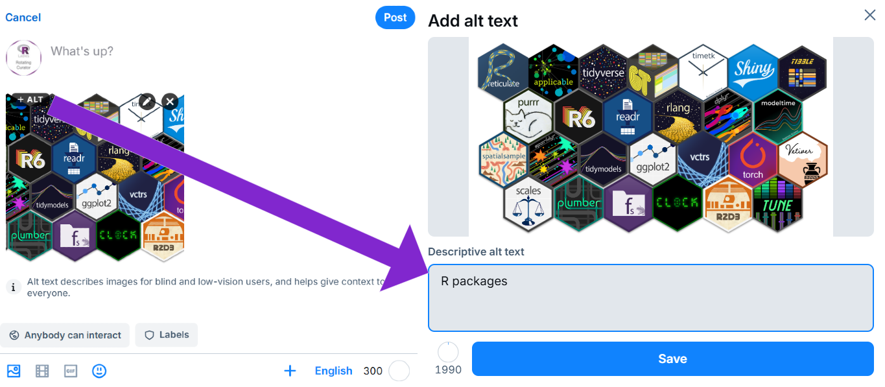

Please read our [Curator Guide](/rocur/guide) for specific information on your role as a curator.  

*The following instructions are for navigating through 🦋 Bluesky as RoCur is currently running on there.*

## Frequently Asked Questions   

### 1. How do I start my first post as @weare.rladies.org?

* Log on to Bluesky from your web browser, iPhone or Android app with `weare.rladies.org` as the username and the app password you received via email from the RoCur admins as the password. Refer to the screenshot below:

{width=600px}

* Click the "New Post" button in the bottom left hand corner to get started on your curation.

{width=200px}

### 2. Can I add photos, emojis, GIFs and videos?

* Yes - you can add up to 4 photos, a GIF, or a video. 

### 3. How to delete a post?

Mistakes happen! First of all, don't panic 😊 Posts can be removed.

* Navigate to the post you wish to delete.
* Click on three-dot menu ("...") in the bottom right of the post.
* Choose the "Delete post" option.

{width=400px}

### 4. As a curator, can I like other posts?

Yes! You can definitely like others' posts.

### 5. How to add polls? 

You can use [poll.blue](https://bsky.app/profile/poll.blue) to make your own poll: https://poll.blue/post.  
The page should look something like the image below.  Make sure you use the `weare.rladies.org` handle when creating the poll.

{width=700px}

### 6. How do you pin a post to the @weare.rladies.org profile?  

If you want to pin a post during your curation week, you can select the "Pin to your profile" option from the three-dot menu. 
Please remember to remove this pin before the end of your curation.

{width=300px}
  
### 7. How do I add alternative text to images in my post?  
  
When uploading an image in a post, a "+ ALT" button will appear at the top right of the image. Click on this button to add a description to your image as seen in the figure below: 

{width=600px}

Watch [this video](https://www.youtube.com/watch?v=RE-iJRXUmTM) for more information about image accessibility on Bluesky.   
  
*If you have further inquiries that are not covered here, please send an email to [weare\@rladies.org](mailto:weare@rladies.org)*
