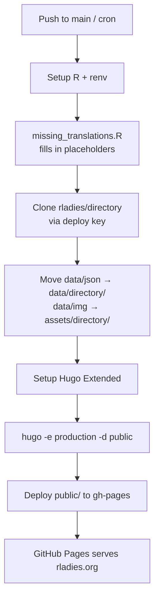
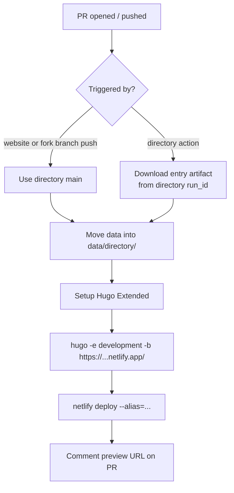
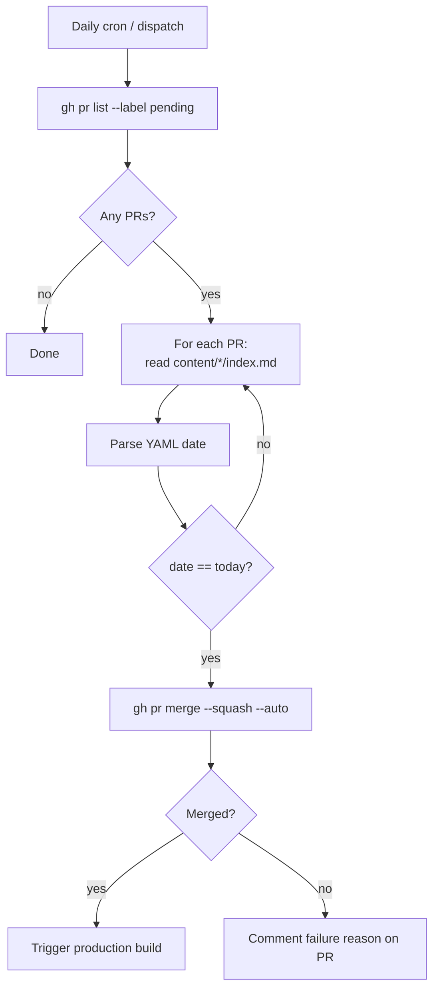

The website's CI is a small constellation of workflows in [`.github/workflows/`](https://github.com/rladies/rladies.github.io/tree/main/.github/workflows).
Some of them build and deploy.
Some run quality checks.
Some sync data from external systems on a schedule.
This page lists every workflow, what it does, and what to know when it fires on your PR.

## Building and deploying

### Production build

[`build-production.yaml`](https://github.com/rladies/rladies.github.io/blob/main/.github/workflows/build-production.yaml) builds and deploys the live site to <https://rladies.org/>.
It runs on every push to `main` and twice a day on a cron (`45 */12 * * *`) so timezone-relative content like upcoming events stays fresh.

The job:

1. Sets up R via [r-lib/actions/setup-r](https://github.com/r-lib/actions) using `RENV_PROFILE=production`.  
2. Runs [`scripts/missing_translations.R`](https://github.com/rladies/rladies.github.io/blob/main/scripts/missing_translations.R) to create placeholder pages for any English content not yet translated.  
3. Wipes `data/directory/` and clones the [rladies/directory](https://github.com/rladies/directory) repo using a deploy key, copying its `data/json/` to `data/directory/` and `data/img/` to `assets/directory/`.  
4. Sets up Hugo Extended at the version pinned in `.hugoversion`.  
5. Runs `hugo -e production -d public`.  
6. Deploys `public/` to the `gh-pages` branch via [JamesIves/github-pages-deploy-action](https://github.com/JamesIves/github-pages-deploy-action).  

GitHub Pages serves the `gh-pages` branch.
There is no Netlify in the production path.

### Preview build

[`build-preview.yaml`](https://github.com/rladies/rladies.github.io/blob/main/.github/workflows/build-preview.yaml) is the workflow that lets PR authors preview their changes against a real build of the site.
Every PR — from a branch in the website repo, from a fork, from anywhere — gets a hosted Netlify preview commented on the PR once the build finishes.
There is no fork gating; Netlify handles the preview deploy via its build hook, so a preview appears regardless of whether GitHub Actions secrets are reachable.

The workflow is invoked from two places.

When a contributor pushes to a branch (on the website repo or on a fork), the action is dispatched automatically.
It builds the site against `data/directory/` from the directory repo's main branch and deploys the result to a Netlify alias.
Once the build finishes, the workflow comments on the PR with the preview URL.

When the [rladies/directory](https://github.com/rladies/directory) repo wants to preview a single new entry without merging it, an action there dispatches this workflow with `directory: <run_id>` set to the directory action's run ID.
The website action then downloads the entry artefact instead of cloning the directory main branch — this is how a single new directory entry gets previewed.

## Pull-request quality checks

These run on every PR.

### `check-build.yaml`

Runs the production-style build (with R, with directory data merged in) on every PR to `main`.
This is the gate that catches breaking template changes before merge — the production deploy will not be the first time the site is built against the change.

### `check-jsons.yaml`

Validates every modified JSON file (chapters, directory, sponsors) against the schemas in [`scripts/json_shema/`](https://github.com/rladies/rladies.github.io/tree/main/scripts/json_shema) using [`scripts/validate_jsons.R`](https://github.com/rladies/rladies.github.io/blob/main/scripts/validate_jsons.R).
Posts a comment on the PR that updates in place: green tick when valid, code block with the validation errors when not.

### `blog-lint.yaml`

Frontmatter check for blog and news posts.
Required fields: `title`, `author`, `date`.
Recommended fields: `description`, `categories`, `image`.
Hard failures: missing required fields, dates that are not `YYYY-MM-DD`, images in the body without alt text.
Soft failures (just suggestions in the comment): unstructured authors, missing image alt text, missing recommended fields.

If the lint fails, the PR is blocked from merge.
The comment in the PR tells you which file and which field.

### `i18n-check.yaml`

Two checks rolled into one workflow.
Checks that every i18n key in `i18n/en.yaml` exists in `i18n/<other>.yaml`.
Checks that every changed content directory has a translation file for every supported language.
Posts an "i18n Coverage" comment summarising missing keys and missing files.

This does not fail the build — `missing_translations.R` will fill in placeholders at build time — but it surfaces the gap so that translation reviewers know what to look at.

### `lighthouse.yaml`

Runs Lighthouse on key pages and on any pages whose content changed in the PR.
Compares scores against the same pages on the live site.
Posts a comparison table and breakdown.

If any image on an audited page is missing alt text, the workflow fails the PR.
This is the safety net that catches accessibility regressions before they hit production.
The same workflow runs Lychee link-checking on the build output (skipping noisy hosts like meetup.com and twitter.com) and reports a bundle-size table.

### `checklist-blogpost.yaml`

Posts an editorial checklist as a PR comment whenever the PR changes content under `content/{blog,news}/**/index*.{md,qmd,rmd}`.
The checklist is informational — it does not fail the PR — and is the cue for the author and reviewers to walk through publication readiness.

## Scheduled and dispatch jobs

### `global-team.yml`

Runs every Sunday at 16:16 UTC.
Pulls global team data from Airtable using [`scripts/get_global_team.R`](https://github.com/rladies/rladies.github.io/blob/main/scripts/get_global_team.R), commits any changes to `data/global_team/` and the team headshots under `content/about-us/global-team/img/`, and pushes to the protected `main` branch using a service account.
Triggers a production build via the cron afterward.

### `merge-pending.yaml`

Runs every weekday at 10:58 UTC and is also dispatchable manually.
Looks for open PRs labelled `pending` whose front-matter `date` matches today.
For each match, attempts a `gh pr merge --squash --delete-branch --auto`.
If the merge fails, comments on the PR with the failure reason.

This is the engine behind "schedule a blog post for next Tuesday" — set the date to next Tuesday, label `pending`, and the workflow merges and triggers production on that morning.

## Visual: the build flow

## Visual: the preview flow

## Visual: the auto-merge flow

## What to do when CI is red

The PR comments are the first place to look — every check writes a structured comment with the failure reason.
The check-build comment, when failing, links to the workflow run.
The lighthouse comment lists the specific images missing alt text.
The i18n comment lists missing keys.

If the production build is red on `main`, look at the most recent merge.
The check-build job runs the same build on every PR, so a red production after a green PR is unusual — it is normally either a directory data change you cannot see in PRs (because the directory repo was merged independently), or a remote-data fetch failing temporarily.
Re-running the production workflow after a few minutes usually clears it.

If the global-team workflow fails, the most likely cause is an Airtable schema change or expired API key.
The Airtable secret is `AIRTABLE_API_KEY` in the repo secrets.

If the merge-pending workflow fails on a specific PR, the comment template is at [`.github/reply_templates/merge_errors.txt`](https://github.com/rladies/rladies.github.io/blob/main/.github/reply_templates/merge_errors.txt) (when present) and explains the most common merge-blockers — branch protection rules, missing reviews, conflicts.
