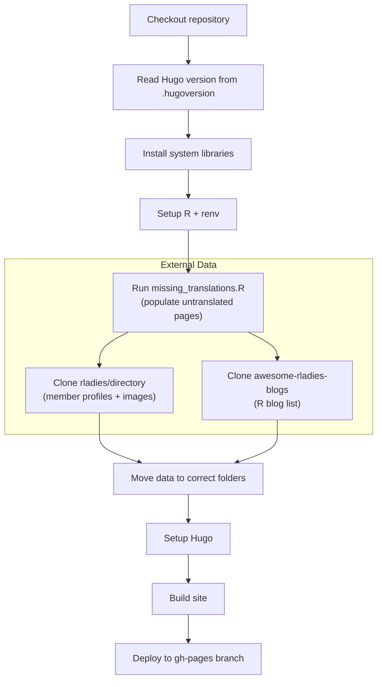

## GitHub Actions

The website uses several GitHub Actions workflows for building, deploying, validating, and automating content management.
This page documents each workflow so the maintenance team knows what runs, when, and why.

### Production build

**Workflow:** `build-production.yaml`
**Triggers:** Push to `main`, scheduled every 12 hours

This is the main deployment pipeline.
It builds the full site and deploys it to the `gh-pages` branch.

The build pulls data from external repositories to populate the directory, chapter information, and R blog aggregator:

- [rladies/directory](https://github.com/rladies/directory) — member profiles and avatar images
- [rladies/awesome-rladies-blogs](https://github.com/rladies/awesome-rladies-blogs) — R blog feed list

The scheduled runs ensure that externally-updated data (like new directory entries) appear on the site even without a commit to the website repo.

**Required secrets:**

| Secret | Purpose |
|--------|---------|
| `ssh_directoryy_repo` | SSH key for cloning the directory repo |
| `RLADIES_BLOGS_KEY` | SSH key for cloning the blogs repo |

Without these secrets, the build fails at the data-fetching step.

### Preview builds

**Workflow:** `build-preview.yaml`
**Triggers:** Workflow dispatch (called from other workflows or manually)

Builds the site and deploys a preview to Netlify.
This workflow accepts inputs to control which version of external data to use:

- `directory` — branch or PR reference for directory data (default: `main`)
- `blogs` — branch or PR reference for blogs data (default: `main`)
- `triggering_issue` — issue/PR number to post the preview link to
- `triggering_repo` — source repo that triggered the build

This allows other repositories (like the directory repo) to trigger a website preview build when their data changes, and get notified about the result.

There are two ways PRs get previewed:

1. **PRs from branches** (team members): The preview workflow deploys to Netlify and posts the preview URL as a comment.
2. **PRs from forks** (external contributors): Forks cannot access repository secrets, so the Netlify deployment is skipped. The build still runs to catch errors. A team member must approve the PR before a Netlify preview becomes available.

**Additional secrets required:**

| Secret | Purpose |
|--------|---------|
| `GLOBAL_GHA_PAT` | GitHub token for cross-repo operations |
| `NETLIFY_AUTH_TOKEN` | Netlify deploy authentication |
| `NETLIFY_SITE_ID` | Netlify site identifier |

### PR build check

**Workflow:** `check-build.yaml`
**Triggers:** Pull request to `main`

Runs the same build process as production but without deploying.
This catches build failures before a PR is merged.
No secrets are required — it uses the data already in the repository.

### Blog post linting

**Workflow:** `blog-lint.yaml`
**Triggers:** Pull request to `main` with changes to `content/blog/**/index*.md` or `content/news/**/index*.md`

Validates blog and news post front matter automatically.
Posts a comment on the PR with a report of any issues found.

**Required fields** (errors — blocks merge):

- `title` must be present
- `author` must be present and use the structured format (`- name: ...`)
- `date` must be present and use `YYYY-MM-DD` format

**Recommended fields** (warnings):

- `description` — used for SEO and listing previews
- `categories` — for content organisation
- `image` — featured image with alt text

**Image checks:**

- Warns if images in markdown are missing alt text (``)
- Warns if the front matter `image` field has no `alt` key

### JSON validation

**Workflow:** `check-jsons.yaml`
**Triggers:** Push to `main`, pull request to `main`

Validates all JSON files in the repository (chapter data, directory data, etc.) using an R script (`scripts/validate_jsons.R`).
Posts a comment on PRs with validation results.

### Blog post checklist

**Workflow:** `checklist-blogpost.yaml`
**Triggers:** Pull request with changes to `content/{blog,news}/**/index*.{md,qmd,rmd}`

Posts a contributor/reviewer checklist as a PR comment when a blog or news post is submitted.
This is a helper workflow — it does not validate anything, just provides a structured checklist to guide both the author and reviewer through the publication process.

### Translation checks

**Workflow:** `i18n-check.yaml`
**Triggers:** Pull request to `main` with changes to `content/**` or `i18n/**`

Checks translation completeness in two ways:

1. **i18n string keys** — compares `en.yaml` against the other language files (`es`, `pt`, `fr`) and reports missing or extra keys.
2. **Content pages** — for each changed content directory, checks whether corresponding files exist for all four languages.

Posts a summary comment on the PR.
Missing content translations are not blocking because `missing_translations.R` creates placeholder files at build time.

### Lighthouse audits

**Workflow:** `lighthouse.yaml`
**Triggers:** Pull request to `main`

Runs performance, accessibility, and SEO audits on the PR build and compares scores against the production site.
This workflow has four jobs:

**Build** — Builds the site and uploads the output as an artifact.

**Lighthouse** — Serves the build locally and runs Lighthouse on pages affected by the PR.
If layout or theme files changed, it audits key pages (`/`, `/events/`, `/chapters/`, `/about-us/`, `/blog/`, `/directory/`).
Compares scores against production and posts a table with emoji indicators (5-point threshold).
Fails if images are missing alt text.

**Link check** — Runs [lychee](https://github.com/lycheeverse/lychee) on the built site to find broken links.
Excludes social media URLs (which often return false positives) and non-English pages.
Posts results but does not block the PR.

**Bundle size** — Measures all CSS and JS files and posts a size breakdown.

### Global team sync

**Workflow:** `global-team.yml`
**Triggers:** Weekly (Sundays), manual dispatch

Pulls current global team data from Airtable and commits updated profile images and data files.
Pushes directly to the protected `main` branch using an admin token.

**Required secrets:**

| Secret | Purpose |
|--------|---------|
| `push-to-protected` | SSH key for checkout |
| `AIRTABLE_API_KEY` | Airtable API authentication |
| `ADMIN_TOKEN` | Token with permission to push to protected branch |

### Welcome bot

**Workflow:** `hello.yaml`
**Triggers:** Pull request opened, issue opened

Checks whether the PR/issue author is a member of the `rladies/global` team.
If not, posts a welcome message letting them know the team will respond.

### Automatic merging of pending posts

**Workflow:** `merge-pending.yaml`
**Triggers:** Daily schedule (10:58 UTC), manual dispatch

Automatically merges blog and news posts that are ready for publication.

The process:

1. Finds all non-draft PRs with the `pending` label
2. For each PR, reads the front matter of any `content/*/index*.md` files on the branch
3. Compares the `date` field against today's date
4. If the date matches today, merges the PR with squash

If the merge fails (e.g. conflicts or failing checks), the workflow posts a comment with the error details using a template from `.github/reply_templates/merge_errors.txt`.

**Required secret:** `ADMIN_TOKEN`

This workflow is the reason blog posts should have their `date` field set to the intended publication date — it controls when the post goes live.

### Workflow summary

| Workflow | Trigger | Purpose | Blocks PR? |
|----------|---------|---------|------------|
| `build-production` | Push to main, 12h schedule | Deploy site | N/A |
| `build-preview` | Workflow dispatch | Netlify preview | No |
| `check-build` | PR to main | Validate build | Yes |
| `blog-lint` | PR (blog/news changes) | Validate front matter | Yes (on errors) |
| `check-jsons` | Push/PR to main | Validate JSON data | Yes (on errors) |
| `checklist-blogpost` | PR (blog/news changes) | Post checklist | No |
| `i18n-check` | PR (content/i18n changes) | Translation gaps | No |
| `lighthouse` | PR to main | Performance/a11y audit | Yes (missing alt text) |
| `global-team` | Weekly, manual | Sync team from Airtable | N/A |
| `hello` | PR/issue opened | Welcome message | No |
| `merge-pending` | Daily, manual | Auto-publish dated posts | N/A |
