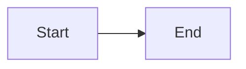

## Hugo setup

This section documents the internal workings of the RLadies+ website.
It covers the theme, configuration, build system, content types, shortcodes, and other features that the website maintenance team needs to understand.

The site runs on [Hugo](https://gohugo.io/) with a custom theme called **hugo-rladiesplus**.
Hugo version is pinned across the project (in `.hugoversion` and `netlify.toml`) and must stay in sync.

### Running locally

Clone the repository, install theme dependencies, and start the dev server:

```sh
git clone https://github.com/rladies/rladies.github.io.git
cd rladies.github.io
cd themes/hugo-rladiesplus && npm install && cd ../..
hugo server
```

The theme lives in `themes/hugo-rladiesplus/` as a regular directory within the repository.

### Configuration

The site uses a [config directory](https://gohugo.io/getting-started/configuration/#configuration-directory) at `config/_default/` instead of a single config file.
This keeps language-specific menus, parameters, and other settings cleanly separated.

Key configuration files:

| File | Purpose |
|------|---------|
| `hugo.yaml` | Core Hugo settings: theme, taxonomies, output formats, build options |
| `params.yaml` | Theme parameters: brand colours, social media handles, footer widgets, banner settings |
| `menu.yaml` | Main navigation structure (hierarchical menus with parent/child items) |
| `languages.yaml` | Multilingual setup for EN, ES, PT, FR — each with translated menu URLs |
| `markup.yaml` | Goldmark markdown config: unsafe HTML enabled, block-level attribute parsing |

### Theme: hugo-rladiesplus

The theme is a custom Hugo theme built with:

- **Tailwind CSS 4** for styling
- **Alpine.js** for lightweight interactivity (dropdowns, tabs, dark mode toggle)
- **FontAwesome 6** for icons
- **FullCalendar 6** for the events calendar
- **D3** for interactive chapter and event maps
- **Mermaid** for diagrams in content
- **Choices.js** for accessible dropdown filters
- **Shuffle.js** for image gallery layouts

#### Brand colours

The brand palette is defined as CSS custom properties in the theme's `assets/css/main.css` via a Tailwind `@theme` block:

| Variable | Value | Usage |
|----------|-------|-------|
| `--color-primary` | `#881ef9` | Primary purple — buttons, links, accents |
| `--color-accent-blue` | `#146af9` | Secondary accent |
| `--color-accent-rose` | `#ff5b92` | Tertiary accent |

Each colour has lighter and darker shades (e.g. `--color-primary-light`, `--color-primary-dark`).
Dark mode overrides these variables in `.dark` class definitions in `assets/css/components/darkmode.css`.

#### Dark mode

Dark mode is controlled by a toggle in the navbar.
The system:

1. Reads the user's system preference on first visit
2. Stores the choice in `localStorage`
3. Applies a `.dark` class to `<html>` — Tailwind and custom CSS respond to this class
4. A small inline script in the `<head>` prevents a flash of the wrong theme on load

#### npm build system

The theme uses [npm](https://docs.npmjs.com/) (the Node.js package manager) to manage its JavaScript and CSS dependencies.
Libraries like Tailwind CSS, Alpine.js, FullCalendar, D3, FontAwesome, and Mermaid are installed via npm and then _vendored_ — copied into the theme's `assets/` directory so Hugo can use them directly.

This means **site contributors and content editors do not need Node.js installed**.
npm is only needed when updating vendor libraries or changing the CSS build.

##### Installing Node.js and npm

If you do not have Node.js installed, download it from [nodejs.org](https://nodejs.org/) (the LTS version is recommended).
npm is included with Node.js.
Verify your installation:

```sh
node --version   # should print a version number, e.g. v20.11.0
npm --version    # should print a version number, e.g. 10.2.4
```

##### How it works

The theme's `package.json` (in `themes/hugo-rladiesplus/`) lists all vendor dependencies and defines build scripts.
When you run `npm install`, npm downloads the packages into a `node_modules/` folder (which is git-ignored), then automatically runs `npm run build` via a `postinstall` hook.
The build step compiles Tailwind CSS, bundles JavaScript, and copies vendor files into `assets/css/vendor/` and `assets/js/vendor/` where Hugo picks them up.

These built vendor files _are_ committed to Git so that Hugo can build the site without npm.

##### Common tasks

All commands below should be run from the theme directory:

```sh
cd themes/hugo-rladiesplus
```

**First-time setup** (or after a fresh clone):

```sh
npm install
```

This downloads all packages and runs the full build automatically.

**Updating all vendor libraries** to their latest compatible versions:

```sh
npm run update
```

This updates packages within the version ranges specified in `package.json`, then rebuilds everything.
After running this, check the site locally with `hugo server` and commit the changed files in `assets/css/vendor/` and `assets/js/vendor/`.

**Rebuilding after editing CSS** (e.g. changing colours, adding component styles):

```sh
npm run build:css
```

This recompiles `assets/css/main.css` through Tailwind and outputs the minified result to `assets/css/vendor/tailwind.css`.
You can also run `npm run build` for a full rebuild of everything.

**Upgrading a specific package** to a new major version:

```sh
npm install alpinejs@latest        # example: upgrade Alpine.js
npm run build                       # rebuild all assets
```

Then test the site locally and commit the updated `package.json`, `package-lock.json`, and any changed files in `assets/`.

##### Build scripts reference

| Script | What it does |
|--------|--------------|
| `build` | Full rebuild: clean, setup, compile CSS, bundle JS, sync all vendor assets and fonts |
| `build:css` | Compile Tailwind CSS with minification |
| `build:fullcalendar` | Bundle FullCalendar with esbuild |
| `build:d3map` | Bundle D3 map modules with esbuild |
| `sync:fontawesome` | Copy FontAwesome webfonts and SCSS from node_modules |
| `sync:alpine` | Copy Alpine.js from node_modules |
| `sync:mermaid` | Copy Mermaid from node_modules |
| `sync:choices` | Copy Choices.js from node_modules |
| `sync:shuffle` | Copy Shuffle.js from node_modules |
| `sync:fonts` | Copy Poppins and Inconsolata web fonts from node_modules |
| `update` | Update npm packages to latest compatible versions and rebuild |
| `clean` | Remove vendor directories (run before a fresh build) |

##### Vendor libraries

These are the main libraries managed by npm:

| Library | Version | Purpose |
|---------|---------|---------|
| Tailwind CSS | 4.x | Utility-first CSS framework — all site styling |
| Alpine.js | 3.x | Lightweight JS for dropdowns, tabs, dark mode toggle |
| FontAwesome | 6.x | Icon library |
| FullCalendar | 6.x | Interactive event calendar |
| D3 (d3-geo, d3-selection, d3-zoom) | 7.x | Chapter and event maps |
| Mermaid | 11.x | Diagram rendering in content |
| Choices.js | 11.x | Accessible dropdown filters (directory page) |
| Shuffle.js | 6.x | Image gallery layouts |
| Poppins | — | Sans-serif body font |
| Inconsolata Variable | — | Monospace code font |

#### CSS architecture

The entry point is `assets/css/main.css`, which imports Tailwind and a series of component CSS files from `assets/css/components/`:

`buttons.css`, `cards.css`, `typography.css`, `nav.css`, `footer.css`, `hero.css`, `forms.css`, `tables.css`, `badges.css`, `callouts.css`, `darkmode.css`, `animations.css`, `layout.css`, `calendar.css`, `maps.css`, `pagination.css`, `syntax.css`, `stats.css`, `press.css`, `programs.css`, `involved.css`, `misc.css`

When editing styles, find the relevant component file rather than adding rules to `main.css`.

### Content

The content folder holds all site pages.
The site does not use `.Rmd` files — all content is plain markdown.

Content uses Hugo [page bundles](https://gohugo.io/content-management/page-bundles/): each page lives in its own folder with an `index.md` (or `index.en.md` for multilingual) alongside its images and assets.
This keeps files organised and allows relative image paths in content.

```
content/blog/2026/04-02-survey-results/
  index.en.md      # post content
  chart.png        # image used in the post
  featured.png     # featured image referenced in front matter
```

Content directories:

| Directory | Content type | Layout |
|-----------|-------------|--------|
| `content/blog/` | Blog posts | `post/single.html` |
| `content/news/` | News announcements (shorter, uses `type: blog`) | `post/single.html` |
| `content/chapters/` | Chapter pages (one per chapter) | `chapters/single.html` |
| `content/directory/` | Member profiles | `directory/single.html` |
| `content/events/` | Events archive and calendar | `events/list.html` |
| `content/programs/` | Programs and initiatives | `programs/list.html` |
| `content/about-us/` | About pages (Our Story, FAQ, etc.) | `faq/list.html` for FAQ, default for others |
| `content/form/` | Redirect pages to external forms | `redirect/single.html` |

### Page layouts

The theme provides several specialised layouts beyond the default.
Each expects specific front matter fields and renders content differently.

#### Blog posts (`post/single.html`)

Used by `content/blog/` and `content/news/` (news pages set `type: blog` in front matter).

**Front matter fields:**

```yaml
title: "Post title"
date: "2026-04-02"              # publication date, YYYY-MM-DD
author:                          # list of authors
  - name: "Author Name"
    directory_id: "profile-id"   # links to /directory/<id>/
    url: "https://example.com"   # fallback if no directory_id
    contributions: [a, b]        # optional contribution codes
editorial:                       # list of editors, same fields as author
  - name: "Editor Name"
    directory_id: "editor-id"
translator:                      # list of translators, same fields as author
  - name: "Translator Name"
    directory_id: "translator-id"
contributions:                   # legend for contribution codes
  a: "Wrote the original post"
  b: "Created visualizations"
image:
  path: "featured.png"           # featured image filename (auto-resized to 1200x630 webp)
  alt: "Description of image"    # required for accessibility
description: |                   # summary for listings and SEO
  A short summary.
slug: "custom-slug"              # optional URL override
tags: [community, survey]
categories: [tutorials]
crosspost:                       # optional, for cross-posted content
  community: "Original Blog"
  url: "https://original.com/post"
```

**Layout features:**

- Featured image with automatic webp conversion and responsive sizing
- Author/editor/translator names with links to directory profiles
- Contribution superscript badges (a, b, c, d) with a legend
- Cross-post banner when `crosspost` is present
- Table of contents sidebar on large screens (auto-generated from headings)
- Reading time estimate
- Related posts section (based on shared tags/categories)
- Previous/next post navigation
- Last modified date (from Git history)
- Translation banner linking to other language versions
- "Improve this post" link to GitHub (blog section only)

#### Chapters (`chapters/single.html`)

Chapter pages are generated from JSON data in `data/chapters/`.

**Front matter / data fields:**

```yaml
urlname: "rladies-oslo"         # Meetup group URL name
status: "active"                 # active, inactive, or unknown
city: "Oslo"
state_region: ""
country: "Norway"
country_iso: "NO"
lat: 59.91
lon: 10.75
members: 342
social_media:
  meetup: "rladies-oslo"
  github: "rladies-oslo"
  twitter: "RLadiesOslo"
organizers:
  current:
    - "Organizer Name"
  former:
    - "Former Organizer"
```

**Layout features:**

- Chapter image (looked up from `assets/chapters/` by filename matching the JSON)
- Status badge — auto-downgrades "active" to "inactive" if no events in 6 months
- Location display with country flag
- Member count
- Meetup link button
- Interactive D3 map showing the chapter's location (hidden for Remote chapters)
- Social media links
- Tabbed organiser section (current / former) using Alpine.js
- Tabbed events section (upcoming / past) with Meetup event data

#### Directory profiles (`directory/single.html`)

Member profiles are imported on production build from [rladies/directory](https://github.com/rladies/directory) repository.

**Front matter / data fields:**

```yaml
name: "Member Name"
honorific: "Dr."                 # optional prefix
directory_id: "member-id"        # unique ID, used to link from blog posts
image: "path/to/avatar.jpg"
photo:
  credit: "Photographer Name"    # optional attribution
location:
  city: "City"
  country: "Country"
categories: [R-Ladies organizer, R-Ladies speaker]
languages: [English, Norwegian]
contact_method: [email, mastodon]
work:
  title: "Data Scientist"
  organisation: "Company"
  department: "Analytics"
  url: "https://company.com"
interests: [neuroimaging, ggplot2, shiny]
activities:
  r_groups:
    "R-Ladies Oslo": "https://meetup.com/rladies-oslo"
  r_packages:
    "ggseg": "https://github.com/ggseg/ggseg"
social_media:
  github: "username"
  mastodon: "@user@server"
```

**Layout features:**

- Profile sidebar: avatar, name with honorific, location, category/language badges, contact preference, social links
- Main content: work affiliation, interests list, R user groups and packages as clickable links
- Bio from page content
- Automatic cross-referencing: finds all blog posts where the member's `directory_id` appears as author, editor, or translator and lists them

#### Events calendar (`events/list.html`)

The events page displays an interactive calendar of past and upcoming Meetup events.
Data is read from remote, grabbing raw JSON from the [rladies/meetup_archive](https://github.com/rladies/meetup_archive) repo.

**Layout features:**

- FullCalendar integration with multiple views: week list, month list, month calendar
- Timezone selector (auto-detects local timezone, lists 400+ options)
- Event tooltips with venue, attendee count, and RSVP link
- RSS and iCal feed subscription buttons
- Stats showing total past events (fetched from GitHub)
- Event data loaded from Meetup archive data injected via the `head/data.html` partial

#### Programs listing (`programs/list.html`)

Displays RLadies+ initiatives with an alternating left-right layout.

**Front matter on child pages:**

```yaml
title: "Program Name"
weight: 1                        # controls display order
image: "stock_image_id"          # references data/stock_images.json
description: |
  Program description with **markdown**.
ctas:                            # call-to-action buttons
  - url: "https://form.example"
    label: "Apply now"
    style: "primary"             # primary, outline, accent-rose, accent-blue
  - url: "/blog/2025/01-program"
    label: "Read more"
    style: "outline"
```

**Layout features:**

- Intro text from the section's `_index.md`
- Alternating image/text layout for each program
- Stock images with attribution from `data/stock_images.json`
- Multiple CTA buttons per program with configurable styles

#### FAQ page (`faq/list.html`)

An accordion-style FAQ page with category filtering.

**Front matter on child pages (one per category):**

```yaml
title: "Chapter Management"
weight: 1
icon: "fa-solid fa-people-group"
items:
  - q: "How do I start a chapter?"
    a: |
      Contact us through the [new chapter form](/form/new-chapter).
      We will pair you with a mentor.
  - q: "Another question?"
    a: "Answer with **markdown** support."
```

**Layout features:**

- Category filter buttons (tabbed navigation, Alpine.js)
- Expandable accordion items with smooth transitions
- Answers rendered as markdown
- ARIA attributes for accessibility

#### Redirect pages (`redirect/single.html`)

Used for short URLs that redirect to external services (e.g. forms, surveys).

**Front matter:**

```yaml
title: "Blog post proposal"
redirect: "https://airtable.com/your-form-id"
type: redirect
aliases:
  - /form/blog-post
```

**Layout features:**

- Animated RLadies+ logo with rotating plus symbol
- 2-second auto-redirect with manual fallback button
- Preserves query string parameters from the original URL
- Respects `prefers-reduced-motion` for the animation

#### Default layouts

- **`_default/single.html`** — Simple centred content. Used by any page without a specialised layout.
- **`_default/list.html`** — Card grid with pagination. Used for section index pages. Displays child pages as cards with title, date, truncated summary, and a "Read more" link. Two-column grid on desktop, single column on mobile.
- **Homepage (`_default/index.html`)** — Assembles the home page from partials: impact stats, chapter map, get involved cards, featured members, latest blog posts, and sponsors.

### Render hooks

The theme overrides how Hugo renders standard markdown elements:

#### Images

Standard markdown images are wrapped in `<figure>` elements with lazy loading:

```markdown

```

The alt text goes in the square brackets (read by screen readers).
The caption goes in quotes after the path (displayed below the image as a `<figcaption>`).
If no caption is provided, a plain `` is rendered.

#### Links

External links (starting with `http`) automatically get `target="_blank"` and `rel="noopener noreferrer"`.
Internal links behave normally.

#### Mermaid code blocks

Fenced code blocks with the `mermaid` language tag render as diagrams:

````markdown

````

The Mermaid JS library is only loaded on pages that contain mermaid blocks.
It automatically adapts to the current dark/light theme.

### Shortcodes

In addition to [Hugo's built-in shortcodes](https://gohugo.io/content-management/shortcodes/), the theme provides:

#### callout

Coloured callout boxes for tips, warnings, and other highlighted content.

```markdown

A helpful suggestion with **markdown** support.

```

Override the title or icon:

```markdown

This step is easy to miss.



Any FontAwesome icon class works here.

```

| Type | Default icon | When to use |
|------|-------------|-------------|
| `tip` | lightbulb | Suggestions and best practices |
| `info` | circle-info | Supplementary context |
| `warning` | triangle-exclamation | Something to watch out for |
| `danger` | circle-xmark | Breaking changes or destructive actions |
| `note` | pen | Neutral asides |

#### button

A call-to-action button that opens in a new tab:

```markdown

```

Also accepts positional parameters:

```markdown

```

#### rlogo

The RLadies+ R-plus submark logo as an inline SVG.
Can be filled with a colour or an image pattern:

```markdown



```

Parameters: `color` (default: `var(--color-primary)`), `width` (default: `200px`), `image` (optional pattern fill), `class`, `alt`.

### Data

The `data/` directory holds structured data that Hugo templates use at build time:

| Directory/File | Source | Purpose |
|----------------|--------|---------|
| `data/chapters/` | Maintained manually + CI merges | Chapter JSON files (~386), one per chapter |
| `data/directory/` | Mock data placeholders for [rladies/directory](https://github.com/rladies/directory) | Member profile JSON files |
| `data/global_team/current/` | Maintained manually, synced by airtable | Current global team members |
| `data/global_team/alumni/` | Maintained manually | Former global team members |
| `data/sponsors.json` | Maintained manually | Sponsor logos and links for the homepage |
| `data/stock_images.json` | Maintained manually | Stock photo metadata with attribution |
| `data/continents.yaml` | Static | Country-to-continent mapping for chapter filters |
| `data/months/*.yaml` | Static | Month name translations per language |
| `data/read_in_lang.yaml` | Static | Available reading languages |
| `data/rblogs/` | Imported from [awesome-rladies-blogs](https://github.com/rladies/awesome-rladies-blogs) | R blog aggregator list |

The chapter and directory data are fetched from external repositories during the CI build.
Local development uses whatever data is already in the repo.

### Static assets

Global assets that need to be available at fixed URLs live in `static/`.
Currently this holds the site logo (`images/logo.svg`), favicon, and default Open Graph (OG) image.

Images specific to a single page should be bundled with that page, not placed in `static/`.

### Menu

The navigation menu is defined in `config/_default/menu.yaml` as a hierarchy of items with `parent` relationships.
Menu item labels come from `i18n/` translation files — each menu `identifier` must have a matching key in all four language YAML files.

To add a new menu item:

1. Add the item to `menu.yaml` with a unique `identifier`, `url`, `weight`, and optionally a `parent`
2. Add the translated label to `i18n/en.yaml`, `i18n/es.yaml`, `i18n/pt.yaml`, and `i18n/fr.yaml`
3. If the language has custom menu URLs (like French), add the translated URL in `languages.yaml`

### i18n (translations)

The `i18n/` directory contains YAML files for each supported language with 100+ translatable strings covering menu labels, page titles, form labels, and UI text.
To add a new translatable string, add the key to all four language files.

A build-time R script (`scripts/missing_translations.R`) runs before every production build to create placeholder files for pages that have not yet been translated.
These placeholders copy the English content and add `translated: no` to the front matter, which triggers a translation banner on the rendered page.

### Archetypes

Archetypes are templates for creating new content.
Use `hugo new` with the archetype name:

```sh
hugo new content/blog/2026/04-02-my-post/index.en.md
```

Available archetypes:

| Archetype | Creates | Key fields |
|-----------|---------|------------|
| `blog` | Blog post | `title`, `author`, `editorial`, `date`, `image`, `tags`, `categories`, `summary` |
| `news` | News item | Same as blog, plus `type: blog` |
| `redirect` | Redirect page | `title`, `redirect` (target URL), `type: redirect` |
| `mentoring` | Mentoring entry | `title`, `date`, `mentee`, `mentor`, `image`, `article`, `summary` |

### Accessibility

The theme includes several accessibility features:

- Skip-to-content link (visible on keyboard focus)
- ARIA labels on interactive elements (nav toggles, buttons, accordions)
- Visible focus styles (2px solid primary outline)
- Semantic HTML (`<nav>`, `<main>`, `<article>`, `<figure>`)
- Lazy-loaded images with required alt text
- Dark mode maintains contrast ratios
- CSS respects `prefers-reduced-motion`
- Blog linting CI checks for missing alt text

### Performance

- CSS and JS are minified and fingerprinted by Hugo Pipes
- Images auto-converted to webp format
- Critical fonts (Poppins, Inconsolata) are preloaded
- Vendor JS is loaded with `defer`
- Mermaid JS is only loaded on pages that use diagrams

