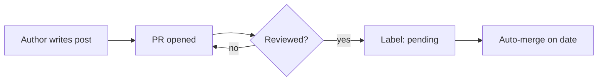

Markdown is the writing surface.
Hugo, Tailwind, and the theme's render hooks are what turn it into a styled page.
Most of the time you do not need to think about that — write prose, write headings, link things, embed an image.
Sometimes you do.

This page covers the things you can reach for that are not standard markdown.

## Render hooks: the magic that happens automatically

Three pieces of markdown behave a little differently on this site than on a vanilla Hugo install, because the theme defines [render hooks](https://gohugo.io/render-hooks/introduction/) that intercept them.

### Images become figures

When you write a block-level image with a title:

```markdown

```

…you do not get a bare ``.
You get:

```html
<figure>
  
  <figcaption>RLadies+ at useR! 2017</figcaption>
</figure>
```

The first argument is alt text, the second (the title in quotes) is the caption.
The `loading="lazy"` is added for you.
If you write an inline image — one that sits inside a paragraph — it stays as a plain `` with the alt text and an optional `title` attribute, no figure wrapping.

The rule, plainly: if you want a caption visible to readers, give the image a title.
If you only want alt text, leave the title off.
Always provide alt text.

### External links open in a new tab

Any link whose URL begins with `http` automatically gets `target="_blank" rel="noopener noreferrer"` added.
Internal links — anything starting with `/`, `#`, or a relative path — are unchanged.
You do not need to write the target attribute by hand:

```markdown
Learn more on [the Hugo site](https://gohugo.io/) or jump to [our chapters](/chapters/).
```

The first opens in a new tab, the second navigates in place.

### Mermaid diagrams

Fenced code blocks tagged `mermaid` are rendered as diagrams via [Mermaid](https://mermaid.js.org/):

````markdown

````

Mermaid is loaded only on pages that include at least one mermaid block.
Pages without diagrams do not pay for the runtime.
This is handled by the render hook setting `Page.Store.hasMermaid = true` and the base layout conditionally loading the script.

Useful for explaining workflows in admin docs, dependency graphs, or simple ER diagrams (like the blog Airtable schema on this very site).

## Custom shortcodes

Shortcodes go beyond what markdown can express.
The theme provides three.

### `button`

A branded primary call-to-action button.
Two ways to call it.

Positional, for short links:

```markdown

```

Named, for clarity when the URL is long or you want to skim a draft:

```markdown

```

Both forms render the same `<a class="btn btn-primary">` with `target="_blank"` and `rel="noopener"`.
Use this in announcement posts, landing pages, anywhere a single big "do this thing" matters.
Do not use it for in-prose links — those should stay as regular markdown links.

### `callout`

A boxed callout for asides — a tip, a warning, a note.

```markdown

The directory data is private. **Do not** copy entries from `rladies/directory`
into a public PR description or screenshot.

```

Five types are supported, each with a default title and icon:

| Type      | Default title | Use it for                                      |
| --------- | ------------- | ----------------------------------------------- |
| `tip`     | Tip           | Helpful patterns, shortcuts, things people miss |
| `info`    | Info          | Neutral context, links to deeper docs           |
| `note`    | Note          | Asides that interrupt the main flow             |
| `warning` | Warning       | Things that will probably break if ignored      |
| `danger`  | Danger        | Things that will break security or data         |

Override the title with `title="Something else"`.
Override the icon with `icon="fa-solid fa-rocket"` (any [Font Awesome](https://fontawesome.com/icons) class).
The body of the callout uses normal markdown.

### `rlogo`

The RLadies+ "R+" submark, as inline SVG.
Used for hero panels and brand-decorated pages.

```markdown

```

You can also fill the logo with an image — the SVG paths become a clip-path over a `<pattern>` of your image:

```markdown

```

This is the trick that the homepage hero uses to embed a video inside the logo silhouette.

## Front matter conventions

Some content behaviour is driven by front matter rather than shortcodes.
The patterns worth knowing:

A blog post that should auto-merge on its publication date carries the GitHub label `pending` and a `date` set to the day you want it published.
The [`merge-pending.yaml`](https://github.com/rladies/rladies.github.io/blob/main/.github/workflows/merge-pending.yaml) action runs daily and will merge any `pending`-labelled PR whose front-matter date matches today.
Do not set a future date and forget it — the date is also when the post is dated on the site.

A page can opt out of being treated as a translation candidate by setting `translated: false`.
A page that has been auto-translated by the build will have `translated: auto` already in its front matter — that is what triggers the orange auto-translation banner.
Removing the field (or replacing with `translated: true`) marks the translation as reviewed.

A redirect page is a single front-matter block with no body:

```yaml
---
title: "Posit::Conf 2024"
type: redirect
redirect: https://app.sli.do/event/some-event
aliases:
  - /positconf24
---
```

The `type: redirect` triggers the redirect layout, which shows a brief "Redirecting…" page and then `window.location.replace()`s the user to the target.
The `aliases` field is the standard Hugo aliasing mechanism — every alias also resolves to this redirect.
Details and conventions are in [Creating a pretty URL](/website/admin_guide/redirects/).

## A small style guide

Two trailing spaces at the end of a list item give you a hard line break — useful when a bullet has multiple sentences.
Use `_underscores_` for italics, not `*asterisks*`.
Em dashes get spaces around them — like that.
Never bold a heading; the heading level is the emphasis.
Do not break a paragraph across multiple lines unless you want each sentence on its own line for diff clarity (which is the convention on this site, and which makes line-by-line review much nicer).
