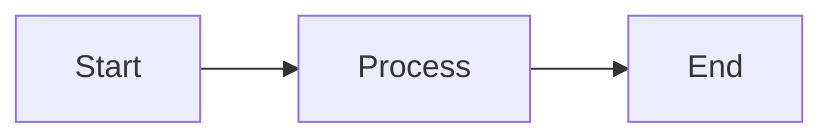

The RLadies+ blog runs on Hugo and accepts posts as plain markdown files.
You write in a folder, add your images alongside it, and open a pull request.
The rest of this page walks you through each step — from proposing a post to getting it published.

A more general guide to forking, cloning, and PR-ing the website lives in [its own chapter](/comm/website/fork-clone-pr).

## Propose a post

You _can_ submit a post by opening a PR directly, but we prefer to plan it with you first.
Submit a [post proposal](https://rladies.org/form/blog-post) and a blog editor will reach out to set a timeline.
This also means we can offer alternative workflows if the Git/GitHub route is not your preference.

Once a proposal is accepted, start drafting by following the steps below.

## Clone the project

Pick whichever Git workflow you are comfortable with — terminal, `{usethis}`, GitHub Desktop, the GitHub web UI.
We document two approaches here.
Garrick Aden-Buie's [Pull Request Flow with usethis](https://www.garrickadenbuie.com/blog/pull-request-flow-usethis/?interactive=1&steps=) is a thorough walkthrough of the `{usethis}` path.

### Via git in the terminal

```sh
git clone https://github.com/rladies/rladies.github.io.git rladies_website
cd rladies_website/
git checkout -b my_branch
```

### Via {usethis}

```r
usethis::create_from_github("rladies/rladies.github.io")
usethis::pr_init("my_branch")
```

## Write a new blog post

### Create the post folder

Posts live in `content/blog/` organised by year, then date-slug:

```
content/blog/YYYY/MM-DD-your-post-slug/
```

For example: `content/blog/2026/04-02-community-survey-results/`.

Inside that folder, create your post file as `index.en.md`.
Writing in another language?
Use the appropriate suffix — `index.es.md` (Spanish), `index.pt.md` (Portuguese), or `index.fr.md` (French).

Place images and any other assets directly in the same folder.

### Front matter

Every post starts with a YAML block.
Here is a complete example:

```yaml
---
title: "Your post title"
author:
  - name: "Your Name"
    directory_id: "your-directory-id"
    url: "https://your-website.com"
editorial:
  - name: "Editor Name"
    directory_id: "editor-directory-id"
date: "2026-04-02"
description: |
  A short summary of your post. Markdown supported.
image:
  path: "featured-image.png"
  alt: "Descriptive alt text for the image"
slug: "your-post-slug"
tags:
  - community
  - survey
categories:
  - tutorials
---
```

What each field does:

- **title** — shown in the post listing and the post page.  
- **author** — a list of authors. See [Authors and contributions](#authors-and-contributions) for details.  
- **editorial** — editors who reviewed the post. Same format as `author`.  
- **date** — publication date in `YYYY-MM-DD` format. Must be static — never use `r Sys.Date()` or similar.  
- **description** — a short summary for the listing page and SEO. Supports markdown. Use `|` for multiline text.  
- **image.path** — filename of a featured image in your post folder. Automatically resized and converted to webp.  
- **image.alt** — alt text for the featured image. Always include this.  
- **slug** — custom URL slug. Auto-generated from the title if omitted.  
- **tags** — topic tags. 4–5 is a good number. Browse existing [tags](https://rladies.org/tags/).  
- **categories** — broader groupings. Browse existing [categories](https://rladies.org/categories/).  

### Authors and contributions

Each author, editor, or translator entry accepts these fields:

- **name** (required) — the person's name.  
- **directory_id** (optional) — their RLadies+ directory profile ID, which creates a link to `rladies.org/directory/<id>/`.  
- **url** (optional) — an external URL. Used when there is no `directory_id`.  

Multi-author posts can track who did what with the _contributions_ system.
Define a legend of contribution codes in the front matter, then assign codes to each person:

```yaml
author:
  - name: Alice
    directory_id: "alice"
    contributions: [a, b]
  - name: Bob
    directory_id: "bob"
    contributions: [a, c]
editorial:
  - name: Carol
    directory_id: "carol"
    contributions: [d]
contributions:
  a: "Wrote the original post"
  b: "Created visualizations"
  c: "Collected survey data"
  d: "Edited for publication"
```

Superscript letters (ᵃ, ᵇ, ᶜ, ᵈ) appear next to each name, with a legend below the author list.

### Cross-posting

If your post originally appeared on another blog, add a `crosspost` field:

```yaml
crosspost:
  community: "Your Blog Name"
  url: "https://your-blog.com/original-post"
```

A notice with a link to the original appears at the top of the post.

### Translations

Create a new file in the same folder with the matching language suffix.
The English version is `index.en.md`; a Portuguese translation would be `index.pt.md`.

The site supports English (en), Spanish (es), Portuguese (pt), and French (fr).

Credit translators in the front matter:

```yaml
translator:
  - name: "Translator Name"
    directory_id: "translator-directory-id"
```

## Formatting your post

### Callouts

Callouts highlight important information in a coloured box.
Five types are available — `tip`, `info`, `warning`, `danger`, and `note` — each with a default icon and title.

```markdown

A helpful suggestion with **markdown** support.

```

Override the title or icon when needed:

```markdown

This step is easy to miss.



Any Font Awesome icon class works here.

```

| Type      | Default icon           | When to use                              |
|-----------|------------------------|------------------------------------------|
| `tip`     | lightbulb              | Suggestions and best practices           |
| `info`    | circle-info            | Supplementary context                    |
| `warning` | triangle-exclamation   | Something the reader should watch out for|
| `danger`  | circle-xmark           | Breaking changes or destructive actions  |
| `note`    | pen                    | Neutral asides or footnotes              |

### Buttons

Add a call-to-action button:

```markdown

```

### Mermaid diagrams

Fenced code blocks with the `mermaid` language tag render as diagrams:

````markdown

````

### Images

Every image in your post should have both alt text and a caption.
They serve different purposes and go in different places.

**Alt text** is read aloud by screen readers and displayed when the image fails to load.
It describes _what the image shows_ — the content, the key visual elements, the data a chart conveys.
A reader who cannot see the image should be able to understand it from the alt text alone.

**Caption text** is the visible line displayed beneath the image.
It describes _why the image matters_ in context — what the reader should take away, where the data comes from, or who is pictured.

A good pair might look like this:

- Alt: "Bar chart showing chapter growth from 12 chapters in 2016 to 219 in 2024"  
- Caption: "RLadies+ chapter growth over the first eight years"  

The alt text tells you what the chart contains.
The caption tells you why it is here.

In markdown, the alt text goes in the square brackets and the caption goes in quotes after the file path:

```markdown

```

A concrete example:

```markdown

```

If you omit the quoted caption, no caption is displayed — but always include alt text.

For the post's _featured_ image, set it in the front matter `image` field — not in the body.

### Links

External links automatically open in a new tab.
No extra markup needed.

### Raw HTML

Raw HTML is supported inside post content when markdown alone is not enough.

## Preview locally

Run Hugo from the repository root:

```sh
hugo server -D
```

The `-D` flag renders draft posts so you can see yours before it is published.

## Submit your post

When the post looks right locally, push it for review.

### Via git in the terminal

```sh
git add content/blog/YYYY/MM-DD-your-post-slug
git commit -m "add post: your post title"
git push --set-upstream origin my_branch
```

### Via {usethis}

Stage and commit your post folder in the RStudio Git pane, then:

```r
usethis::pr_push()
```

## Open a pull request

Open a [pull request](https://github.com/rladies/rladies.github.io/pulls) against the `main` branch.
If you are not on the RLadies+ Global team, you will be working from a fork — the site build will run, but no deploy preview is generated.

A blog or website team member will be assigned as your reviewer and guide you through any remaining changes via GitHub code review.

### What happens after review

Once the team is happy with the post, they [create a branch](https://docs.github.com/en/pull-requests/collaborating-with-pull-requests/proposing-changes-to-your-work-with-pull-requests/creating-and-deleting-branches-within-your-repository#creating-a-branch) from the main repository (usually named `fork_[postname]`) and [switch your PR's base](https://docs.github.com/en/pull-requests/collaborating-with-pull-requests/proposing-changes-to-your-work-with-pull-requests/changing-the-base-branch-of-a-pull-request) to that branch.
Your PR is merged there, a deploy preview is generated, and any final editorial tweaks happen on the team's side.
They will reach out if they need anything else from you.

## Questions

If anything here is unclear, open [an issue](https://github.com/rladies/rladiesguide/issues) and we will sort it out.
