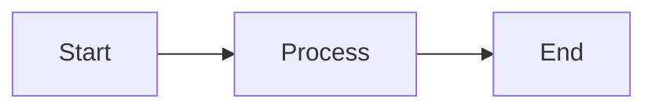

This page documents the formatting features available when writing content for the RLadies+ website.
It is relevant whether you are writing a blog post, translating a page, or editing any content on the site.

All content is written in standard markdown.
The features below extend what plain markdown can do.

## Images

Every image should have **alt text**.
Images can optionally have a **caption** displayed below them.

- **Alt text** is read by screen readers and shown when the image fails to load. It describes _what the image shows_.
- **Caption text** is the visible line beneath the image. It describes _why the image matters_ in context.

```markdown

```

A concrete example:

```markdown

```

If you omit the quoted caption, no caption is displayed — but always include alt text.

Behind the scenes, the theme wraps images in a `<figure>` element with `loading="lazy"` for performance.

## Links

External links (starting with `http`) automatically open in a new tab with `rel="noopener noreferrer"`.
Internal links behave normally.
No extra markup is needed.

## Callouts

Callouts highlight important information in a coloured box.
Five types are available, each with a default icon and title.

```markdown

A helpful suggestion with **markdown** support.

```

Override the title or icon when needed:

```markdown

This step is easy to miss.



Any Font Awesome icon class works here.

```

| Type      | Default icon           | When to use                              |
|-----------|------------------------|------------------------------------------|
| `tip`     | lightbulb              | Suggestions and best practices           |
| `info`    | circle-info            | Supplementary context                    |
| `warning` | triangle-exclamation   | Something the reader should watch out for|
| `danger`  | circle-xmark           | Breaking changes or destructive actions  |
| `note`    | pen                    | Neutral asides or footnotes              |

## Buttons

Add a call-to-action button that opens in a new tab:

```markdown

```

Also accepts positional parameters:

```markdown

```

## Mermaid diagrams

Fenced code blocks with the `mermaid` language tag render as interactive diagrams.
The Mermaid library is only loaded on pages that use it.

````markdown

````

Mermaid supports flowcharts, sequence diagrams, Gantt charts, and more.
See the [Mermaid documentation](https://mermaid.js.org/intro/) for the full syntax.

## RLadies+ logo

The `rlogo` shortcode inserts the RLadies+ R-plus submark as an inline SVG.
It can be filled with a solid colour or an image pattern:

```markdown



```

| Parameter | Default | Description |
|-----------|---------|-------------|
| `color` | `var(--color-primary)` | Fill colour |
| `width` | `200px` | Display width |
| `image` | — | Image URL for pattern fill |
| `alt` | `RLadies+ R-plus submark in purple` | Accessible label |
| `class` | — | Additional CSS class |

## Raw HTML

Raw HTML is supported inside content when markdown alone is not enough.
Use sparingly — markdown is preferred for consistency and accessibility.

## Formatting tips

These are not features of the theme, but common patterns that come up during editorial review.

### Do not repeat the title

The title from front matter is displayed automatically at the top of the page.
Adding it again as a heading in the body makes it appear twice.

### Do not bold headings

Headings are already styled by the theme.
Writing `## **My heading**` adds redundant bold markup.

### Keep the body clean for summaries

Hugo generates a preview card for the blog listing from the first lines of the post body.
If you put an author list, table of contents, or other metadata at the top, it ends up in the preview card.
Put that kind of content further down, or use front matter fields instead.

### Numbered lists with paragraphs

Standard markdown numbered lists restart when broken by a paragraph.
If you need numbered items with full paragraphs between them, use explicit numbers and make each item a heading:

```markdown
### 1. First point

A full paragraph about the first point.

### 2. Second point

A full paragraph about the second point.
```
